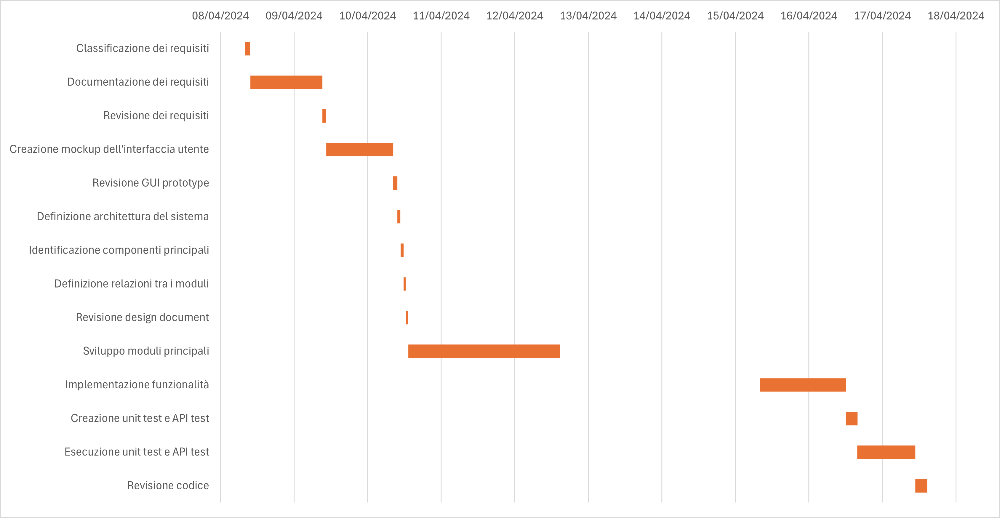

# Project Estimation - FUTURE
Date: 04/05/2024

| Version number | Change   |  
| :----------:   | :----:   |    
| 2.1            | Prima compilazione Estimation V2 |  
| 2.2            | Inserimento diagramma di Gantt   |  
| 2.3            | Revisione finale Estimation V2   |

# Estimation approach
Consider the EZElectronics  project in FUTURE version (as proposed by your team in requirements V2), assume that you are going to develop the project INDEPENDENT of the deadlines of the course, and from scratch (not from V1)
# Estimate by size
### 
|             | Estimate                        |             
| ----------- | ------------------------------- |  
| NC =  Estimated number of classes to be developed   |  7                           |             
|  A = Estimated average size per class, in LOC       |  370                         | 
| S = Estimated size of project, in LOC (= NC * A)    |  2590                        |
| E = Estimated effort, in person hours (here use productivity 10 LOC per person hour)  |  259 ph  |   
| C = Estimated cost, in euro (here use 1 person hour cost = 30 euro) | € 7770 | 
| Estimated calendar time, in calendar weeks (Assume team of 4 people, 8 hours per day, 5 days per week ) | 1.62 weeks |  

- Il numero di classi *NC* considerato è stato calcolato, basandosi sul solo numero di classi inserite nel glossario.  
- La dimensione media di ciascuna classe, espressa in termini di *LOC*, è stata calcolata basandosi sulla lunghezza della definizione della classe fornita nel codice e ipotizzando la lunghezza dei metodi (compresi quelli di testing) che in essa dovrebbero essere implementati. I risultati sucessivi derivano quindi da questa considerazione.

# Estimate by product decomposition
### 
|         component name    | Estimated effort (person hours)   |             
| ----------- | ------------------------------- | 
|requirement document    | 40 ph|
| GUI prototype | 25 ph|
|design document | 10 ph|
|code | 130 ph|
| unit tests | 15 ph |
| api tests | 15 ph |
| management documents  | 6 ph|

- Il tempo stimato in person hours per *GUI prototype* è stato calcolato basandosi sullo sviluppo del solo mockup.

# Estimate by activity decomposition
### 
|         Activity name    | Estimated effort (person hours)   |             
| ----------- | ------------------------------- |   
| Classificazione dei requisiti| 7 ph |
| Documentazione dei requisiti| 30 ph |  
| Revisione dei requisiti| 5 ph | 
| Creazione mockup interfaccia utente| 23 ph |
| Revisione GUI prototype| 6 ph |
| Definizione architettura del sistema| 4 ph |
| Identificazione componenti principali| 4 ph |
| Definizione relazioni tra i moduli| 3 ph |
| Revisione design document| 3 ph |
| Sviluppo moduli principali| 70 ph |
| Implementazione funzionalità| 48 ph |
| Creazione unit test e API test| 15 ph |
| Esecuzione unit test e API test| 12 ph |
| Revisione codice| 15 ph |

## Gantt diagram
Le stime sono state fatte ipotizzando giornate lavorative da 8 ore e un team composto da 4 persone. I weekend non sono considerati giorni lavorativi.  

# Summary

|             | Estimated effort                        |   Estimated duration |          
| ----------- | ------------------------------- | ---------------|
| estimate by size | 259 ph | 1.62 weeks |
| estimate by product decomposition | 241 ph| 1.51 weeks |
| estimate by activity decomposition | 245 ph | 1.53 weeks |

Adottando le diverse metodologie (*by size*, *by product decomposition*, *by activity decomposition*), si sono ottenute stime più o meno simili, prospettiva che sembra suggerire che il progetto software è sufficientemente definito e che si ha un'idea piuttosto chiara su quelli che saranno i costi. Tuttavia, è sempre bene considerare le limitazioni e le incertezze associate a ciascun metodo di stima e valutare attentamente i fattori che potrebbero influenzare i costi di progetto nel tempo (ritardi, eventuali problemi tecnici, diversa capacità del team di gestire efficacemente le attività). 

Seppur più laboriosa rispetto ad altre metodologie, la stima **by activity decomposition** è forse quella più affidabile in quanto in grado di stimare i costi in person hours per ciascuna attività utile al completamento del progetto. La rappresentazione mediante il **diagramma di Gantt** consente di visualizzare chiaramente la sequenza delle attività, le eventuali dipendenze presenti tra ciascuna di esse e la durata complessiva progetto. Se mediante la stima *by activity decomposition* le eventuali interruzioni lavorative e l'impossibilità di parallelizzare determinate attività risultano infatti evidenti, così non è per le altre metodologie. Una stima *by size*, senz'altro più rapida e semplice da eseguire (in quanto basata sul solo numero di *LOC*), potrebbe non considerare importanti fattori come quelli sopramenzionati.  

