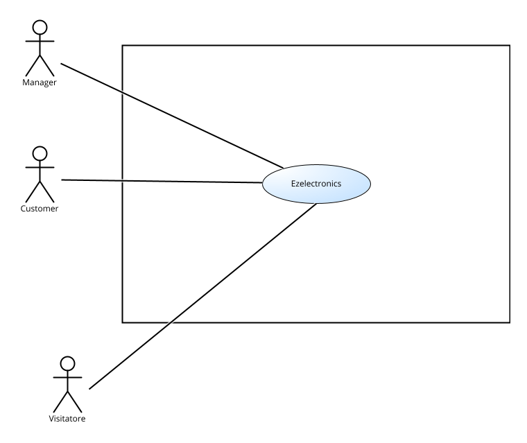
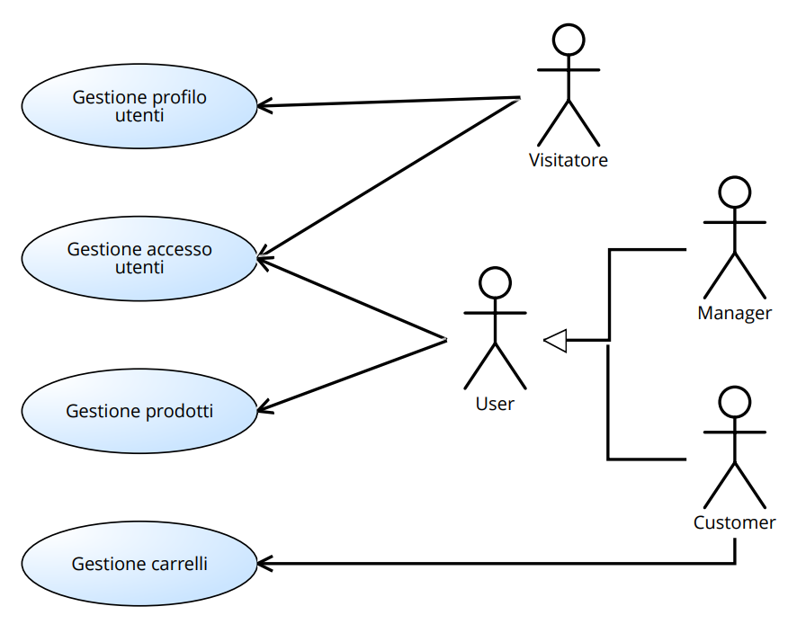
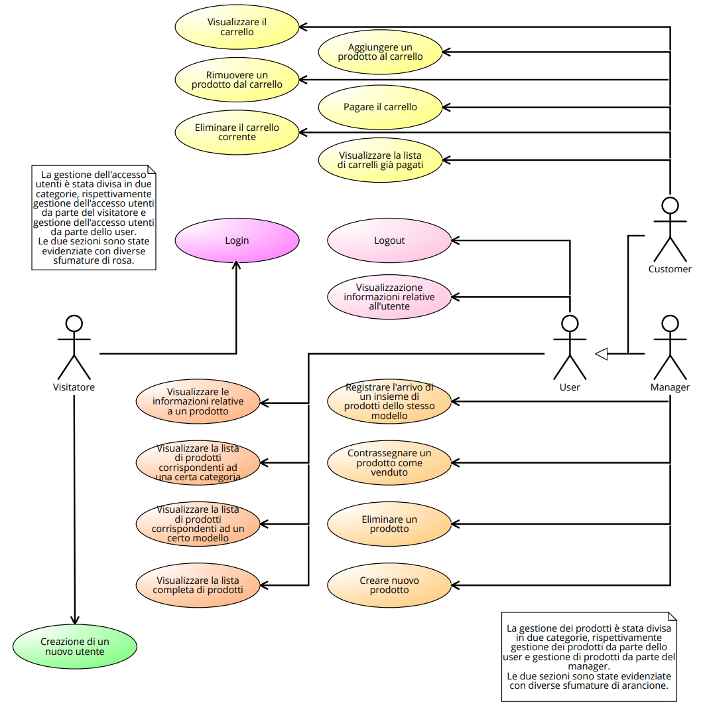
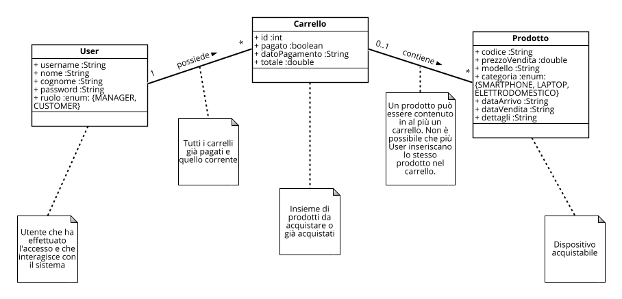
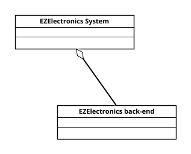
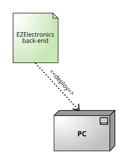

# Requirements Document - current EZElectronics

Date: 28/04/2024

Version: V1 - description of EZElectronics in CURRENT form (as received by teachers)

| Version number | Change                  |  
|:-----------:   |:--                      |
| 1.1           | Inserimento requisiti funzionali e non funzionali                  |
| 1.2           | Inserimento use cases e scenari relativi a gestione prodotti       | 
| 1.3           | Inserimento stories and personas                                   |
| 1.4           | Inserimento use cases e scenari relativi alla gestione carrello    |
| 1.5           | Inserimento use cases e scenari relativi a gestione profilo utenti |
| 1.6           | Inserimento use cases e scenari relativi a gestione accesso utenti |
| 1.7           | Inserimento stakeholder e context diagram                          |
| 1.8           | Inserimento glossario                                              |
| 1.9           | Inserimento system design e deployment diagram                     |
| 1.10          | Inserimento defect table                                           |
| 1.11          | Revisione finale documento dei requisiti                           |

# Contents

- [Requirements Document - current EZElectronics](#requirements-document---current-ezelectronics)
- [Contents](#contents)
- [Informal description](#informal-description)
- [Stakeholders](#stakeholders)
- [Context Diagram and interfaces](#context-diagram-and-interfaces)
  - [Context Diagram](#context-diagram)
  - [Interfaces](#interfaces)
- [Stories and personas](#stories-and-personas)
- [Functional and non functional requirements](#functional-and-non-functional-requirements)
  - [Functional Requirement](#functional-requirement)
    - [Defect Table](#defect-table)
  - [Non Functional Requirements](#non-functional-requirements)
- [Table of rights](#table-of-rights)
- [Use case diagram and use cases](#use-case-diagram-and-use-cases)
  - [Use case diagram (summary level)](#use-case-diagram-summary-level)
  - [Use case diagram](#use-case-diagram)
    - [Caso d'uso 1, Login](#caso-duso-1-login)
      - [Scenario 1.1](#scenario-11)
      - [Scenario 1.2](#scenario-12)
      - [Scenario 1.3](#scenario-13)
    - [Caso d'uso 2, Logout](#caso-duso-2-logout)
      - [Scenario 2.1](#scenario-21)
    - [Caso d'uso 3, Visualizzazione informazioni relative ad un utente](#caso-duso-3-visualizzazione-informazioni-relative-ad-un-utente)
      - [Scenario 3.1](#scenario-31)
    - [Caso d'uso 4, Creazione nuovo utente](#caso-duso-4-creazione-nuovo-utente)
      - [Scenario 4.1](#scenario-41)
      - [Scenario 4.2](#scenario-42)
      - [Scenario 4.3](#scenario-43)
      - [Scenario 4.4](#scenario-44)
    - [Caso d'uso 5, Creazione prodotto](#caso-duso-5-creazione-prodotto)
      - [Scenario 5.1](#scenario-51)
      - [Scenario 5.2](#scenario-52)
      - [Scenario 5.3](#scenario-53)
      - [Scenario 5.4](#scenario-54)
    - [Caso d'uso 6, Arrivo prodotti di uno stesso modello](#caso-duso-6-arrivo-prodotti-di-uno-stesso-modello)
      - [Scenario 6.1](#scenario-61)
      - [Scenario 6.2](#scenario-62)
      - [Scenario 6.3](#scenario-63)
      - [Scenario 6.4](#scenario-64)
    - [Caso d'uso 7, Registrazione vendita di un prodotto](#caso-duso-7-registrazione-vendita-di-un-prodotto)
      - [Scenario 7.1](#scenario-71)
      - [Scenario 7.2](#scenario-72)
    - [Caso d'uso 8, Ottenimento lista prodotti](#caso-duso-8-ottenimento-lista-prodotti)
      - [Scenario 8.1](#scenario-81)
      - [Scenario 8.2](#scenario-82)
      - [Scenario 8.3](#scenario-83)
      - [Scenario 8.4](#scenario-84)
    - [Caso d'uso 9, Ottenimento informazioni prodotto](#caso-duso-9-ottenimento-informazioni-prodotto)
      - [Scenario 9.1](#scenario-91)
    - [Caso d'uso 10, Eliminazione prodotto](#caso-duso-10-eliminazione-prodotto)
      - [Scenario 10.1](#scenario-101)
    - [Caso d'uso 11, Visualizzazione carrello](#caso-duso-11-visualizzazione-carrello)
      - [Scenario 11.1](#scenario-111)
      - [Scenario 11.2](#scenario-112)
    - [Caso d'uso 12, Aggiunta prodotto al carrello](#caso-duso-12-aggiunta-prodotto-al-carrello)
      - [Scenario 12.1](#scenario-121)
      - [Scenario 12.2](#scenario-122)
      - [Scenario 12.3](#scenario-123)
    - [Caso d'uso 13, Pagamento carrello](#caso-duso-13-pagamento-carrello)
      - [Scenario 13.1](#scenario-131)
    - [Use case 14, Visualizzazione lista carrelli già pagati](#use-case-14-visualizzazione-lista-carrelli-già-pagati)
      - [Scenario 14.1](#scenario-141)
      - [Scenario 14.2](#scenario-142)
    - [Caso d'uso 15, Rimozione prodotto dal carrello](#caso-duso-15-rimozione-prodotto-dal-carrello)
      - [Scenario 15.1](#scenario-151)
    - [Caso d'uso 16, Eliminazione carrello corrente](#caso-duso-16-eliminazione-carrello-corrente)
      - [Scenario 16.1](#scenario-161)
- [Glossary](#glossary)
- [System Design](#system-design)
- [Deployment Diagram](#deployment-diagram)

# Informal description

EZElectronics (read EaSy Electronics) is a software application designed to help managers of electronics stores to manage their products and offer them to customers through a dedicated website. Managers can assess the available products, record new ones, and confirm purchases. Customers can see available products, add them to a cart and see the history of their past purchases.

# Stakeholders

| Stakeholder name | Description                                |
| :--------------: | :---------:                                |
| Customer         | Utente autenticato con ruolo Customer      |
| Manager          | Utente autenticato con ruolo Manager       |
| Visitatore       | Utilizzatore del sistema non autenticato   |  

# Context Diagram and interfaces

## Context Diagram

## Interfaces

|   Actor   | Logical Interface | Physical Interface |
| :-------: | :---------------: | :----------------: |
|Customer   | GUI Customer      |      PC            |
|Manager    | GUI Manager       |      PC            |
|Visitatore | GUI Visitatore    |      PC            |

# Stories and personas

**Persona 1 (Customer)**:  
Erika, 22 anni, è una studentessa di Ingegneria Informatica. Ha bisogno di comprare un nuovo laptop per poter seguire i suoi corsi universitari.  
Story:  
Erika esplora l'applicazione web e, nel momento in cui vede un laptop con le caratteristiche che sta cercando, lo aggiunge al carrello.  
Story:  
Erika ha appena terminato la ricerca per il suo nuovo laptop. Controlla allora l'intero carrello e rimuove tutti i laptop, tranne quello per lei migliore. Dopo di che, acquista il laptop.

**Persona 2 (Manager)**:  
Emanuele, 45 anni, è il manager di uno dei negozi di *EZElectronics*. Ha ricevuto una richiesta di informazioni, da parte di un cliente, riguardo alcuni prodotti appena arrivati in negozio.  
Story:  
Emanuele accede al suo account da manager. Una volta effettuato l'accesso, registra l'arrivo dei prodotti.  
Story:  
Attraverso l'applicazione web, Emanuele recupera le informazioni sul prodotto, riportandole al cliente.

**Persona 3 (Visitatore)**:  
Agnese, 56 anni, è la madre di un ragazzo giovane. Vuole fare un regalo di compleanno a suo figlio.  
Story:  
Agnese crea un nuovo account sull'applicazione web. Una volta creato il profilo, effettua il login con le sue credenziali per poter iniziare la ricerca del regalo.

# Functional and non functional requirements

## Functional Requirement

|  ID    | Description |
| :---   | :---------  |
|**FR1** |  **Gestione accesso utenti**                                              |
|  FR1.1 |  Il visitatore deve poter effettuare il login                             |
|  FR1.2 |  Tutti gli utenti loggati devono poter effettuare il logout               |
|  FR1.3 |  Tutti gli utenti loggati devono poter visualizzare le informazioni relative al proprio profilo |
|**FR2** |  **Gestione profilo utenti**                                              |
|  FR2.1 |  Il visitatore deve poter creare un nuovo utente                          |
|**FR3** |  **Gestione prodotti**                                                    | 
|  FR3.1 |  Il manager deve poter creare un nuovo prodotto                           |
|  FR3.2 |  Il manager deve poter registrare l'arrivo di un insieme di prodotti dello stesso modello      |
|  FR3.3 |  Il manager deve poter contrassegnare un prodotto come venduto                                 |
|  FR3.4 |  Tutti gli utenti loggati devono poter visualizzare la lista completa di prodotti          |
|  FR3.5 |  Tutti gli utenti loggati devono poter visualizzare le informazioni relative a un prodotto |
|  FR3.6 |  Tutti gli utenti loggati devono poter visualizzare la lista di prodotti corrispondenti ad una certa categoria|
|  FR3.7 |  Tutti gli utenti loggati devono poter visualizzare la lista di prodotti corrispondenti ad un certo modello   |
|  FR3.8 |  Il manager deve poter eliminare un prodotto                              |
|**FR4** |  **Gestione carrelli**                                                    |
|  FR4.1 |  Il customer deve poter visualizzare il carrello                          |
|  FR4.2 |  Il customer deve poter aggiungere un prodotto al carrello                |
|  FR4.3 |  Il customer deve poter pagare il carrello                                |
|  FR4.4 |  Il customer deve poter visualizzare la lista di carrelli già pagati      |
|  FR4.5 |  Il customer deve poter rimuovere un prodotto dal carrello                |
|  FR4.6 |  Il customer deve poter eliminare il carrello corrente                    |

### Defect Table
**Le funzionalità per soli scopi di test non sono state inserite nei requisiti funzionali.**

Alcuni requisiti funzionali relativi alla gestione dei prodotti e alla gestione dei carrelli sono stati derivati da parti di codice ambigue o potenzialmente problematiche per un'implementazione su larga scala. I difetti, i problemi riscontrati e i relativi FR influenzati da tali porzioni di codice (verranno corretti nella seconda versione del progetto) sono intanto riportati nella seguente **Defect Table**. 
| Defect | Description |
| :----: | :--------- |
| FR2.1 | Per coerenza con l'implementazione proposta, qualsiasi visitatore ha la possibilità di creare un profilo con ruolo manager. Esiste quindi il rischio di un utilizzo improprio dell'applicazione da parte degli utenti. |
| FR3.1, FR3.2 | Per coerenza con quanto riportato nell'implementazione proposta, si è deciso che ogni singolo prodotto debba avere una entry dedicata nel database (*e.g*. due prodotti, seppur dello stesso modello, occuperanno due entry separate, in quanto prodotti distinti). Una scelta  non ottimale in caso di elevata molteplicità (*e.g* *n* prodotti di modello *Iphone 13* occuperanno *n* entry nel db). Inoltre, la richiesta di un codice identificativo durante la registrazione di un singolo prodotto e l'assenza di tale richiesta nel caso dell'arrivo di un insieme di prodotti dello stesso modello, genera ambiguità riguardo all'assegnazione dei codici a ciascun articolo dell'insieme.|
| FR3.4, FR3.6, FR3.7 | Dato il difetto sopracitato, correlato alla gestione dei prodotti, ogni singolo prodotto viene mostrato all'utente. Compaiono dunque più visualizzazoni dello stesso modello (prodotti con codice diverso) durante la ricerca. |
| FR4.2 | In caso di tentativo di inserimento di uno stesso prodotto in carrelli distinti, è possibile per il sistema rilevare la situazione. Data però la mancanza di una variabile booleana dedicata, questa operazione di rilevazione risulta computazionalmente poco efficiente. |

## Non Functional Requirements

|   ID    | Type (efficiency, reliability, ..)    | Description | Refers to |
| :-----  | :--------------------------------     | :---------  | :-------: |
|  NFR1   | Affidabilità                          | L'uptime deve essere superiore al 99% |  All FR  |
|  NFR2   | Correttezza                           | La probabilità di fail di ciascuna funzionalità deve essere inferiore al 1%     | All FR  |
|  NFR3   | Efficienza                            | Tutte le funzionalità devono completarsi in un tempo inferiore a 0.5 secondi   | All FR  |          
|  NFR4   | Portabilità                           | L'applicazione web deve essere disponibile sui seguenti browser: Google Chrome, Microsoft Edge, Mozilla Firefox, Safari        | All FR          |
|  NFR5   | Usabilità                             | Il training time necessario al manager per imparare ad utilizzare tutte le funzionalità non deve essere superiore ai 20 minuti | All FR  |  

# Table of rights

|  Requisiti                                                                                                            | Manager | Customer | Visitatore |
| :---                                                                                                                  |:--      |:--       |:--         |
|  FR1.1 : Il visitatore deve poter effettuare il login                                                                                                         |         |          | X          |
|  FR1.2 : Tutti gli utenti loggati devono poter effettuare il logout                                                                                                       | X       | X        |            |
|  FR1.3 : Tutti gli utenti loggati devono poter visualizzare le informazioni relative al proprio profilo                                                             | X       | X        |            |
|  FR2.1 : Il visitatore deve poter creare un nuovo utente                                                                                 |         |          | X          |
|  FR3.1 : Il manager deve poter creare un nuovo prodotto                                                               | X       |          |            |
|  FR3.2 : Il manager deve poter registrare l'arrivo di un insieme di prodotti dello stesso modello                     | X       |          |            |    
|  FR3.3 : Il manager deve poter contrassegnare un prodotto come venduto                                                | X       |          |            |
|  FR3.4 : Tutti gli utenti loggati devono poter visualizzare la lista completa di prodotti                             | X       | X        |            |
|  FR3.5 : Tutti gli utenti loggati devono poter visualizzare le informazioni relative a un prodotto                    | X       | X        |            |    
|  FR3.6 : Tutti gli utenti loggati devono poter visualizzare la lista di prodotti corrispondenti ad una certa categoria| X       | X        |            |
|  FR3.7 : Tutti gli utenti loggati devono poter visualizzare la lista di prodotti corrispondenti ad un certo modello   | X       | X        |            |
|  FR3.8 : Il manager deve poter eliminare un prodotto                                                                  | X       |          |            |
|  FR4.1 : Il customer deve poter visualizzare il carrello                                                              |         | X        |            |
|  FR4.2 : Il customer deve poter aggiungere un prodotto al carrello                                                    |         | X        |            |
|  FR4.3 :  Il customer deve poter pagare il carrello                                                                   |         | X        |            |
|  FR4.4 :  Il customer deve poter visualizzare la lista di carrelli già pagati                                         |         | X        |            |
|  FR4.5 :  Il customer deve poter rimuovere un prodotto dal carrello                                                   |         | X        |            |
|  FR4.6 :  Il customer deve poter eliminare il carrello corrente                                                       |         | X        |            |

# Use case diagram and use cases

## Use case diagram (summary level)

## Use case diagram

### Caso d'uso 1, Login

| Actors Involved  | Visitatore                                                           |
| :--------------: | :------------------------------------------------------------------: |
|  Precondition    | Il visitatore non è autenticato                                      |
| Post condition   | L'utente è autenticato e può accedere al sistema                     |
| Nominal Scenario |                                 1.1                                  |
|     Variants     |                                                                      |
|    Exceptions    |                                 1.2, 1.3                             |

#### Scenario 1.1

|  Scenario 1.1  | Login con credenziali corrette                                                              |
| :------------: | :------------------------------------------------------------------------:                  |
|  Precondition  | Il visitatore non è autenticato                                                             |
| Post condition | L'utente è autenticato e può accedere al sistema                                            |
|     Step#      |                                Descrizione                                                  |
|       1        | Visitatore: fornisce *username* e *password* al sistema                                     |
|       2        | Sistema: verifica le credenziali e autentica il visitatore                                  |
|       3        | Sistema: reindirizza l'utente autenticato alla schermata principale dell'applicazione       |

#### Scenario 1.2

|  Scenario 1.2  | Login fallito                                                                           |
| :------------: | :------------------------------------------------------------------------:              |
|  Precondition  | Il visitatore non è autenticato                                                         |
| Post condition | Il visitatore non è autenticato e riceve un messaggio di errore                         |
|     Step#      |                                Descrizione                                              |
|       1        | Visitatore: fornisce *username* e *password* al sistema                                 |
|       2        | Sistema: verifica le credenziali e rileva che sono errate                               |
|       3        | Sistema: mostra un messaggio di errore al visitatore relativo alle credenziali inserite |

#### Scenario 1.3

|  Scenario 1.3  | Credenziali mancanti                                                                    |
| :------------: | :------------------------------------------------------------------------:              |
|  Precondition  | Il visitatore non è autenticato                                                         |
| Post condition | Il visitatore non è autenticato e riceve un messaggio di errore                         |
|     Step#      |                                Descrizione                                              |
|       1        | Visitatore: omette uno o più campi tra *username* e *password*                          |
|       2        | Sistema: rileva uno o più campi vuoti                                                   |
|       3        | Sistema: mostra un messaggio di errore al visitatore                                    |

### Caso d'uso 2, Logout

| Actors Involved  | Manager, Customer (generalizzati come "User")                    |
| :--------------: | :--------------------------------------------------------------: |
|  Precondition    | L'utente è autenticato                                           |
| Post condition   | L'utente non è più autenticato                                   |   
| Nominal Scenario |                                 2.1                              |
|     Variants     |                                                                  |
|     Exceptions   |                                                                  |

#### Scenario 2.1

|  Scenario 2.1  | Logout                                                                            |
| :------------: | :------------------------------------------------------------------------:        |
|  Precondition  | L'utente è autenticato                                                            |
| Post condition | L'utente non è più autenticato e non ha più accesso alle funzionalità del sistema |
|     Step#      |                                Descrizione                                        |
|       1        | User: seleziona l'opzione di logout dall'applicazione                             |
|       2        | Sistema: termina la sessione dell'utente e lo reindirizza alla schermata di login |

### Caso d'uso 3, Visualizzazione informazioni relative ad un utente

| Actors Involved  | Manager, Customer (generalizzati come "User")                    |
| :--------------: | :--------------------------------------------------------------: |
|  Precondition    | L'utente è autenticato                                           |
| Post condition   | L'utente visualizza le proprie informazioni                      |
| Nominal Scenario |                                 3.1                              |
|     Variants     |                                                                  |
|     Exceptions   |                                                                  |

#### Scenario 3.1

|  Scenario 3.1  | Visualizzazione delle informazioni personali                                      |
| :------------: | :------------------------------------------------------------------------:        |
|  Precondition  | L'utente è autenticato                                                            |
| Post condition | L'utente visualizza le proprie informazioni personali                             |
|     Step#      |                                Descrizione                                        |
|       1        | User: chiede di accedere alla schermata relativa alle informazioni personali      |
|       2        | Sistema: recupera le informazioni personali dell'utente                           |
|       3        | Sistema: mostra una schermata con le informazioni personali dell'utente           |

### Caso d'uso 4, Creazione nuovo utente

| Actors Involved  | Visitatore                                                                |
| :--------------: | :------------------------------------------------------------------:      |
|   Precondition   | Il visitatore non ha un account                                           |
|  Post condition  | L'account dell'utente è correttamente creato                              |
| Nominal Scenario |         4.1                                                               |
|     Variants     |                                                                           |
|    Exceptions    |         4.2, 4.3, 4.4                                                     |

#### Scenario 4.1

|  Scenario 4.1  | Registrazione nuovo utente                                                 |
| :------------: | :------------------------------------------------------------------------: |
|  Precondition  | Il visitatore non ha un account                                                      |
| Post condition | L'account dell'utente è correttamente creato                      |
|     Step#      |                                Descrizione                                           |
|       1        | Visitatore: chiede di accedere alla pagina di registrazione                          |
|       2        | Sistema: richiede l'inserimento di *username*, *nome*, *cognome*, *password*, *ruolo*|
|       3        | Visitatore: inserisce *username*, *nome*, *cognome*, *password*, *ruolo*             |
|       4        | Sistema: legge *username*, *nome*, *cognome*, *password*, *ruolo*. Crea un nuovo account e memorizza le informazioni     |

#### Scenario 4.2 

|  Scenario 4.2  | Utente già registrato                                                                |
| :------------: | :------------------------------------------------------------------------:           |
|  Precondition  | L'utente ha già un account                                                           |
| Post condition | L'account dell'utente non viene creato (registrazione fallita)                       |
|     Step#      |                                Descrizione                                           |
|       1        | Visitatore: chiede di accedere alla pagina di registrazione                          |
|       2        | Sistema: richiede l'inserimento di *username*, *nome*, *cognome*, *password*, *ruolo*|
|       3        | Visitatore: inserisce *username*, *nome*, *cognome*, *password*, *ruolo*             |
|       4        | Sistema: legge *username*, *nome*, *cognome*, *password*, *ruolo*. Controlla se lo *username* è associato a un utente già registrato. Lo *username* è già associato ad un utente. Mostra un messaggio di errore     |  

#### Scenario 4.3

|  Scenario 4.3  | Dati mancanti in fase di registrazione                                               |
| :------------: | :------------------------------------------------------------------------:           |
|  Precondition  | Il visitatore non ha un account                                                      |
| Post condition | L'account dell'utente non viene creato (registrazione fallita)                       |
|     Step#      |                                Descrizione                                           |
|       1        | Visitatore: chiede di accedere alla pagina di registrazione                          |
|       2        | Sistema: richiede l'inserimento di *username*, *nome*, *cognome*, *password*, *ruolo*|
|       3        | Visitatore: omette uno o più campi tra *username*, *nome*, *cognome*, *password* e *ruolo*             |
|       4        | Sistema: legge *username*, *nome*, *cognome*, *password*, *ruolo*. Rileva uno o più campi vuoti. Mostra un messaggio di errore |

#### Scenario 4.4

|  Scenario 4.4  | Annullamento registrazione                                                           |
| :------------: | :------------------------------------------------------------------------:           |
|  Precondition  | Il visitatore non ha un account                                                      |
| Post condition | L'account dell'utente non viene creato (registrazione fallita)                       |
|     Step#      |                                Descrizione                                           |
|       1        | Visitatore: chiede di accedere alla pagina di registrazione                          |
|       2        | Sistema: richiede l'inserimento di *username*, *nome*, *cognome*, *password*, *ruolo* |
|       3        | Visitatore: decide di annullare l'operazione                                          |
|       4        | Sistema: conferma l'annullamento dell'operazione                                      |

### Caso d'uso 5, Creazione prodotto

| Actors Involved  | Manager                                                              |
| :--------------: | :------------------------------------------------------------------: |
|   Precondition   | L'utente è autenticato e ha ruolo Manager                            |
|  Post condition  | Il nuovo prodotto viene creato                                       |
| Nominal Scenario | 5.1                                                                  |
|     Variants     |      5.4                                                             |
|    Exceptions    | 5.2, 5.3                                                             |

#### Scenario 5.1

|Scenario 5.1| Registrazione nuovo prodotto|
|:----------:|:---------------------------:|
|Precondition|L'utente è autenticato e ha ruolo Manager. Il prodotto non esiste            |
|Postcondition| Il nuovo prodotto è inserito nella lista prodotti                          |
|Step#|Descrizione|
|1|Manager: chiede di inserire un prodotto|
|2|Sistema: chiede di inserire *codice identificativo*, *prezzo di vendita*, *modello*, *categoria*, *dettagli* (descrizione prodotto opzionale), *data di arrivo* (opzionale) |
|3|Manager: inserisce *codice identificativo*, *prezzo di vendita*, *modello*, *categoria*, *dettagli* (descrizione prodotto), *data di arrivo*|
|4|Sistema: legge *codice identificativo*, *prezzo di vendita*, *modello*, *categoria*, *dettagli* (descrizione prodotto), *data di arrivo*. Inserisce il nuovo prodotto nella lista dei prodotti|

*Nota*: dalla GUI non è possibile selezionare una data successiva a quella corrente.

#### Scenario 5.2

|Scenario 5.2| Registrazione prodotto già esistente|
|:----------:|:---------------------------:|
|Precondition|L'utente è autenticato e ha ruolo Manager. Il prodotto è già esistente|
|Postcondition|Il prodotto non viene registrato|
|Step#|Descrizione|
|1|Manager: chiede di inserire un prodotto|
|2|Sistema: chiede di inserire *codice identificativo*, *prezzo di vendita*, *modello*, *categoria*, *dettagli* (descrizione prodotto opzionale), *data di arrivo* (opzionale) |
|3|Manager: inserisce *codice identificativo*, *prezzo di vendita*, *modello*, *categoria*, *dettagli* (descrizione prodotto), *data di arrivo* |
|4|Sistema: legge *codice identificativo*, *prezzo di vendita*, *modello*, *categoria*, *dettagli* (descrizione prodotto), *data di arrivo*. Controlla se il *codice identificativo* è associato a un prodotto già registrato. Il *codice identificativo* è già associato a un prodotto. Mostra un messaggio di errore. |

#### Scenario 5.3

|Scenario 5.3| Dati mancanti in fase di registrazione |
|:----------:|:---------------------------:|
|Precondition|L'utente è autenticato e ha ruolo Manager|
|Postcondition|Il prodotto non viene registrato|
|Step#|Descrizione|
|1|Manager: chiede di inserire un prodotto|
|2|Sistema: chiede di inserire *codice identificativo*, *prezzo di vendita*, *modello*, *categoria*, *dettagli* (descrizione prodotto opzionale), *data di arrivo* (opzionale) |
|3|Manager: omette uno o più campi tra *codice identificativo*, *prezzo di vendita*, *modello* e *categoria* |
|4|Sistema: verifica che alcuni campi tra *codice identificativo*, *prezzo di vendita*, *modello* e *categoria* sono vuoti e restituisce un messaggio di errore|

#### Scenario 5.4

|Scenario 5.4| Registrazione nuovo prodotto con omissione della data|
|:----------:|:---------------------------:|
|Precondition|L'utente è autenticato e ha ruolo Manager. Il prodotto non esiste            |
|Postcondition| Il nuovo prodotto è inserito nella lista di prodotti                       |
|Step#|Descrizione|
|1|Manager: chiede di inserire un prodotto|
|2|Sistema: chiede di inserire *codice identificativo*, *prezzo di vendita*, *modello*, *categoria*, *dettagli* (descrizione prodotto), *data di arrivo*|
|3|Manager: inserisce *codice identificativo*, *prezzo di vendita*, *modello*, *categoria*, *dettagli* (descrizione prodotto)|
|4|Sistema: legge *codice identificativo*, *prezzo di vendita*, *modello*, *categoria*, *dettagli* (descrizione prodotto). Inserisce il nuovo prodotto nella lista dei prodotti, utilizzando come *data di arrivo* quella odierna |

### Caso d'uso 6, Arrivo prodotti di uno stesso modello

| Actors Involved  | Manager |
| :--------------: | :------------------------------------------------------------------: |
|   Precondition   |L'utente è autenticato e ha ruolo Manager |
|  Post condition  |  L'arrivo dei prodotti è registrato   |
| Nominal Scenario | 6.1 |
|     Variants     | 6.4 |
|    Exceptions    | 6.2, 6.3 |

#### Scenario 6.1

|Scenario 6.1| Registrazione arrivo prodotti dello stesso modello|
|:----------:|:---------------------------:|
|Precondition|L'utente è autenticato e ha ruolo Manager. Il modello del prodotto è esistente|
|Postcondition|L'arrivo dei prodotti è registrato|
|Step#|Descrizione|
|1|Manager: chiede di registrare l'arrivo di prodotti dello stesso modello|
|2|Sistema: chiede di inserire *modello*, *quantità*, *categoria*, *prezzo di vendita*, *dettagli* (descrizione prodotto opzionale) e *data di arrivo* (opzionale) |
|3|Manager: inserisce *modello*, *quantità*, *categoria*, *prezzo di vendita*, *dettagli* (descrizione prodotto) e *data di arrivo* |
|4|Sistema: registra l'arrivo dei prodotti|

*Nota*: dalla GUI non è possibile selezionare una data successiva a quella odierna.

#### Scenario 6.2

|Scenario 6.2| Registrazione arrivo prodotti di un modello non esistente|
|:----------:|:---------------------------:|
|Precondition|L'utente è autenticato e ha ruolo Manager. Il modello del prodotto non è esistente|
|Postcondition|L'arrivo dei prodotti non è registrato|
|Step#|Descrizione|
|1|Manager: chiede di registrare l'arrivo di prodotti dello stesso modello|
|2|Sistema: chiede di inserire *modello*, *quantità*, *categoria*, *prezzo di vendita*, *dettagli* (descrizione prodotto opzionale) e *data di arrivo* (opzionale) |
|3|Manager: inserisce *modello*, *quantità*, *categoria*, *prezzo di vendita*, *dettagli* (descrizione prodotto) e *data di arrivo*|
|4|Sistema: verifica che il modello non è ancora registrato e restituisce un messaggio di errore|

#### Scenario 6.3

|Scenario 6.3| Dati mancanti in fase di registrazione |
|:----------:|:---------------------------:|
|Precondition|L'utente è autenticato e ha ruolo Manager|
|Postcondition|L'arrivo dei prodotti non è registrato|
|Step#|Descrizione|
|1|Manager: chiede di registrare l'arrivo di prodotti dello stesso modello|
|2|Sistema: chiede di inserire *modello*, *quantità*, *categoria*, *prezzo di vendita*, *dettagli* (descrizione prodotto opzionale) e *data di arrivo* (opzionale) |
|3|Manager: omette uno o più campi tra *modello*, *quantità*, *categoria* e *prezzo di vendita* |
|4|Sistema: verifica che alcuni campi tra *modello*, *quantità*, *categoria* e *prezzo di vendita* sono vuoti e restituisce un messaggio di errore|

#### Scenario 6.4

|Scenario 6.4| Registrazione arrivo prodotti dello stesso modello con omissione della data|
|:----------:|:---------------------------:|
|Precondition|L'utente è autenticato e ha ruolo Manager. Il modello del prodotto è esistente|
|Postcondition|L'arrivo dei prodotti è registrato|
|Step#|Descrizione|
|1|Manager: chiede di registrare l'arrivo di prodotti dello stesso modello|
|2|Sistema: chiede di inserire *modello*, *quantità*, *categoria*, *prezzo di vendita*, *dettagli* (descrizione prodotto opzionale) e *data di arrivo* (opzionale) |
|3|Manager: inserisce *modello*, *quantità*, *categoria*, *prezzo di vendita*, *dettagli* (descrizione prodotto)|
|4|Sistema: registra l'arrivo dei prodotti, usando come *data di arrivo* quella odierna |

### Caso d'uso 7, Registrazione vendita di un prodotto

| Actors Involved  | Manager |
| :--------------: | :------------------------------------------------------------------: |
|   Precondition   | L'utente è autenticato e ha ruolo Manager |
|  Post condition  | La vendita del prodotto è registrata |
| Nominal Scenario | 7.1 |
|     Variants     |7.2|
|    Exceptions    |  |

#### Scenario 7.1

|Scenario 7.1| Registrazione vendita prodotto|
|:----------:|:---------------------------:|
|Precondition| L'utente autenticato e ha ruolo Manager|
|Postcondition| La vendita del prodotto è registrata |
|Step#|Descrizione|
|1|Manager: accede alla pagina di un prodotto e chiede di contrassegnarlo come venduto |
|2|Sistema: registra la vendita del prodotto |

#### Scenario 7.2

|Scenario 7.2| Prodotto già venduto|
|:----------:|:---------------------------:|
|Precondition|L'utente è autenticato e ha ruolo Manager|
|Postcondition| La vendita del prodotto non è registrata |
|Step#|Descrizione|
|1|Manager: accede alla pagina di un prodotto|
|2|Sistema: mostra che il prodotto è già stato venduto|

### Caso d'uso 8, Ottenimento lista prodotti

| Actors Involved  | Manager, Customer (generalizzati come "User") |
| :--------------: | :------------------------------------------------------------------: |
|   Precondition   | L'utente è autenticato |
|  Post condition  | La lista dei prodotti viene mostrata all'utente (tutti i prodotti, prodotti appartenenti ad una certa categoria, prodotti di un certo modello o singolo prodotto con un dato codice)  |
| Nominal Scenario | 8.1 |
|     Variants     | 8.2, 8.3, 8.4 |
|    Exceptions    | 8.5 |

#### Scenario 8.1

|Scenario 8.1|Ottenimento lista di tutti i prodotti|
|:----------:|:---------------------------:|
|Precondition|L'utente è autenticato|
|Postcondition|La lista completa di prodotti viene mostrata all'utente|
|Step#|Descrizione|
|1|User: chiede di visualizzare la lista completa di prodotti|
|2|Sistema: mostra la lista completa di prodotti|

#### Scenario 8.2

|Scenario 8.2|Ottenimento lista prodotti di una certa categoria|
|:----------:|:---------------------------:|
|Precondition|L'utente è autenticato|
|Postcondition|La lista dei prodotti di una certa categoria viene mostrata all'utente|
|Step#|Descrizione|
|1|User: chiede di visualizzare i prodotti appartenenti ad una certa categoria|
|2|Sistema: mostra la lista dei prodotti appartenenti alla categoria richiesta |

#### Scenario 8.3

|Scenario 8.3|Ottenimento lista prodotti di un certo modello|
|:----------:|:---------------------------:|
|Precondition|L'utente è autenticato|
|Postcondition|La lista dei prodotti di un certo modello viene mostrata all'utente|
|Step#|Descrizione|
|1|User: chiede di visualizzare la lista dei prodotti di un certo modello|
|2|Sistema: mostra la lista dei prodotti appartenenti al modello richiesto |

#### Scenario 8.4

|Scenario 8.4| Nessun prodotto corrispondente |
|:----------:|:---------------------------:|
|Precondition|L'utente è autenticato|
|Postcondition|La lista di prodotti richiesta non viene mostrata|
|Step#|Descrizione|
|1|User: chiede di visualizzare la lista di prodotti corrispondenti ad una specifica richiesta (ricerca per codice o per modello) |
|2|Sistema: verifica che non ci sono prodotti corrispondenti alla specifica richiesta e mostra un messaggio di errore|

### Caso d'uso 9, Ottenimento informazioni prodotto

| Actors Involved  | Manager, Customer (generalizzati come "User") |
| :--------------: | :------------------------------------------------------------------: |
|   Precondition   | L'utente è autenticato |
|  Post condition  | Le informazioni del prodotto sono mostrate |
| Nominal Scenario | 9.1 |
|     Variants     ||
|    Exceptions    ||

#### Scenario 9.1

|Scenario 9.1|Ottenimento informazioni prodotto|
|:----------:|:---------------------------:|
|Precondition|L'utente è autenticato|
|Postcondition|Le informazioni del prodotto sono mostrate|
|Step#|Descrizione|
|1|User: chiede di visualizzare le informazioni di uno specifico prodotto|
|2|Sistema: mostra le informazioni del prodotto|

Nota: se nella ricerca viene inserito il codice identificativo di un prodotto, viene direttamente aperta la pagina dedicata alla visualizzazione del prodotto stesso.

### Caso d'uso 10, Eliminazione prodotto

| Actors Involved  | Manager|
| :--------------: | :------------------------------------------------------------------: |
|   Precondition   | L'utente è autenticato e ha ruolo Manager |
|  Post condition  | Il prodotto specificato viene eliminato |
| Nominal Scenario | 10.1 |
|     Variants     | |
|    Exceptions    ||

#### Scenario 10.1

|Scenario 10.1|Eliminazione di un prodotto|
|:----------:|:---------------------------:|
|Precondition|L'utente è autenticato e ha ruolo Manager|
|Postcondition|Il prodotto specificato è eliminato|
|Step#|Descrizione|
|1|Manager: chiede di eliminare un prodotto|
|2|Sistema: elimina il prodotto specificato| 

### Caso d'uso 11, Visualizzazione carrello

| Actors Involved  | Customer |
| :--------------: | :------------------------------------------------------------------: |
|   Precondition   | L'utente è autenticato e ha ruolo Customer |
|  Post condition  | Viene mostrato il carrello corrente |
| Nominal Scenario | 11.1 |
|     Variants     | 11.2 |
|    Exceptions    ||  

#### Scenario 11.1

|Scenario 11.1| Visualizzazione carrello |
|:----------:|:---------------------------:|
|Precondition| L'utente è autenticato e ha ruolo Customer |
|Postcondition| Viene mostrato il carrello corrente |
|Step#|Descrizione|
|1|Customer: chiede di visualizzare il carrello |
|2|Sistema: mostra il carrello corrente |

#### Scenario 11.2

|Scenario 11.2| Visualizzazione carrello vuoto| 
|:----------:|:---------------------------:|
|Precondition| L'utente è autenticato e ha ruolo Customer |
|Postcondition| Viene mostrato il carrello vuoto |
|Step#|Descrizione|
|1|Customer: chiede di visualizzare il carrello |
|2|Sistema: mostra il carrello vuoto |

### Caso d'uso 12, Aggiunta prodotto al carrello

| Actors Involved  | Customer|
| :--------------: | :------------------------------------------------------------------: |
|   Precondition   | L'utente è autenticato e ha ruolo Customer |
|  Post condition  | Il prodotto selezionato viene aggiunto al carrello |
| Nominal Scenario | 12.1 |
|     Variants     | |
|    Exceptions    | 12.2, 12.3|

#### Scenario 12.1

|Scenario 12.1| Aggiunta di un prodotto al carrello |
|:----------:|:---------------------------:|
|Precondition| L'utente è autenticato e ha ruolo Customer |
|Postcondition| Il prodotto selezionato viene aggiunto al carrello | 
|Step#| Descrizione |
|1|Customer: accede alla pagina del prodotto e chiede di aggiungerlo al carrello |
|2|Sistema: inserisce il prodotto nel carrello |

#### Scenario 12.2

|Scenario 12.2| Aggiunta di un prodotto già presente nel proprio carrello |
|:----------:|:---------------------------:|
|Precondition| L'utente è autenticato e ha ruolo Customer |
|Postcondition|Viene visualizzato un messaggio informativo |
|Step#|Descrizione|
|1|Customer: accede alla pagina del prodotto |
|2|Sistema: indica che il prodotto è già presente nel proprio carrello|

#### Scenario 12.3

|Scenario 12.3| Aggiunta di un prodotto già presente nel carrello di un altro Customer |
|:----------:|:---------------------------:|
|Precondition| L'utente è autenticato e ha ruolo Customer |
|Postcondition|Viene visualizzato un messaggio informativo |
|Step#|Descrizione|
|1|Customer: apre la pagina del prodotto |
|2|Sistema: indica che il prodotto è già presente nel carrello di un altro Customer|

### Caso d'uso 13, Pagamento carrello

| Actors Involved  | Customer|
| :--------------: | :------------------------------------------------------------------: |
|   Precondition   | L'utente è autenticato e ha ruolo Customer |
|  Post condition  | Il carrello viene pagato |
| Nominal Scenario | 13.1 |
|     Variants     | |
|    Exceptions    | |

#### Scenario 13.1

|Scenario 13.1| Pagamento carrello |
|:----------:|:---------------------------:|
|Precondition| L'utente è autenticato e ha Customer |
|Postcondition| Il carrello viene pagato |
|Step#|Descrizione|
|1|Customer: chiede di pagare il carrello |
|2|Sistema: gestisce il pagamento del carrello |

### Use case 14, Visualizzazione lista carrelli già pagati

| Actors Involved  | Customer|
| :--------------: | :------------------------------------------------------------------: |
|   Precondition   | L'utente è autenticato e ha ruolo Customer |
|  Post condition  | La lista di carrelli già pagati viene mostrata |
| Nominal Scenario | 14.1 |
|     Variants     | 14.2 |
|    Exceptions    ||

#### Scenario 14.1

|Scenario 14.1| Visualizzazione lista di carrelli già pagati |
|:----------:|:---------------------------:|
|Precondition|L'utente è autenticato e ha ruolo Customer|
|Postcondition|I carrelli già pagati vengono mostrati|
|Step#|Descrizione|
|1|Customer: chiede di visualizzare la lista di carrelli già pagati|
|2|Sistema: mostra la lista di carrelli già pagati|

#### Scenario 14.2

|Scenario 14.2| Visualizzazione lista di carrelli già pagati vuota |
|:----------:|:---------------------------:|
|Precondition| L'utente è autenticato e ha ruolo Customer |
|Postcondition| Viene mostrata una lista vuota |
|Step#|Descrizione|
|1|Customer: chiede di visualizzare la lista di carrelli già pagati |
|2|Sistema: mostra che la lista di carrelli già pagati è vuota | 

### Caso d'uso 15, Rimozione prodotto dal carrello

| Actors Involved  | Customer|
| :--------------: | :------------------------------------------------------------------: |
|   Precondition   | L'utente è autenticato e ha ruolo Customer |
|  Post condition  | Il prodotto selezionato viene rimosso dal carrello |
| Nominal Scenario | 15.1 |
|     Variants     | |
|    Exceptions    | |

#### Scenario 15.1

|Scenario 15.1| Rimozione di un prodotto dal carrello |
|:----------:|:---------------------------:|
|Precondition| L'utente è autenticato e ha ruolo Customer |
|Postcondition| Il prodotto selezionato viene rimosso dal carrello | 
|Step#|Descrizione|
|1|Customer: chiede di rimuovere il prodotto selezionato dal carrello |
|2|Sistema: rimuove il prodotto dal carrello |

### Caso d'uso 16, Eliminazione carrello corrente

| Actors Involved  | Customer|
| :--------------: | :------------------------------------------------------------------: |
|   Precondition   | L'utente è autenticato e ha ruolo Customer |
|  Post condition  | Il carrello corrente viene eliminato |
| Nominal Scenario | 16.1 |
|     Variants     | |
|    Exceptions    | |

#### Scenario 16.1

|Scenario 16.1| Eliminazione del carrello corrente |
|:----------:|:---------------------------:|
|Precondition| L'utente è autenticato e ha ruolo Customer |
|Postcondition| Il carrello corrente viene eliminato | 
|Step#|Descrizione|
|1|Customer: chiede di eliminare il carrello corrente |
|2|Sistema: elimina il carrello corrente |

# Glossary

- **User**
  - utente che ha effettuato l'accesso al sistema
  - può essere un *Customer* oppure un *Manager*
    - *Customer*: utente con ruolo *Customer* che ha la possibilità di visualizzare i prodotti registrati, aggiungerli al proprio carrello e procedere con il pagamento
    - *Manager*: utente con ruolo *Manager* che ha la possibilità di visualizzare i prodotti già registrati, aggiungerne uno nuovo, registrare l'arrivo di un insieme di prodotti di uno stesso modello, contrassegnare un prodotto come venduto, eliminare un prodotto
- **Prodotto**
  - dispositivo acquistabile
  - può essere uno *Smartphone*, un *Laptop* oppure un *Elettrodomestico* (Appliance)
- **Carrello**
  - insieme di prodotti da acquistare o già acquistati da un *Customer*
  
I termini più importanti, il loro significato nel dominio dell'applicazione e le loro relazioni sono descritte nell' **UML diagram** sottostante.

# System Design

# Deployment Diagram

Il nodo *PC* è connesso all'artefatto *EZElectronics back-end*. La freccia tratteggiata a punta aperta rappresenta una *deploy relationship*.

