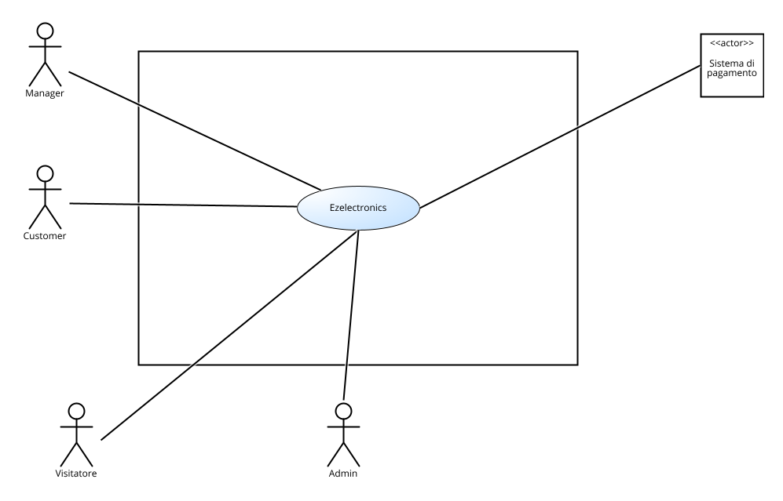
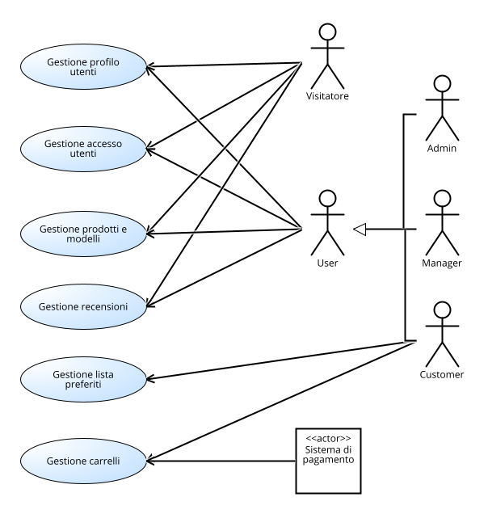
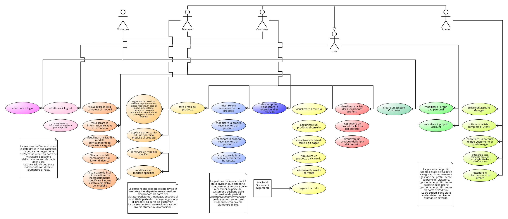
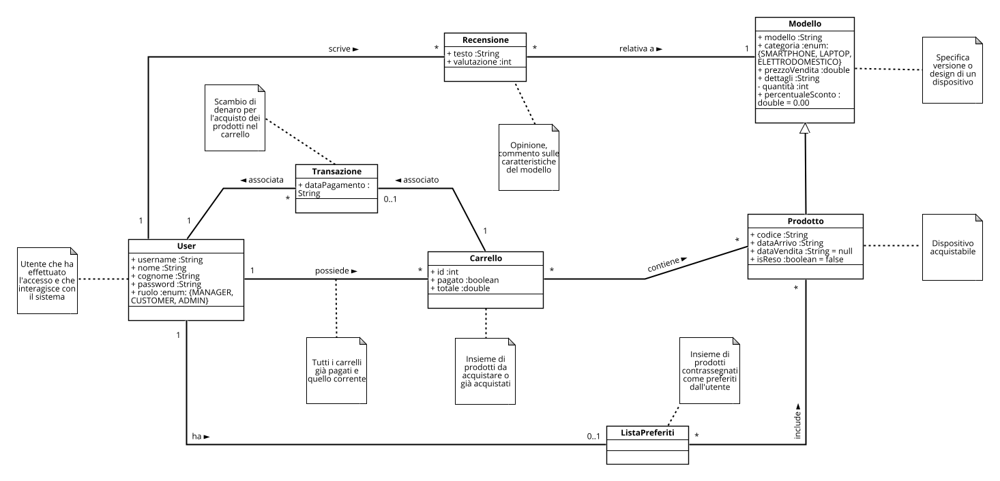
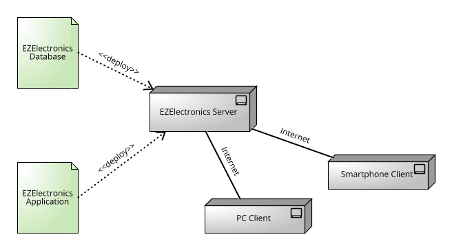

# Requirements Document - future EZElectronics

Date: 04/05/2024

Version: V2 - description of EZElectronics in FUTURE form (as proposed by the team)

| Version number | Change |
| :------------: | :----  |
| 2.1            | Inserimento requisiti funzionali                            |
| 2.2            | Inserimento stakeholders e table of rights                  |                       
| 2.3            | Inserimento requisiti non funzionali                        |
| 2.4            | Modifica #1 table of rights e inserimento use case diagram  |
| 2.5            | Modifica #2 table of rights e modifica #1 use case diagram  |
| 2.6            | Inserimento context diagram, interfaces, stories and personas |
| 2.7            | Inserimento use cases gestione lista preferiti              |
| 2.8            | Inserimento use cases gestione carrello                     |
| 2.9            | Inserimento use cases gestione accesso e profilo utenti     |
| 2.10           | Modifica #2 use case diagram e modifica #1 use cases gestione carrello |
| 2.11           | Modifica #1 context diagram e modifica #1 use cases gestione lista preferiti |
| 2.12           | Modifica #1 use cases gestione accesso e profilo utenti     |
| 2.13           | Inserimento glossario, system design e deployment diagram   |
| 2.14           | Modifica #3 table of rights e modifica #2 use case diagram  |
| 2.15           | Revisione finale documento dei requisiti                    |

# Contents

- [Requirements Document - future EZElectronics](#requirements-document---future-ezelectronics)
- [Contents](#contents)
- [Informal description](#informal-description)
- [Stakeholders](#stakeholders)
- [Context Diagram and interfaces](#context-diagram-and-interfaces)
  - [Context Diagram](#context-diagram)
  - [Interfaces](#interfaces)
- [Stories and personas](#stories-and-personas)
- [Functional and non functional requirements](#functional-and-non-functional-requirements)
  - [Functional Requirements](#functional-requirements)
  - [Non Functional Requirements](#non-functional-requirements)
- [Table of rights](#table-of-rights)
- [Use case diagram and use cases](#use-case-diagram-and-use-cases)
  - [Use case diagram (summary level)](#use-case-diagram-summary-level)
  - [Use case diagram](#use-case-diagram)
    - [Caso d'uso 1, Login](#caso-duso-1-login)
      - [Scenario 1.1](#scenario-11)
      - [Scenario 1.2](#scenario-12)
      - [Scenario 1.3](#scenario-13)
    - [Caso d'uso 2, Logout](#caso-duso-2-logout)
      - [Scenario 2.1](#scenario-21)
    - [Caso d'uso 3, Visualizzazione informazioni personali da parte di un utente](#caso-duso-3-visualizzazione-informazioni-personali-da-parte-di-un-utente)
      - [Scenario 3.1](#scenario-31)
    - [Caso d'uso 4, Creazione nuovo utente Customer](#caso-duso-4-creazione-nuovo-utente-customer)
      - [Scenario 4.1](#scenario-41)
      - [Scenario 4.2](#scenario-42)
      - [Scenario 4.3](#scenario-43)
      - [Scenario 4.4](#scenario-44)
    - [Caso d'uso 5, Creazione nuovo utente Manager](#caso-duso-5-creazione-nuovo-utente-manager)
      - [Scenario 5.1](#scenario-51)
      - [Scenario 5.2](#scenario-52)
      - [Scenario 5.3](#scenario-53)
      - [Scenario 5.4](#scenario-54)
    - [Caso d'uso 6, Cancellazione utente Customer o Manager da parte dell'Admin](#caso-duso-6-cancellazione-utente-customer-o-manager-da-parte-delladmin)
      - [Scenario 6.1](#scenario-61)
      - [Scenario 6.2](#scenario-62)
    - [Caso d'uso 7, Ottenimento lista di utenti registrati](#caso-duso-7-ottenimento-lista-di-utenti-registrati)
      - [Scenario 7.1](#scenario-71)
      - [Scenario 7.2](#scenario-72)
      - [Scenario 7.3](#scenario-73)
      - [Scenario 7.4](#scenario-74)
    - [Caso d'uso 8, Visualizzazione informazioni relative ad un utente da parte dell'Admin](#caso-duso-8-visualizzazione-informazioni-relative-ad-un-utente-da-parte-delladmin)
      - [Scenario 8.1](#scenario-81)
    - [Caso d'uso 9, Modifica dati personali](#caso-duso-9-modifica-dati-personali)
      - [Scenario 9.1](#scenario-91)
      - [Scenario 9.2](#scenario-92)
      - [Scenario 9.3](#scenario-93)
    - [Caso d'uso 10, Cancellazione account personale](#caso-duso-10-cancellazione-account-personale)
      - [Scenario 10.1](#scenario-101)
      - [Scenario 10.2](#scenario-102)
      - [Scenario 10.3](#scenario-103)
    - [Caso d'uso 11, Arrivo prodotti di uno stesso modello](#caso-duso-11-arrivo-prodotti-di-uno-stesso-modello)
      - [Scenario 11.1](#scenario-111)
      - [Scenario 11.2](#scenario-112)
      - [Scenario 11.3](#scenario-113)
    - [Caso d'uso 12, Inserimento sconto modello](#caso-duso-12-inserimento-sconto-modello)
      - [Scenario 12.1](#scenario-121)
      - [Scenario 12.2](#scenario-122)
      - [Scenario 12.3](#scenario-123)
    - [Caso d'uso 13, Modifica dati modello](#caso-duso-13-modifica-dati-modello)
      - [Scenario 13.1](#scenario-131)
      - [Scenario 13.2](#scenario-132)
    - [Caso d'uso 14, Ottenimento lista modelli](#caso-duso-14-ottenimento-lista-modelli)
      - [Scenario 14.1](#scenario-141)
      - [Scenario 14.2](#scenario-142)
      - [Scenario 14.3](#scenario-143)
    - [Caso d'uso 15, Ottenimento informazioni relative a un modello](#caso-duso-15-ottenimento-informazioni-relative-a-un-modello)
      - [Scenario 15.1](#scenario-151)
    - [Caso d'uso 16, Eliminazione modello](#caso-duso-16-eliminazione-modello)
      - [Scenario 16.1](#scenario-161)
    - [Caso d'uso 17, Reso prodotto](#caso-duso-17-reso-prodotto)
      - [Scenario 17.1](#scenario-171)
    - [Caso d'uso 18, Visualizzazione carrello](#caso-duso-18-visualizzazione-carrello)
      - [Scenario 18.1](#scenario-181)
      - [Scenario 18.2](#scenario-182)
    - [Caso d'uso 19, Aggiunta prodotto al carrello](#caso-duso-19-aggiunta-prodotto-al-carrello)
      - [Scenario 19.1](#scenario-191)
    - [Caso d'uso 20, Pagamento carrello](#caso-duso-20-pagamento-carrello)
      - [Scenario 20.1](#scenario-201)
      - [Scenario 20.2](#scenario-202)
      - [Scenario 20.3](#scenario-203)
      - [Scenario 20.4](#scenario-204)
    - [Caso d'uso 21, Visualizzazione lista carrelli già pagati](#caso-duso-21-visualizzazione-lista-carrelli-già-pagati)
      - [Scenario 21.1](#scenario-211)
      - [Scenario 21.2](#scenario-212)
    - [Caso d'uso 22, Rimozione prodotto dal carrello](#caso-duso-22-rimozione-prodotto-dal-carrello)
      - [Scenario 22.1](#scenario-221)
    - [Caso d'uso 23, Eliminazione carrello corrente](#caso-duso-23-eliminazione-carrello-corrente)
      - [Scenario 23.1](#scenario-231)
    - [Caso d'uso 24, Visualizzazione lista preferiti](#caso-duso-24-visualizzazione-lista-preferiti)
      - [Scenario 24.1](#scenario-241)
      - [Scenario 24.2](#scenario-242)
    - [Caso d'uso 25, Aggiunta prodotto alla lista dei preferiti](#caso-duso-25-aggiunta-prodotto-alla-lista-dei-preferiti)
    - [Scenario 25.1](#scenario-251)
    - [Caso d'uso 26, Rimozione prodotto dalla lista dei preferiti](#caso-duso-26-rimozione-prodotto-dalla-lista-dei-preferiti)
    - [Scenario 26.1](#scenario-261)
    - [Caso d'uso 27, Inserimento recensione](#caso-duso-27-inserimento-recensione)
      - [Scenario 27.1](#scenario-271)
      - [Scenario 27.2](#scenario-272)
      - [Scenario 27.3](#scenario-273)
    - [Caso d'uso 28, Modifica recensione](#caso-duso-28-modifica-recensione)
      - [Scenario 28.1](#scenario-281)
      - [Scenario 28.2](#scenario-282)
      - [Scenario 28.3](#scenario-283)
    - [Caso d'uso 29, Eliminazione recensione](#caso-duso-29-eliminazione-recensione)
      - [Scenario 29.1](#scenario-291)
    - [Caso d'uso 30, Visualizzazione elenco recensioni](#caso-duso-30-visualizzazione-elenco-recensioni)
      - [Scenario 30.1](#scenario-301)
      - [Scenario 30.2](#scenario-302)
    - [Caso d'uso 31, Visualizzazione elenco di recensioni lasciate](#caso-duso-31-visualizzazione-elenco-di-recensioni-lasciate)
      - [Scenario 31.1](#scenario-311)
      - [Scenario 31.2](#scenario-312)
- [Glossary](#glossary)
- [System Design](#system-design)
- [Deployment Diagram](#deployment-diagram)

# Informal description

EZElectronics (read EaSy Electronics) is a software application designed to help managers of electronics stores to manage their products and offer them to customers through a dedicated website. Managers can assess the available products, record new ones, and confirm purchases. Customers can see available products, add them to a cart and see the history of their past purchases.

# Stakeholders

| Stakeholder name     | Description |
| :--------------:     | :---------: |
| Customer             | Utente autenticato con ruolo Customer          |
| Manager              | Utente autenticato con ruolo Manager           | 
| Admin                | Utente autenticato con ruolo Admin             | 
| Visitatore           | Utilizzatore del sistema non autenticato       |
| Sistema di pagamento | Server abilitato alla gestione dei pagamenti   |

# Context Diagram and interfaces

## Context Diagram

## Interfaces

|   Actor    | Logical Interface | Physical Interface |
| :-------:  | :---------------: | :----------------: |
| Customer   | GUI Customer      |      PC/Smartphone            |
| Manager    | GUI Manager       |      PC/Smartphone            |
| Admin      | GUI Admin         |      PC/Smartphone            |
| Visitatore | GUI Visitatore    |      PC/Smartphone            |
| Sistema di pagamento| API      |      Internet                 |

# Stories and personas

**Persona 1 (Customer)**:  
Erika, 22 anni, è una studentessa di Ingegneria Informatica. Ha bisogno di comprare un nuovo laptop per poter seguire i suoi corsi universitari.  
Story:  
Erika esplora l'applicazione web e, nel momento in cui vede un laptop con le caratteristiche che sta cercando, lo aggiunge al carrello.  
Story:  
Erika ha appena terminato la ricerca per il suo nuovo laptop. Controlla allora l'intero carrello e rimuove tutti i laptop, tranne quello per lei migliore. Dopo di che, acquista il laptop.   
Story:  
Erika decide inoltre di modificare nome e cognome sul proprio account. Accede all'area personale e modifica le voci sopracitate.

**Persona 2 (Manager)**:  
Emanuele, 45 anni, è il manager di uno dei negozi di *EZElectronics*. Ha ricevuto una richiesta di informazioni, da parte di un cliente, riguardo alcuni prodotti appena arrivati in negozio.  
Story:  
Emanuele accede al suo account da manager. Una volta effettuato l'accesso, registra l'arrivo dei prodotti.  
Story:  
Attraverso l'applicazione web, Emanuele recupera le informazioni sul prodotto, riportandole al cliente.

**Persona 3 (Visitatore)**:  
Agnese, 56 anni, è la madre di un ragazzo giovane. Vuole fare un regalo di compleanno a suo figlio.  
Story:  
Agnese crea un nuovo account sull'applicazione web. Una volta creato il profilo, effettua il login con le sue credenziali per poter iniziare la ricerca del regalo.

**Persona 4 (Admin)**:  
Riccardo, 55 anni, è l'admin di un negozio di *EZElectronics*. Ha deciso di assumere un nuovo manager.  
Story:  
Riccardo accede al suo account da admin, crea un account per il manager appena assunto e fornisce lui le credenziali d'accesso.

**Persona 5 (Customer)**:  
Andrea, 26 anni, è un tecnico informatico. Vuole vedere quale tra i laptop disponibili può essere il più idoneo per le sue esigenze.  
Story:  
Andrea esplora l'applicazione web e aggiunge 4 laptop alla lista dei preferiti, per poi valutare quali tra questi possa essere per lui il migliore.  
Story:  
Durante la navigazione, Andrea si imbatte in un laptop che aveva comprato tempo fa e che non aveva soddisfatto le sue aspettative. Decide quindi di lasciare una recensione negativa.

**Persona 6 (Manager)**:  
Umberto, 40 anni, è il manager di un negozio di *EZElectronics*. Ha deciso di applicare uno sconto ad un determinato modello di smartphone.  
Story:  
Umberto ricerca la pagina del modello di smartphone di suo interesse e registra la percentuale di sconto.

# Functional and non functional requirements

## Functional Requirements

|  ID    | Description |
| :---   | :---------  |
|**FR1** |  **Gestione accesso utenti**                                              |
|  FR1.1 |  Il visitatore deve poter effettuare il login                             |
|  FR1.2 |  Lo user deve poter effettuare il logout                                  |
|  FR1.3 |  Lo user deve poter visualizzare le informazioni relative al proprio profilo |
|**FR2** |  **Gestione profilo utenti**                                              |
|  FR2.1 |  Il visitatore deve poter creare un account *Customer*                    |
|  FR2.2 |  L'admin deve poter creare un account *Manager*                           |
|  FR2.3 |  L'admin deve poter cancellare un account di tipo *Customer* o di tipo *Manager* |
|  FR2.4 |  L'admin deve poter ottenere la lista completa di utenti                  |
|  FR2.5 |  L'admin deve poter ottenere la lista completa di utenti corrispondenti ad uno specifico ruolo |
|  FR2.6 |  L'admin deve poter ottenere le informazioni di un utente                 |
|  FR2.7 |  Lo user deve poter modificare i propri dati personali                    |
|  FR2.8 |  Lo user deve poter cancellare il proprio account |
|**FR3** |  **Gestione prodotti e modelli**                                                    | 
|  FR3.1 |  Il manager deve poter registrare l'arrivo di un insieme di prodotti dello stesso modello. In caso di modello inesistente, questo verrà creato automaticamente insieme alla registrazione dei prodotti    |
|  FR3.2 |  Il manager deve poter applicare uno sconto ad uno specifico modello di prodotti |
|  FR3.3 |  Il manager deve poter modificare i dati di un modello specifico                    |
|  FR3.4 |  Il visitatore, il customer e il manager devono poter visualizzare la lista completa di modelli |
|  FR3.5 |  Il visitatore, il customer e il manager devono poter visualizzare le informazioni relative a un modello |
|  FR3.6 |  Il visitatore, il customer e il manager devono poter visualizzare la lista di modelli corrispondenti ad una certa categoria|
|  FR3.7 |  Il visitatore, il customer e il manager devono poter visualizzare la lista di modelli, senza necessariamente specificare il nome esatto (completo) del modello |
|  FR3.8 |  Il visitatore, il customer e il manager devono poter filtrare i modelli, combinando più fattori di ricerca|
|  FR3.9 |  Il manager deve poter eliminare un modello specifico                     |
|  FR3.10|  Il customer deve poter effettuare il reso di un prodotto                 |
|**FR4** |  **Gestione carrelli**                                                    |
|  FR4.1 |  Il customer deve poter visualizzare il carrello                          |
|  FR4.2 |  Il customer deve poter aggiungere un prodotto al carrello                |
|  FR4.3 |  Il customer deve poter pagare il carrello                                |
|  FR4.4 |  Il customer deve poter visualizzare la lista di carrelli già pagati      |
|  FR4.5 |  Il customer deve poter rimuovere un prodotto dal carrello                |
|  FR4.6 |  Il customer deve poter eliminare il carrello corrente                    |
|**FR5** |  **Gestione lista preferiti**                                             |
|  FR5.1 |  Il customer deve poter visualizzare la lista dei suoi prodotti preferiti |
|  FR5.2 |  Il customer deve poter aggiungere un prodotto alla lista dei preferiti   |
|  FR5.3 |  Il customer deve poter rimuovere un prodotto dalla lista dei preferiti   |
|**FR6** |  **Gestione recensioni**                                                  |
|  FR6.1 |  Il customer deve poter inserire una recensione per un modello            |
|  FR6.2 |  Il customer deve poter modificare la propria recensione su un modello    |
|  FR6.3 |  Il customer deve poter eliminare la propria recensione su un modello     |
|  FR6.4 |  Il customer, il manager e il visitatore devono poter visualizzare le recensioni di un modello |
|  FR6.5 |  Il customer deve poter visualizzare la lista delle recensioni che ha lasciato|

## Non Functional Requirements

|   ID    | Type (efficiency, reliability, ..) | Description | Refers to |
| :-----: | :--------------------------------: | :---------: | :-------: |
|  NFR1   | Affidabilità                       | L'uptime deve essere superiore al 99% |  All FR  |
|  NFR2   | Correttezza                        | La probabilità di fail di ciascuna funzionalità deve essere inferiore al 1%        | All FR  |
|  NFR3   | Efficienza                         | Tutte le funzionalità devono completarsi in un tempo inferiore a 0.5 secondi   | All FR  |          
|  NFR4   | Portabilità                        | L'applicazione web deve essere disponibile sui seguenti browser: Google Chrome, Microsoft Edge, Mozilla Firefox, Safari. Deve inoltre essere *responsive*, al fine di garantire una User Experience di qualità su tutti i dispositivi (PC, Smartphone) | All FR          |
|  NFR5   | Sicurezza                          | L'applicazione deve essere conforme al GDPR | All FR |
|  NFR6   | Usabilità                          | Il training time necessario al manager e all'admin per imparare ad utilizzare tutte le funzionalità dell'applicazione non deve essere superiore ai 30 minuti | All FR  | 

# Table of rights  

| Requisiti                                                                                                                                      | Customer | Manager | Admin | Visitatore |
| :---                                                                                                                                           | :------- | :---    | :---  | :---       | 
|  FR1.1: Il visitatore deve poter effettuare il login                                                                                           |          |         |       | X          |
|  FR1.2: Lo user deve poter effettuare il logout                                                                                                | X        | X       | X     |            |
|  FR1.3: Lo user deve poter visualizzare le informazioni relative al proprio profilo                                                            | X        | X       | X     |            |
|  FR2.1: Il visitatore deve poter creare un account *Customer*                                                                                  |          |         |       | X          |
|  FR2.2: L'admin deve poter creare un account *Manager*                                                                                         |          |         | X     |            |
|  FR2.3: L'admin deve poter cancellare un account di tipo *Customer* o di tipo *Manager*                                                        |          |         | X     |            |
|  FR2.4: L'admin deve poter ottenere la lista completa di utenti                                                                                |          |         | X     |            |
|  FR2.5: L'admin deve poter ottenere la lista completa di utenti corrispondenti ad uno specifico ruolo                                          |          |         | X     |            |
|  FR2.6: L'admin deve poter ottenere le informazioni di un utente                                                                               |          |         | X     |            |
|  FR2.7: Lo user deve poter modificare i propri dati personali                                                                                  | X        | X       | X     |            |
|  FR2.8: Lo user deve poter cancellare il proprio account                                                                                       | X        | X       | X     |            |
|  FR3.1: Il manager deve poter registrare l'arrivo di un insieme di prodotti dello stesso modello. In caso di modello inesistente, questo verrà creato automaticamente insieme alla registrazione dei prodotti                                               |          | X       |       |            |
|  FR3.2: Il manager deve poter applicare uno sconto ad uno specifico modello di prodotti                                                        |          | X       |       |            |
|  FR3.3: Il manager deve poter modificare un modello specifico                                                                                  |          | X       |       |            |
|  FR3.4: Il visitatore, il customer e il manager devono poter visualizzare la lista completa di modelli                                         | X        | X       |       | X          |
|  FR3.5: Il visitatore, il customer e il manager devono poter visualizzare le informazioni relative a un modello                                | X        | X       |       | X          |
|  FR3.6: Il visitatore, il customer e il manager devono poter visualizzare la lista di modelli corrispondenti ad una certa categoria            | X        | X       |       | X          |
|  FR3.7: Il visitatore, il customer e il manager devono poter visualizzare la lista di modelli, senza necessariamente specificare il nome esatto (completo) del modello | X         | X        |       | X          |
|  FR3.8: Il visitatore, il customer e il manager devono poter filtrare i modelli, combinando più fattori di ricerca                             | X        | X       |       | X          |
|  FR3.9: Il manager deve poter eliminare un modello specifico                                                                                   |          | X       |       |            |
|  FR3.10: Il customer deve poter effettuare il reso di un prodotto                                                                              | X        |         |       |            |
|  FR4.1: Il customer deve poter visualizzare il carrello                                                                                        | X        |         |       |            |
|  FR4.2: Il customer deve poter aggiungere un prodotto al carrello                                                                              | X        |         |       |            |
|  FR4.3: Il customer deve poter pagare il carrello                                                                                              | X        |         |       |            |
|  FR4.4: Il customer deve poter visualizzare la lista di carrelli già pagati                                                                    | X        |         |       |            |
|  FR4.5: Il customer deve poter rimuovere un prodotto dal carrello                                                                              | X        |         |       |            |
|  FR4.6: Il customer deve poter eliminare il carrello corrente                                                                                  | X        |         |       |            |
|  FR5.1: Il customer deve poter visualizzare la lista dei suoi prodotti preferiti                                                               | X        |         |       |            |
|  FR5.2: Il customer deve poter aggiungere un prodotto alla lista dei preferiti                                                                 | X        |         |       |            |
|  FR5.3: Il customer deve poter rimuovere un prodotto dalla lista dei preferiti                                                                 | X        |         |       |            |
|  FR6.1: Il customer deve poter inserire una recensione per un prodotto                                                                         | X        |         |       |            |
|  FR6.2: Il customer deve poter modificare la propria recensione su un prodotto                                                                 | X        |         |       |            |
|  FR6.3: Il customer deve poter eliminare la propria recensione su un prodotto                                                                  | X        |         |       |            |
|  FR6.4: Il customer, il manager e il visitatore devono poter visualizzare le recensioni di un modello                                          | X        | X       |       |  X         |
|  FR6.5: Il customer deve poter visualizzare la lista delle recensioni che ha lasciato                                                          | X        |         |       |            |

# Use case diagram and use cases

## Use case diagram (summary level)

## Use case diagram

### Caso d'uso 1, Login

| Actors Involved  | Visitatore                                                           |
| :--------------: | :------------------------------------------------------------------: |
|  Precondition    | Il visitatore non è autenticato                                      |
| Post condition   | L'utente è autenticato e può accedere al sistema                     |
| Nominal Scenario |                                 1.1                                  |
|     Variants     |                                                                      |
|    Exceptions    |                                 1.2, 1.3                             |

#### Scenario 1.1

|  Scenario 1.1  | Login con credenziali corrette                                                              |
| :------------: | :------------------------------------------------------------------------:                  |
|  Precondition  | Il visitatore non è autenticato                                                             |
| Post condition | L'utente è autenticato e può accedere al sistema                                            |
|     Step#      |                                Descrizione                                                  |
|       1        | Visitatore: chiede di accedere alla pagina di login                                         |
|       2        | Sistema: richiede l'inserimento di *username* e *password*                                  |
|       3        | Visitatore: inserisce *username* e *password*                                               |
|       4        | Sistema: verifica le credenziali e reindirizza l'utente autenticato alla schermata principale dell'applicazione |

#### Scenario 1.2

|  Scenario 1.2  | Login fallito                                                                           |
| :------------: | :------------------------------------------------------------------------:              |
|  Precondition  | Il visitatore non è autenticato                                                         |
| Post condition | Il visitatore non è autenticato e riceve un messaggio di errore                         |
|     Step#      |                                Descrizione                                              |
|       1        | Visitatore: chiede di accedere alla pagina di login                                     |
|       2        | Sistema: richiede l'inserimento di *username* e *password*                              |
|       3        | Visitatore: inserisce *username* e *password*                                           |
|       4        | Sistema: verifica le credenziali. Rileva che sono errate. Mostra un messaggio di errore relativo alle credenziali inserite |

#### Scenario 1.3

|  Scenario 1.3  | Credenziali mancanti                                                                    |
| :------------: | :------------------------------------------------------------------------:              |
|  Precondition  | Il visitatore non è autenticato                                                         |
| Post condition | Il visitatore non è autenticato e riceve un messaggio di errore                         |
|     Step#      |                                Descrizione                                              |
|       1        | Visitatore: omette uno o più campi tra *username* e *password*                          |
|       2        | Sistema: rileva uno o più campi vuoti                                                   |
|       3        | Sistema: mostra un messaggio di errore al visitatore                                    |

### Caso d'uso 2, Logout

| Actors Involved  | Manager, Customer, Admin (generalizzati come "User")             |
| :--------------: | :--------------------------------------------------------------: |
|  Precondition    | L'utente è autenticato                                           |
| Post condition   | L'utente non è più autenticato                                   |   
| Nominal Scenario |                                 2.1                              |
|     Variants     |                                                                  |
|     Exceptions   |                                                                  |

#### Scenario 2.1

|  Scenario 2.1  | Logout                                                                            |
| :------------: | :------------------------------------------------------------------------:        |
|  Precondition  | L'utente è autenticato                                                            |
| Post condition | L'utente non è più autenticato e non ha più accesso alle funzionalità del sistema |
|     Step#      |                                Descrizione                                        |
|       1        | User: seleziona l'opzione di logout                                               |
|       2        | Sistema: termina la sessione dell'utente e lo reindirizza alla schermata di login |

### Caso d'uso 3, Visualizzazione informazioni personali da parte di un utente

| Actors Involved  | Manager, Customer, Admin (generalizzati come "User")             |
| :--------------: | :--------------------------------------------------------------: |
|  Precondition    | L'utente è autenticato                                           |
| Post condition   | Le informazioni dell'utente sono visualizzate                    |
| Nominal Scenario |                                 3.1                              |
|     Variants     |                                                                  |
|     Exceptions   |                                                                  |

#### Scenario 3.1

|  Scenario 3.1  | Visualizzazione delle informazioni personali                                      |
| :------------: | :------------------------------------------------------------------------:        |
|  Precondition  | L'utente è autenticato                                                            |
| Post condition | L'utente visualizza le proprie informazioni personali                             |
|     Step#      |                                Descrizione                                        |
|       1        | User: chiede di accedere alla pagina relativa al profilo personale                |
|       2        | Sistema: mostra una schermata con le informazioni personali dell'utente           |

### Caso d'uso 4, Creazione nuovo utente Customer

| Actors Involved  | Visitatore                                                           |
| :--------------: | :------------------------------------------------------------------: |
|   Precondition   | Il visitatore non ha un account                                      |
|  Post condition  | L'account dell'utente *Customer* è correttamente creato (registrazione avvenuta con successo) |
| Nominal Scenario |                     4.1                                              |
|     Variants     |                                                                      |
|    Exceptions    |                     4.2, 4.3, 4.4                                    |

#### Scenario 4.1
|  Scenario 4.1  | Registrazione nuovo utente Customer                                        |
| :------------: | :------------------------------------------------------------------------: |
|  Precondition  | Il visitatore non ha un account                                            |
| Post condition | L'account dell'utente *Customer* è correttamente creato (registrazione avvenuta con successo)    |
|     Step#      |                                Descrizione                                 |
|       1        | Visitatore: chiede di accedere alla pagina di registrazione                |
|       2        | Sistema: richiede l'inserimento di *username*, *nome*, *cognome* e *password* |
|       3        | Visitatore: inserisce *username*, *nome*, *cognome* e *password*           |
|       4        | Sistema: legge *username*, *nome*, *cognome* e *password*. Crea un nuovo utente di ruolo *Customer* e memorizza le informazioni |

#### Scenario 4.2
|  Scenario 4.2  | Utente già registrato                                                      |
| :------------: | :------------------------------------------------------------------------: |
|  Precondition  | Il visitatore non ha un account                                            |
| Post condition | L'account dell'utente *Customer* non viene creato (registrazione fallita)  |
|     Step#      |                                Descrizione                                 |
|       1        | Visitatore: chiede di accedere alla pagina di registrazione                |
|       2        | Sistema: richiede l'inserimento di *username*, *nome*, *cognome* e *password* |
|       3        | Visitatore: inserisce *username*, *nome*, *cognome* e *password*           |
|       4        | Sistema: legge *username*, *nome*, *cognome* e *password*. Controlla se lo *username* è associato ad un utente già registrato. Lo *username* è già associato ad un utente. Mostra un messaggio di errore     |

#### Scenario 4.3
|  Scenario 4.3  | Dati mancanti in fase di registrazione                                     |
| :------------: | :------------------------------------------------------------------------: |
|  Precondition  | Il visitatore non ha un account                                            |
| Post condition | L'account dell'utente *Customer* non viene creato (registrazione fallita)  |
|     Step#      |                                Descrizione                                 |
|       1        | Visitatore: chiede di accedere alla pagina di registrazione                |
|       2        | Sistema: richiede l'inserimento di *username*, *nome*, *cognome* e *password* |
|       3        | Visitatore: omette uno o più campi fra *username*, *nome*, *cognome* e *password* |
|       4        | Sistema: legge *username*, *nome*, *cognome* e *password*. Rileva uno o più campi vuoti. Mostra un messaggio di errore           |

#### Scenario 4.4
|  Scenario 4.4  | Annullamento registrazione                                                 |
| :------------: | :------------------------------------------------------------------------: |
|  Precondition  | Il visitatore non ha un account                                            |
| Post condition | L'account dell'utente *Customer* non viene creato (registrazione fallita)  |
|     Step#      |                                Descrizione                                 |
|       1        | Visitatore: chiede di accedere alla pagina di registrazione                |
|       2        | Sistema: richiede l'inserimento di *username*, *nome*, *cognome* e *password* |
|       3        | Visitatore: decide di annullare l'operazione di registrazione              |
|       4        | Sistema: conferma l'annullamento dell'operazione di registrazione          |

### Caso d'uso 5, Creazione nuovo utente Manager

| Actors Involved  | Admin                                                                |
| :--------------: | :------------------------------------------------------------------: |
|   Precondition   | L'utente è autenticato e ha ruolo *Admin*                            |
|  Post condition  | L'account dell'utente *Manager* è correttamente creato (registrazione avvenuta con successo) |
| Nominal Scenario |                     5.1                                              |
|     Variants     |                                                                      |
|    Exceptions    |                     5.2, 5.3, 5.4                                    |

#### Scenario 5.1
|  Scenario 5.1  | Registrazione nuovo utente Manager                                         |
| :------------: | :------------------------------------------------------------------------: |
|  Precondition  | L'utente è autenticato e ha ruolo *Admin*                                  |
| Post condition | L'account dell'utente *Manager* è correttamente creato (registrazione avvenuta con successo)    |
|     Step#      |                                Descrizione                                 |
|       1        | Admin: chiede di accedere alla pagina di registrazione di nuovi utenti *Manager*        |
|       2        | Sistema: richiede l'inserimento di *username*, *nome*, *cognome* e *password* |
|       3        | Admin: inserisce *username*, *nome*, *cognome* e *password*                |
|       4        | Sistema: legge *username*, *nome*, *cognome* e *password*. Crea un nuovo utente di ruolo *Manager* e memorizza le informazioni  |

#### Scenario 5.2
|  Scenario 5.2  | Utente già registrato                                                      |
| :------------: | :------------------------------------------------------------------------: |
|  Precondition  | L'utente è autenticato e ha ruolo *Admin*                                  |
| Post condition | L'account dell'utente *Manager* non viene creato (registrazione fallita)   |
|     Step#      |                                Descrizione                                 |
|       1        | Admin: chiede di accedere alla pagina di registrazione di nuovi utenti *Manager*        |
|       2        | Sistema: richiede l'inserimento di *username*, *nome*, *cognome* e *password* |
|       3        | Admin: inserisce *username*, *nome*, *cognome* e *password*                |
|       4        | Sistema: legge *username*, *nome*, *cognome* e *password*. Controlla se lo *username* è associato ad un utente già registrato. Lo *username* è già associato ad un utente. Mostra un messaggio di errore     |

#### Scenario 5.3
|  Scenario 5.3  | Dati mancanti in fase di registrazione                                     |
| :------------: | :------------------------------------------------------------------------: |
|  Precondition  | L'utente è autenticato e ha ruolo *Admin*                                  |
| Post condition | L'account dell'utente *Manager* non viene creato (registrazione fallita)   |
|     Step#      |                                Descrizione                                 |
|       1        | Admin: chiede di accedere alla pagina di registrazione di nuovi utenti *Manager*        |
|       2        | Sistema: richiede l'inserimento di *username*, *nome*, *cognome* e *password* |
|       3        | Admin: omette uno o più campi fra *username*, *nome*, *cognome* e *password* |
|       4        | Sistema: legge *username*, *nome*, *cognome* e *password*. Rileva uno o più campi vuoti. Mostra un messaggio di errore |

#### Scenario 5.4
|  Scenario 5.4  | Annullamento registrazione                                                 |
| :------------: | :------------------------------------------------------------------------: |
|  Precondition  | L'utente è autenticato e ha ruolo *Admin*                                  |
| Post condition | L'account dell'utente *Manager* non viene creato (registrazione fallita)   |
|     Step#      |                                Descrizione                                 |
|       1        | Admin: chiede di accedere alla pagina di registrazione di nuovi utenti *Manager*        |
|       2        | Sistema: richiede l'inserimento di *username*, *nome*, *cognome* e *password* |
|       3        | Admin: decide di annullare l'operazione di registrazione                   |
|       4        | Sistema: conferma l'annullamento dell'operazione di registrazione          |

### Caso d'uso 6, Cancellazione utente Customer o Manager da parte dell'Admin

| Actors Involved  | Admin                                                                |
| :--------------: | :------------------------------------------------------------------: |
|   Precondition   | L'utente è autenticato e ha ruolo *Admin*                            |
|  Post condition  | L'account dell'utente è correttamente eliminato (cancellazione avvenuta con successo) |
| Nominal Scenario |                     6.1                                              |
|     Variants     |                                                                      |
|    Exceptions    |                     6.2                                              |

#### Scenario 6.1
|  Scenario 6.1  | Cancellazione di un utente                                                 |
| :------------: | :------------------------------------------------------------------------: |
|  Precondition  | L'utente è autenticato e ha ruolo *Admin*                                  |
| Post condition | L'account dell'utente è correttamente eliminato (cancellazione avvenuta con successo) |
|     Step#      |                                Descrizione                                 |
|       1        | Admin: chiede di cancellare un utente                                      |
|       2        | Sistema: mostra una finestra di dialogo per chiedere conferma riguardo la cancellazione dell'utente selezionato |
|       3        | Admin: conferma la sua intenzione di cancellare l'utente selezionato       |
|       4        | Sistema: cancella l'utente selezionato                                     |

#### Scenario 6.2
|  Scenario 6.2  | Annullamento cancellazione utente                                          |
| :------------: | :------------------------------------------------------------------------: |
|  Precondition  | L'utente è autenticato e ha ruolo *Admin*                                  |
| Post condition | L'account dell'utente non viene eliminato (cancellazione fallita)          |
|     Step#      |                                Descrizione                                 |
|       1        | Admin: chiede di cancellare un utente                                      |
|       2        | Sistema: mostra una finestra di dialogo per chiedere conferma riguardo la cancellazione dell'utente selezionato |
|       3        | Admin: decide di annullare l'operazione di cancellazione                   |
|       4        | Sistema: conferma l'annullamento dell'operazione di cancellazione          |

### Caso d'uso 7, Ottenimento lista di utenti registrati
| Actors Involved  | Admin                                                                |
| :--------------: | :------------------------------------------------------------------: |
|   Precondition   | L'utente è autenticato e ha ruolo *Admin*                            |
|  Post condition  | La lista di utenti registrati (tutti gli utenti, utenti con uno specifico ruolo o singolo utente dato il suo username) è mostrata |
| Nominal Scenario | 7.1                                                                  |
|     Variants     | 7.2, 7.3                                                             |
|    Exceptions    | 7.4                                                                  |

#### Scenario 7.1
|  Scenario 7.1  | Ottenimento lista completa utenti registrati                               |
| :------------: | :------------------------------------------------------------------------: |
|  Precondition  | L'utente è autenticato e ha ruolo *Admin*                                  |
| Post condition | La lista di tutti gli utenti registrati è mostrata                         |      
|     Step#      |                                Descrizione                                 |
|       1        | Admin: chiede di visualizzare la lista di tutti gli utenti registrati      |
|       2        | Sistema: mostra la lista completa di tutti gli utenti registrati           |

#### Scenario 7.2
|  Scenario 7.2  | Ottenimento lista completa utenti registrati corrispondenti ad uno specifico ruolo |
| :------------: | :------------------------------------------------------------------------: |
|  Precondition  | L'utente è autenticato e ha ruolo *Admin*                                  |
| Post condition | La lista di tutti gli utenti registrati corrispondenti ad uno specifico ruolo è mostrata |      
|     Step#      |                                Descrizione                                 |
|       1        | Admin: chiede di visualizzare la lista di tutti gli utenti registrati con uno specifico ruolo  |
|       2        | Sistema: mostra la lista di utenti corrispondenti allo specifico ruolo richiesto         |

#### Scenario 7.3
|  Scenario 7.3  | Ottenimento utente registrato con un dato username |
| :------------: | :------------------------------------------------------------------------: |
|  Precondition  | L'utente è autenticato e ha ruolo *Admin*                                  |
| Post condition | L'utente con uno specifico username viene mostrato                         |      
|     Step#      |                                Descrizione                                 |
|       1        | Admin: chiede di visualizzare l'utente con uno specifico username          |
|       2        | Sistema: mostra l'utente con lo username indicato                          |

Nota: non deve essere necessario specificare lo username esatto, basta che una parte dello username corrisponda a ciò che viene specificato dall'admin.

#### Scenario 7.4
|  Scenario 7.4  | Nessun utente corrispondente alla ricerca                                  |
| :------------: | :------------------------------------------------------------------------: |
|  Precondition  | L'utente è autenticato e ha ruolo *Admin*                                  |
| Post condition | Non è mostrato alcun risultato                                             |      
|     Step#      |                                Descrizione                                 |
|       1        | Admin: chiede di visualizzare l'utente o la lista di tutti gli utenti corrispondenti ad un dato criterio di ricerca          |
|       2        | Sistema: verifica che nessun utente soddisfa il criterio di ricerca desiderato. Mostra un messaggio informativo      |

### Caso d'uso 8, Visualizzazione informazioni relative ad un utente da parte dell'Admin
| Actors Involved  | Admin                                                                |
| :--------------: | :------------------------------------------------------------------: |
|   Precondition   | L'utente è autenticato e ha ruolo *Admin*                            |
|  Post condition  | Le informazioni relative all'utente desiderato sono mostrate         |
| Nominal Scenario | 8.1                                                                  |
|     Variants     |                                                                      |
|    Exceptions    |                                                             |

#### Scenario 8.1
|  Scenario 8.1  | Visualizzazione informazioni relative ad un utente                         |
| :------------: | :------------------------------------------------------------------------: |
|  Precondition  | L'utente è autenticato e ha ruolo *Admin*                                  |
| Post condition | Le informazioni relative all'utente desiderato sono mostrate               |
|     Step#      |                                Descrizione                                 |
|       1        | Admin: chiede di visualizzare le informazioni relative ad un utente        |
|       2        | Sistema: mostra *username*, *nome*, *cognome* e *ruolo* dell'utente desiderato |

### Caso d'uso 9, Modifica dati personali
| Actors Involved  | Customer, Manager o Admin (generalizzati come "User")                |
| :--------------: | :------------------------------------------------------------------: |
|   Precondition   | L'utente è autenticato                                               |
|  Post condition  | Le modifiche richieste dall'utente sono correttamente effettuate     |
| Nominal Scenario | 9.1                                                                 |
|     Variants     |                                                                      |
|    Exceptions    | 9.2, 9.3                                                                 |

#### Scenario 9.1
|  Scenario 9.1 | Modifiche dati personali avvenute con successo                             |
| :------------: | :------------------------------------------------------------------------: |
|  Precondition  | L'utente è autenticato                                                     |
| Post condition | Le modifiche richieste dall'utente sono correttamente effettuate           |
|     Step#      |                                Descrizione                                 |
|       1        | User: chiede di modificare i propri dati personali                         |
|       2        | Sistema: mostra i dati personali dell'utente                               |
|       3        | User: modifica i dati personali desiderati (*nome*, *cognome* e *password*)|
|       4        | Sistema: verifica i nuovi dati inseriti e aggiorna l'account dell'utente con le informazioni modificate |

#### Scenario 9.2
|  Scenario 9.2 | Tentativo di modifica dati personali con campi vuoti                       |
| :------------: | :------------------------------------------------------------------------: |
|  Precondition  | L'utente è autenticato                                                     |
| Post condition | Le modifiche richieste dall'utente non sono effettuate                     |
|     Step#      |                                Descrizione                                 |
|       1        | User: chiede di modificare i propri dati personali                         |
|       2        | Sistema: mostra i dati personali dell'utente                               |
|       3        | User: cancella il contenuto di uno o più campi fra *nome*, *cognome* e *password*       |
|       4        | Sistema: rileva uno o più campi vuoti. Mostra un messaggio di errore       |

#### Scenario 9.3
|  Scenario 9.3 | Annullamento modifiche dati personali                                      |
| :------------: | :------------------------------------------------------------------------: |
|  Precondition  | L'utente è autenticato                                                     |
| Post condition | Le modifiche richieste dall'utente non sono effettuate                     |
|     Step#      |                                Descrizione                                 |
|       1        | User: chiede di modificare i propri dati personali                         |
|       2        | Sistema: mostra i dati personali dell'utente                               |
|       3        | User: chiede l'annullamento delle modifiche fatte                          |
|       4        | Sistema: conferma l'annullamento delle modifiche                           |

### Caso d'uso 10, Cancellazione account personale
| Actors Involved  | Customer, Manager o Admin (generalizzati come "User")                |
| :--------------: | :------------------------------------------------------------------: |
|   Precondition   | L'utente è autenticato e ha ruolo *Customer*, *Manager* oppure *Admin*        |
|  Post condition  | L'account dell'utente è correttamente eliminato (cancellazione avvenuta con successo) |
| Nominal Scenario | 10.1                                                                 |
|     Variants     |    10.3                                                              |
|    Exceptions    | 10.2                                                                 |

#### Scenario 10.1
|  Scenario 10.1 | Cancellazione account personale avvenuta con successo                      |
| :------------: | :------------------------------------------------------------------------: |
|  Precondition  | L'utente è autenticato e ha ruolo *Customer*, *Manager* oppure *Admin*     |
| Post condition | L'account dell'utente è correttamente eliminato (cancellazione avvenuta con successo)        |
|     Step#      |                                Descrizione                                 |
|       1        | User: chiede di cancellare il proprio account                              |
|       2        | Sistema: richiede l'inserimento della *password* dell'account              |
|       3        | User: inserisce la *password* dell'utente dell'account e conferma          |
|       4        | Sistema: legge la *password* inserita. Cancella l'account dell'utente      |

#### Scenario 10.2
|  Scenario 10.2 | Cancellazione account personale fallita                                    |
| :------------: | :------------------------------------------------------------------------: |
|  Precondition  | L'utente è autenticato e ha ruolo *Customer*, *Manager* oppure *Admin*     |
| Post condition | L'account dell'utente non è eliminato (cancellazione fallita)              |
|     Step#      |                                Descrizione                                 |
|       1        | User: chiede di cancellare il proprio account                  |
|       2        | Sistema: richiede l'inserimento della *password* dell'account              |
|       3        | User: inserisce la *password* dell'utente dell'account e conferma        |
|       4        | Sistema: legge la *password* inserita. Verifica che la *password* corrisponda a quella associata all'account dell'utente. La *password* non corrisponde. Mostra un messaggio di errore           |

#### Scenario 10.3
|  Scenario 10.3 | Cancellazione account personale avvenuta con successo                      |
| :------------: | :------------------------------------------------------------------------: |
|  Precondition  | L'utente è autenticato e ha ruolo *Customer*, *Manager* oppure *Admin*     |
| Post condition | L'account dell'utente è correttamente eliminato (cancellazione avvenuta con successo)        |
|     Step#      |                                Descrizione                                 |
|       1        | User: chiede di cancellare il proprio account                  |
|       2        | Sistema: richiede l'inserimento della *password* dell'account              |
|       3        | User: annulla l'operazione        |
|       4        | Sistema: riporta alla schermata precedente      |

### Caso d'uso 11, Arrivo prodotti di uno stesso modello

| Actors Involved  | Manager |
| :--------------: | :------------------------------------------------------------------: |
|   Precondition   | L'utente è autenticato e ha ruolo *Manager* |
|  Post condition  | L'arrivo dei prodotti è registrato   |
| Nominal Scenario | 11.1 |
|     Variants     | 11.2 |
|    Exceptions    | 11.3 |

#### Scenario 11.1

|Scenario 11.1| Registrazione arrivo prodotti dello stesso modello|
|:----------:|:---------------------------:|
|Precondition|L'utente è autenticato e ha ruolo *Manager*. Il modello del prodotto è esistente|
|Postcondition|L'arrivo dei prodotti è registrato|
|Step#|Descrizione|
|1|Manager: chiede di registrare l'arrivo di prodotti dello stesso modello|
|2|Sistema: chiede di inserire *modello*, *quantità*, *categoria*, *prezzo di vendita*, *dettagli* (descrizione modello opzionale) e *data di arrivo* (opzionale) |
|3|Manager: inserisce *modello*, *quantità*, *categoria*, *prezzo di vendita*, *dettagli* (descrizione modello opzionale) e *data di arrivo* (opzionale) |
|4|Sistema: registra l'arrivo dei prodotti|

Nota: all'inserimento del modello già esistente, i campi *categoria*, *prezzo di vendita* e *dettagli* vengono compilati con *categoria*, *prezzo di vendita* e *dettagli* del modello esistente.

#### Scenario 11.2

|Scenario 11.2| Registrazione arrivo prodotti di un modello non esistente|
|:----------:|:---------------------------:|
|Precondition|L'utente è autenticato e ha ruolo *Manager*. Il modello del prodotto non è esistente|
|Postcondition|L'arrivo dei prodotti è registrato|
|Step#|Descrizione|
|1|Manager: chiede di registrare l'arrivo di prodotti dello stesso modello|
|2|Sistema: chiede di inserire *modello*, *quantità*, *categoria*, *prezzo di vendita*, *dettagli* (descrizione modello opzionale) e *data di arrivo* (opzionale) |
|3|Manager: inserisce *modello*, *quantità*, *categoria*, *prezzo di vendita*, *dettagli* (descrizione modello opzionale) e *data di arrivo* (opzionale) |
|4|Sistema: registra l'arrivo dei prodotti e il nuovo modello|

#### Scenario 11.3

|Scenario 11.3| Dati mancanti in fase di registrazione arrivo prodotti |
|:----------:|:---------------------------:|
|Precondition|L'utente è autenticato e ha ruolo *Manager*. Il modello del prodotto non è esistente|
|Postcondition|L'arrivo dei prodotti non è registrato|
|Step#|Descrizione|
|1|Manager: chiede di registrare l'arrivo di prodotti dello stesso modello|
|2|Sistema: chiede di inserire il *modello*, *quantità*, *categoria*, *prezzo di vendita*, *dettagli* (descrizione modello opzionale) e *data di arrivo* (opzionale) |
|3|Manager: omette uno o più campi tra *modello*, *quantità*, *categoria* e *prezzo di vendita* |
|4|Sistema: verifica che uno dei campi è vuoto e invia un messaggio di errore|

### Caso d'uso 12, Inserimento sconto modello

|Actors involved|Manager|
|:-:|:-:|
|Precondition|L'utente è autenticato e ha ruolo *Manager*|
|Postcondition|Lo sconto è applicato sul modello|
|Nominal scenario|12.1|
|Variants||
|Exceptions|12.2|

#### Scenario 12.1

|Scenario 12.1|Registrazione sconto modello|
|:-:|:-:|
|Precondition|L'utente è autenticato e ha ruolo *Manager*|
|Postcondition|Lo sconto applicato al modello è registrato|
|Step#|Descrizione|
|1|Manager: chiede di inserire uno sconto per uno specifico modello|
|2|Sistema: chiede qual è la percentuale di sconto da applicare|
|3|Manager: inserisce la percentuale di sconto da applicare|
|4|Sistema: registra la percentuale di sconto da applicare|

#### Scenario 12.2

|Scenario 12.2|Sconto non valido|
|:-:|:-:|
|Precondition|L'utente è autenticato e ha ruolo *Manager*|
|Postcondition|Lo sconto applicato al modello non è registrato |
|Step#|Descrizione|
|1|Manager: chiede di inserire lo sconto per uno specifico modello|
|2|Sistema: chiede qual è la percentuale di sconto da applicare|
|3|Manager: inserisce una percentuale di sconto minore di 0 o maggiore di 100|
|4|Sistema: verifica che la percentuale di sconto inserita è minore di 0 oppure maggiore di 100. Restituisce un messaggio d'errore|

#### Scenario 12.3

|Scenario 12.3|Annullamento sconto|
|:-:|:-:|
|Precondition|L'utente è autenticato e ha ruolo *Manager*|
|Postcondition|Lo sconto applicato al modello non è registrato|
|Step#|Descrizione|
|1|Manager: chiede di inserire lo sconto per uno specifico modello|
|2|Sistema: chiede qual è la percentuale di sconto da applicare|
|3|Manager: annulla l'applicazione dello sconto|
|4|Sistema: termina la procedura di applicazione dello sconto |

### Caso d'uso 13, Modifica dati modello

| Actors Involved  | Manager |
| :--------------: | :------------------------------------------------------------------: |
|   Precondition   | L'utente è autenticato e ha ruolo *Manager* |
|  Post condition  | Il modello viene modificato  |
| Nominal Scenario | 13.1 |
|     Variants     |  |
|    Exceptions    | 13.2 |

#### Scenario 13.1

|Scenario 13.1|Modifica dati modello|
:-:|:-:|
|Precondition|L'utente è autenticato e ha ruolo *Manager* |
|  Post condition  | Il modello viene modificato  |
|     Step#      |                                Descrizione                                 |
|1|Manager: chiede di modificare uno specifico modello|
|2|Sistema: mostra i campi modificabili *modello*, *quantità*, *categoria*, *prezzo di vendita*, *dettagli* (descrizione modello opzionale)|
|3|Manager: modifica almeno uno tra i campi *modello*, *quantità*, *categoria*, *prezzo di vendita*, *dettagli* (descrizione modello opzionale)|
|4|Sistema: legge *modello*, *quantità*, *categoria*, *prezzo di vendita*, *dettagli* (descrizione modello opzionale). Registra le modifiche|

#### Scenario 13.2

|Scenario 13.2|Dati mancanti in fase di modifica |
:-:|:-:|
|Precondition|L'utente è autenticato e ha ruolo *Manager* |
|  Post condition  | Il modello non viene modificato  |
|     Step#      |                                Descrizione                                 |
|1|Manager: chiede di modificare uno specifico modello|
|2|Sistema: mostra i campi modificabili *modello*, *quantità*, *categoria*, *prezzo di vendita*, *dettagli* (descrizione modello opzionale)|
|3|Manager: omette uno o più campi tra *modello*, *quantità*, *categoria*, *prezzo di vendita* |
|4|Sistema: legge *modello*, *quantità*, *categoria*, *prezzo di vendita*, *dettagli* (descrizione modello opzionale). Rileva che uno o più campi sono vuoti. Mostra un messaggio di errore. |

### Caso d'uso 14, Ottenimento lista modelli

| Actors Involved  | Visitatore, Manager, Customer |
| :--------------: | :------------------------------------------------------------------: |
|   Precondition   | L'utente è autenticato e ha ruolo *Customer* o *Manager* oppure è un visitatore |
|  Post condition  | La lista dei modelli viene mostrata (tutti i modelli, i modelli appartenenti a una certa categoria oppure il singolo modello, ricercandolo per nome)  |
| Nominal Scenario | 14.1 |
|     Variants     | 14.2|
|    Exceptions    | 14.3|

#### Scenario 14.1

|Scenario 14.1|Ottenimento lista di tutti i modelli|
|:----------:|:---------------------------:|
|Precondition|L'utente è autenticato e ha ruolo *Customer* o *Manager* oppure è un visitatore |
|Postcondition|La lista completa dei modelli viene mostrata|
|Step#|Descrizione|
|1|Customer/Manager/Visitatore: chiede di visualizzare la lista di tutti i modelli|
|2|Sistema: mostra la lista completa dei modelli|

#### Scenario 14.2

|Scenario 14.2|Ottenimento lista modelli con filtri|
|:----------:|:---------------------------:|
|Precondition|L'utente è autenticato e ha ruolo *Customer* o *Manager* oppure è un visitatore |
|Postcondition|La lista dei modelli richiesta viene mostrata|
|Step#|Descrizione|
|1|Customer/Manager/Visitatore: chiede di visualizzare i modelli, specificando una o più criteri tra *categoria*, *modello* |
|2|Sistema: mostra la lista dei modelli corrispondenti ai filtri applicati|

*Nota*: non deve essere necessario specificare il nome esatto del modello, basta che una parte del nome corrisponda a ciò che viene specificato dall'utente autenticato o dal visitatore.

#### Scenario 14.3

|Scenario 14.3|Nessun modello corrispondente alla ricerca |
|:----------:|:---------------------------:|
|Precondition|L'utente è autenticato e ha ruolo *Customer* o *Manager* oppure è un visitatore|
|Postcondition|Nessun modello corrisponde alla ricerca |
|Step#|Descrizione|
|1|Customer/Manager/Visitatore: chiede di visualizzare la lista dei modelli corrispondenti a determinati criteri |
|2|Sistema: verifica che non esistono modelli che soddisfano i filtri indicati. Ritorna un messaggio di errore|

### Caso d'uso 15, Ottenimento informazioni relative a un modello

| Actors Involved  | Visitatore, Manager, Customer |
| :--------------: | :------------------------------------------------------------------: |
|   Precondition   | L'utente è autenticato e ha ruolo *Customer* o *Manager* oppure è un visitatore |
|  Post condition  | Le informazioni del modello sono mostrate |
| Nominal Scenario | 15.1 |
|     Variants     ||
|    Exceptions    ||

#### Scenario 15.1

|Scenario 15.1|Ottenimento informazioni modello|
|:----------:|:---------------------------:|
|Precondition|L'utente è autenticato e ha ruolo *Customer* o *Manager* oppure è un visitatore|
|Postcondition|Le informazioni del prodotto sono mostrate|
|Step#|Descrizione|
|1|Customer/Manager/Visitatore: chiede di visualizzare le informazioni di uno specifico modello |
|2|Sistema: mostra le informazioni dello specifico modello |

### Caso d'uso 16, Eliminazione modello

| Actors Involved  | Manager |
| :--------------: | :------------------------------------------------------------------: |
|   Precondition   | L'utente è autenticato e ha ruolo *Manager* |
|  Post condition  | Il modello selezionato viene eliminato |
| Nominal Scenario | 16.1 |
|     Variants     | |
|    Exceptions    ||

#### Scenario 16.1

|Scenario 16.1|Eliminazione modello |
|:----------:|:---------------------------:|
|Precondition|L'utente è autenticato e ha ruolo *Manager* |
|Postcondition|Il modello selezionato è eliminato|
|Step#|Descrizione|
|1|Manager: chiede di eliminare un modello |
|2|Sistema: elimina il modello specificato| 

### Caso d'uso 17, Reso prodotto

| Actors Involved  | Customer, Manager o Admin, Sistema di pagamento|
| :--------------: | :------------------------------------------------------------------: |
|   Precondition   | Un'utente è autenticato e ha ruolo *Manager* o *Admin*. Un altro utente è autenticato e ha ruolo *Customer* |
|  Post condition  | Il prodotto viene restituito e il rimborso viene emesso|
| Nominal Scenario | 17.1 |
|     Variants     ||
|    Exceptions    | |

#### Scenario 17.1

|Scenario 17.1|Reso di un prodotto|
|:----------:|:---------------------------:|
|Precondition| Un utente è autenticato e ha ruolo *Manager* o *Admin*. Un altro utente è autenticato e ha ruolo *Customer* |
|Postcondition| Il prodotto viene restituito e il rimborso viene emesso|
|Step#|Descrizione|
|1|Customer: chiede il rimborso per uno specifico prodotto|
|2|Sistema: indica il punto di ritiro più vicino|

### Caso d'uso 18, Visualizzazione carrello

| Actors Involved  | Customer |
| :--------------: | :------------------------------------------------------------------: |
|   Precondition   | L'utente è autenticato e ha ruolo *Customer* |
|  Post condition  | Il carrello corrente viene mostrato |
| Nominal Scenario | 18.1 |
|     Variants     | 18.2 |
|    Exceptions    ||  

#### Scenario 18.1

|Scenario 18.1| Visualizzazione carrello |
|:----------:|:---------------------------:|
|Precondition| L'utente è autenticato e ha ruolo *Customer*. Il carrello non è vuoto |
|Postcondition| Il carrello corrente viene mostrato |
|Step#|Descrizione|
|1|Customer: chiede di visualizzare il carrello |
|2|Sistema: mostra il carrello corrente |

#### Scenario 18.2

|Scenario 18.2| Visualizzazione carrello vuoto| 
|:----------:|:---------------------------:|
|Precondition| L'utente è autenticato e ha ruolo *Customer*. Il carrello è vuoto |
|Postcondition| Il carrello corrente vuoto viene mostrato |
|Step#|Descrizione|
|1|Customer: chiede di visualizzare il carrello |
|2|Sistema: mostra il carrello vuoto |

### Caso d'uso 19, Aggiunta prodotto al carrello

| Actors Involved  | Customer|
| :--------------: | :------------------------------------------------------------------: |
|   Precondition   | L'utente è autenticato e ha ruolo *Customer* |
|  Post condition  | Il prodotto selezionato viene aggiunto al carrello |
| Nominal Scenario | 19.1 |
|     Variants     | |
|    Exceptions    | |

#### Scenario 19.1

|Scenario 19.1| Aggiunta di un prodotto al carrello |
|:----------:|:---------------------------:|
|Precondition| L'utente è autenticato e ha ruolo *Customer* |
|Postcondition| Il prodotto selezionato viene aggiunto al carrello | 
|Step#| Descrizione |
|1|Customer: chiede di inserire il prodotto selezionato nel carrello |
|2|Sistema: inserisce il prodotto nel carrello |

### Caso d'uso 20, Pagamento carrello

| Actors Involved  | Customer, Sistema di pagamento|
| :--------------: | :------------------------------------------------------------------: |
|   Precondition   | L'utente è autenticato e ha ruolo *Customer* |
|  Post condition  | Il carrello viene pagato |
| Nominal Scenario | 20.1 |
|     Variants     | |
|    Exceptions    | 20.2, 20.3, 20.4|

#### Scenario 20.1

|Scenario 20.1| Pagamento carrello |
|:----------:|:---------------------------:|
|Precondition| L'utente è autenticato e ha ruolo *Customer*. Il carrello non è vuoto |
|Postcondition| Il carrello viene pagato |
|Step#|Descrizione|
|1|Customer: accede alla pagina del carrello e chiede di pagarlo |
|2|Sistema: richiede l'inserimento dei seguenti campi: *numero di carta*, *nome e cognome intestatario*, *data scadenza*, *cvv* |
|3|Customer: inserisce i dati *numero di carta*, *nome e cognome intestatario*, *data scadenza*, *cvv*. Conferma l'acquisto|
|4|Sistema: invia i dati inseriti al Sistema di pagamento|
|5|Sistema di pagamento: gestisce la transazione e notifica il sistema quando questa è stata compiuta|
|6|Sistema: contrassegna i prodotti del carrello come venduti| 

#### Scenario 20.2

|Scenario 20.2| Pagamento carrello con prodotto non più disponibile |
|:----------:|:---------------------------:|
|Precondition| L'utente è autenticato e ha ruolo *Customer*, il carrello non è vuoto, uno o più prodotti non sono disponibili |
|Postcondition| Il carrello non viene pagato |
|Step#|Descrizione|
|1|Customer: accede alla pagina del carrello |
|2|Sistema: mostra che il carrello non è più acquistabile e indica quali prodotti non sono più disponibili|

#### Scenario 20.3

|Scenario 20.3| Annullamento pagamento carrello |
|:----------:|:---------------------------:|
|Precondition| L'utente è autenticato e ha ruolo *Customer* |
|Postcondition| Il carrello non viene pagato |
|Step#|Descrizione|
|1|Customer: accede alla pagina del carrello e chiede di pagarlo |
|2|Sistema: richiede l'inserimento dei seguenti campi: *numero di carta*, *nome e cognome intestatario*, *data scadenza*, *cvv* |
|3|Customer:  annulla l'operazione di acquisto del carrello|
|4|Sistema: annulla il pagamento |

#### Scenario 20.4

|Scenario 20.4| pagamento non riuscito|
|:-:|:-:|
|Precondition| L'utente è autenticato e ha ruolo *Customer* |
|Postcondition| Il carrello non viene pagato |
|Step#|Descrizione|
|1|Customer: accede alla pagina del carrello e chiede di pagarlo |
|2|Sistema: richiede l'inserimento dei seguenti campi: *numero di carta*, *nome e cognome intestatario*, *data scadenza*, *cvv* |
|3|Customer: inserisce i dati *numero di carta*, *nome e cognome intestatario*, *data scadenza*, *cvv*. Conferma l'acquisto|
|4|Sistema: invia i dati inseriti al Sistema di pagamento|
|5|Sistema di pagamento: gestisce la transazione, che non va a buon fine per qualche motivo (i.e. credito residuo insufficiente). Invia un messaggio di errore al sistema|
|6|Sistema: annulla il pagamento|

### Caso d'uso 21, Visualizzazione lista carrelli già pagati

| Actors Involved  | Customer|
| :--------------: | :------------------------------------------------------------------: |
|   Precondition   | L'utente è autenticato e ha ruolo *Customer* |
|  Post condition  | La lista di carrelli già pagati viene mostrata |
| Nominal Scenario | 21.1 |
|     Variants     | 21.2 |
|    Exceptions    ||

#### Scenario 21.1

|Scenario 21.1| Visualizzazione lista di carrelli già pagati |
|:----------:|:---------------------------:|
|Precondition|L'utente è autenticato e ha ruolo *Customer* |
|Postcondition|I carrelli già pagati vengono mostrati|
|Step#|Descrizione|
|1|Customer: chiede di visualizzare la lista di carrelli già pagati|
|2|Sistema: mostra la lista di carrelli già pagati|

#### Scenario 21.2

|Scenario 21.2| Visualizzazione lista di carrelli già pagati vuota |
|:----------:|:---------------------------:|
|Precondition| L'utente è autenticato e ha ruolo *Customer* |
|Postcondition| Viene mostrata una lista vuota |
|Step#|Descrizione|
|1|Customer: chiede di visualizzare la lista di carrelli già pagati |
|2|Sistema: mostra che la lista di carrelli già pagati è vuota | 

### Caso d'uso 22, Rimozione prodotto dal carrello

| Actors Involved  | Customer|
| :--------------: | :------------------------------------------------------------------: |
|   Precondition   | L'utente è autenticato e ha ruolo *Customer* |
|  Post condition  | Il prodotto selezionato viene rimosso dal carrello |
| Nominal Scenario | 22.1 |
|     Variants     | |
|    Exceptions    | |

#### Scenario 22.1

|Scenario 22.1| Rimozione di un prodotto dal carrello |
|:----------:|:---------------------------:|
|Precondition| L'utente è autenticato e ha ruolo *Customer* |
|Postcondition| Il prodotto selezionato viene rimosso dal carrello | 
|Step#|Descrizione|
|1|Customer: chiede di rimuovere il prodotto selezionato dal carrello |
|2|Sistema: rimuove il prodotto dal carrello |

### Caso d'uso 23, Eliminazione carrello corrente

| Actors Involved  | Customer|
| :--------------: | :------------------------------------------------------------------: |
|   Precondition   | L'utente è autenticato e ha ruolo *Customer* |
|  Post condition  | Il carrello corrente viene eliminato |
| Nominal Scenario | 23.1 |
|     Variants     | |
|    Exceptions    | |

#### Scenario 23.1

|Scenario 23.1| Eliminazione del carrello corrente |
|:----------:|:---------------------------:|
|Precondition| L'utente è autenticato e ha ruolo *Customer* |
|Postcondition| Il carrello corrente viene eliminato | 
|Step#|Descrizione|
|1|Customer: chiede di eliminare il carrello corrente |
|2|Sistema: elimina il carrello corrente |

### Caso d'uso 24, Visualizzazione lista preferiti

|Actors involved|Customer|
|:-:|:-:|
|   Precondition   |L'utente è autenticato e ha ruolo *Customer* |
|  Post condition  |La lista dei preferiti è visualizzata |
| Nominal Scenario |24.1|
|     Variants     |24.2|
|    Exceptions    ||

#### Scenario 24.1

|Scenario 24.1|Visualizzazione lista dei preferiti|
|:----------:|:---------------------------:|
|Precondition|L'utente è autenticato e ha ruolo *Customer*. La lista dei preferiti non è vuota|
|Postcondition|La lista dei preferiti è visualizzata |
|Step#|Descrizione|
|1|Customer: chiede di visualizzare la propria lista dei preferiti|
|2|Sistema: mostra la lista dei preferiti|

#### Scenario 24.2

|Scenario 24.2|Lista dei preferiti vuota|
|:----------:|:---------------------------:|
|Precondition|L'utente è autenticato e ha ruolo *Customer*. La lista dei preferiti è vuota|
|Postcondition|Viene visualizzato un messaggio che indica che la lista dei preferiti è vuota|
|Step#|Descrizione|
|1|Customer: chiede di visualizzare la propria lista dei preferiti|
|2|Sistema: mostra un messaggio in vui viene detto che la lista dei preferiti è vuota|

### Caso d'uso 25, Aggiunta prodotto alla lista dei preferiti

|Actors involved|Customer|
|:-:|:-:|
|   Precondition   |L'utente è autenticato e ha ruolo *Customer*|
|  Post condition  |Il prodotto è aggiunto alla lista dei preferiti|
| Nominal Scenario |25.1|
|     Variants     ||
|    Exceptions    ||

### Scenario 25.1

|Scenario 25.1|Aggiunta prodotto alla lista dei preferiti|
|:-:|:-:|
|   Precondition   |L'utente è autenticato e ha ruolo *Customer*|
|  Post condition  |Il prodotto è aggiunto alla lista dei preferiti|
|Step#|Descrizione|
|1|Customer: chiede di aggiungere un prodotto alla lista dei preferiti|
|2|Sistema: aggiunge il prodotto alla lista dei preferiti|

### Caso d'uso 26, Rimozione prodotto dalla lista dei preferiti

|Actors involved|Customer|
|:-:|:-:|
|   Precondition   |L'utente è autenticato e ha ruolo *Customer*|
|  Post condition  |Il prodotto è rimosso dalla lista dei preferiti|
| Nominal Scenario |26.1|
|     Variants     ||
|    Exceptions    ||

### Scenario 26.1

|Scenario 26.1|Rimozione prodotto dalla lista dei preferiti|
|:-:|:-:|
|   Precondition   |L'utente è autenticato e ha ruolo *Customer*|
|  Post condition  |Il prodotto è rimosso dalla lista dei preferiti|
|Step#|Descrizione|
|1|Customer: chiede di rimuovere un prodotto dalla lista dei preferiti|
|2|Sistema: rimuove il prodotto dalla lista dei preferiti|

### Caso d'uso 27, Inserimento recensione

| Actors Involved  | Customer |
| :--------------: | :------------------------------------------------------------------: |
|   Precondition   | L'utente è autenticato e ha ruolo *Customer* |
|  Post condition  | La recensione relativa al modello selezionato è inserita |
| Nominal Scenario | 27.1 |
|     Variants     | 27.2|
|    Exceptions    | 27.3 |  

#### Scenario 27.1

|Scenario 27.1| Inserimento recensione su uno specifico modello |
|:----------:|:---------------------------:|
|Precondition| L'utente è autenticato e ha ruolo *Customer* |
|Postcondition| La recensione relativa al modello selezionato è inserita | 
|Step#|Descrizione|
|1|Customer: chiede di inserire una recensione |
|2|Sistema: richiede di inserire una *recensione testuale* ed una *votazione*|
|3|Customer: inserisce *recensione testuale* e *votazione*. Conferma l'inserimento della recensione|
|4|Sistema: verifica i campi *recensione testuale* e *votazione*. Inserisce la recensione |

#### Scenario 27.2

|Scenario 27.2| Annullamento inserimento recensione |
|:----------:|:---------------------------:|
|Precondition| L'utente è autenticato e ha ruolo *Customer* |
|Postcondition| La recensione relativa al modello selezionato non viene inserita| 
|Step#|Descrizione|
|1|Customer: chiede di inserire una recensione |
|2|Sistema: richiede di inserire una *recensione testuale* ed una *votazione*|
|3|Customer: annulla l'inserimento della recensione|
|4|Sistema: non inserisce la recensione |

#### Scenario 27.3

|Scenario 27.3| Dati mancanti in fase di inserimento di una recensione|
|:----------:|:---------------------------:|
|Precondition| L'utente è autenticato e ha ruolo *Customer* |
|Postcondition| La recensione relativa al modello selezionato non viene inserita| 
|Step#|Descrizione|
|1|Customer: chiede di inserire una recensione |
|2|Sistema: richiede di inserire una *recensione testuale* ed una *votazione*|
|3|Customer: almeno uno tra i campi *recensione testuale* e *votazione* viene lasciato vuoto. Conferma l'inserimento della recensione|
|4|Sistema: verifica i campi *recensione testuale* e *votazione*. Rileva che almeno uno dei campi è vuoto. Non inserisce la recensione e ritorna un messaggio di errore |

### Caso d'uso 28, Modifica recensione

| Actors Involved  | Customer |
| :--------------: | :------------------------------------------------------------------: |
|   Precondition   | L'utente è autenticato e ha ruolo *Customer* |
|  Post condition  | La recensione selezionata viene modificata |
| Nominal Scenario | 28.1 |
|     Variants     ||
|    Exceptions    | 28.2, 28.3 |  

#### Scenario 28.1

|Scenario 28.1| Modifica recensione|
|:----------:|:---------------------------:|
|Precondition| L'utente è autenticato e ha ruolo *Customer* |
|Postcondition| La recensione selezionata viene modificata | 
|Step#|Descrizione|
|1|Customer: chiede di modificare una recensione |
|2|Sistema: richiede di inserire le modifiche (almeno uno tra i campi *recensione testuale* e *votazione*)|
|3|Customer: inserisce le modifiche desiderate e conferma |
|4|Sistema: verifica i campi *recensione testuale* e *votazione*. Modifica la specifica recensione  |

#### Scenario 28.2

|Scenario 28.2| Annullamento modifica di una recensione |
|:----------:|:---------------------------:|
|Precondition| L'utente è autenticato e ha ruolo *Customer* |
|Postcondition| La recensione non viene modificata | 
|Step#|Descrizione|
|1|Customer: chiede di modificare una recensione |
|2|Sistema: richiede di inserire le modifiche (almeno uno tra i campi *recensione testuale* e *votazione*)|
|3|Customer: annulla la modifica della recensione |
|3|Sistema: reindirizza il Customer alla schermata delle recensioni, senza applicare alcuna modifica alla specifica recensione|

#### Scenario 28.3

|Scenario 28.3| Dati mancanti in fase di modifica di una recensione|
|:----------:|:---------------------------:|
|Precondition| L'utente è autenticato e ha ruolo *Customer* |
|Postcondition| La recensione non viene modificata| 
|Step#|Descrizione|
|1|Customer: chiede di modificare una recensione |
|2|Sistema: richiede di inserire le modifiche (almeno uno tra i campi *recensione testuale* e *votazione*)|
|3|Customer: almeno uno tra i campi *recensione testuale* e *votazione* viene lasciato vuoto. Conferma la modifica della recensione|
|4|Sistema: verifica i campi *recensione testuale* e *votazione*. Rileva che almeno uno è vuoto. Non modifica la recensione e ritorna un messaggio di errore|

### Caso d'uso 29, Eliminazione recensione

| Actors Involved  | Customer |
| :--------------: | :------------------------------------------------------------------: |
|   Precondition   | L'utente è autenticato e ha ruolo *Customer* |
|  Post condition  | La recensione selezionata viene eliminata |
| Nominal Scenario | 29.1 |
|     Variants     ||
|    Exceptions    ||  

#### Scenario 29.1

|Scenario 29.1| Eliminazione di una recensione su uno specifico prodotto|
|:----------:|:---------------------------:|
|Precondition| L'utente è autenticato e ha ruolo *Customer* |
|Postcondition| La recensione selezionata viene eliminata| 
|Step#|Descrizione|
|1|Customer: chiede di eliminare la propria recensione |
|2|Sistema: elimina la recensione |

### Caso d'uso 30, Visualizzazione elenco recensioni

| Actors Involved  | Visitatore, Customer, Manager |
| :--------------: | :------------------------------------------------------------------: |
|   Precondition   | L'utente è autenticato e ha ruolo *Customer* o *Manager* oppure è un visitatore |
|  Post condition  | Tutte le recensioni relative al modello selezionato vengono visualizzate |
| Nominal Scenario | 30.1 |
|     Variants     | 30.2|
|    Exceptions    ||

#### Scenario 30.1

|Scenario 30.1| Visualizzazione recensioni relative ad uno specifico modello |
|:----------:|:---------------------------:|
|Precondition| L'utente è autenticato e ha ruolo *Customer* o *Manager* oppure è un visitatore |
|Postcondition| Tutte le recensioni relative allo specifico modello vengono visualizzate | 
|Step#|Descrizione|
|1|Customer/Manager/Visitatore: chiede di visualizzare tutte le recensioni relative allo specifico modello |
|2|Sistema: mostra tutte le recensioni relative allo specifico modello |

#### Scenario 30.2

|Scenario 30.2| Elenco recensioni vuoto |
|:----------:|:---------------------------:|
|Precondition| L'utente è autenticato e ha ruolo *Customer* o *Manager* oppure è un visitatore |
|Postcondition| Non è mostrata alcuna recensione | 
|Step#|Descrizione|
|1|Customer/Manager/Visitatore: chiede di visualizzare tutte le recensioni relative ad uno specifico modello |
|2|Sistema: mostra che l'elenco di recensioni relative allo specifico modello è vuoto |

### Caso d'uso 31, Visualizzazione elenco di recensioni lasciate
| Actors Involved  | Customer |
| :--------------: | :------------------------------------------------------------------: |
|   Precondition   | L'utente è autenticato e ha ruolo *Customer* |
|  Post condition  | Tutte le recensioni lasciate da un *Customer* vengono visualizzate   |
| Nominal Scenario | 31.1 |
|     Variants     | |
|    Exceptions    | 31.2    |

#### Scenario 31.1

|Scenario 31.1| Elenco recensioni lasciate |
|:----------:|:---------------------------:|
|Precondition| L'utente è autenticato e ha ruolo *Customer* |
|Postcondition| Tutte le recensioni lasciate da un *Customer* vengono visualizzate | 
|Step#|Descrizione|
|1|Customer: chiede di visualizzare tutte le recensioni da lui lasciate |
|2|Sistema: mostra l'elenco di recensioni lasciate |

#### Scenario 31.2

|Scenario 31.2| Elenco recensioni lasciate vuoto |
|:----------:|:---------------------------:|
|Precondition| L'utente è autenticato e ha ruolo *Customer* |
|Postcondition| Nessuna recensione è stata ancora lasciata dall'utente | 
|Step#|Descrizione|
|1|Customer: chiede di visualizzare tutte le recensioni da lui lasciate |
|2|Sistema: verifica che nessuna recensione è stata ancora lasciata. Mostra un messaggio informativo |

# Glossary

- **User**
  - utente che ha effettuato l'accesso al sistema
  - può essere un *Customer*, un *Manager* oppure un *Admin*
    - *Customer*: utente con ruolo *Customer* che ha la possibilità di visualizzare i modelli di prodotti registrati, aggiungere un prodotto alla lista dei preferiti, aggiungere un prodotto al carrello e procedere successivamente all'acquisto, previo l'inserimento dei dati della propria carta di credito. L'utente *Customer* ha inoltre la facoltà di effettuare il reso del prodotto acquistato e di lasciare una recensione su un modello specifico, quindi di modificarla ed eventualmente eliminarla;
    - *Manager*: utente con ruolo *Manager* che ha la possibilità di visualizzare i modelli di prodotti già registrati, aggiungerne uno nuovo, registrare l'arrivo di un insieme di prodotti di uno stesso modello, scontare un modello, eliminare un modello;
    - *Admin*: utente con ruolo *Admin* che ha la possibilità di visualizzare la lista di utenti registrati, accedere alle loro informazioni personali (fatta eccezione per la *password*), cancellare il profilo di un utente registrato.
- **Prodotto**
  - dispositivo acquistabile
  - può essere inserito contemporaneamente nel carrello di più *Customer*. Sarà poi un solo *Customer* ad acquistarlo. Per i restanti *Customer* che lo avevano inserito nel carrello, risulterà non più disponibile
  - può essere reso
- **Modello**
  - specifica versione o design di un dispositivo
  - può essere di categoria *Smartphone*, *Laptop* oppure *Elettrodomestico* (Appliance)
  - può essere scontato
- **Carrello**
  - insieme di prodotti da acquistare o già acquistati da un *Customer*
  - può essere già pagato oppure non ancora pagato
- **Transazione**
  - scambio di denaro per l'acquisto dei prodotti nel carrello
- **Recensione**
  - opinione, commento sulle caratteristiche di un certo modello
  - può essere modificata e/o eliminata
- **ListaPreferiti**
  - insieme di prodotti contrassegnati come preferiti da un utente *Customer*
  
I termini più importanti, il loro significato nel dominio dell'applicazione e le loro relazioni sono descritte nell' **UML diagram** sottostante.

# System Design

# Deployment Diagram

É adottato un modello *client-server*, in cui l'applicazione risiede sul server. Il client, sia esso un PC oppure uno smartphone, accede al server tramite un link (Internet). Il nodo *EZElectronics server* è inoltre connesso all'artefatto *EZElectronics Database*. La freccia tratteggiata a punta aperta rappresenta una *deploy relationship*.

