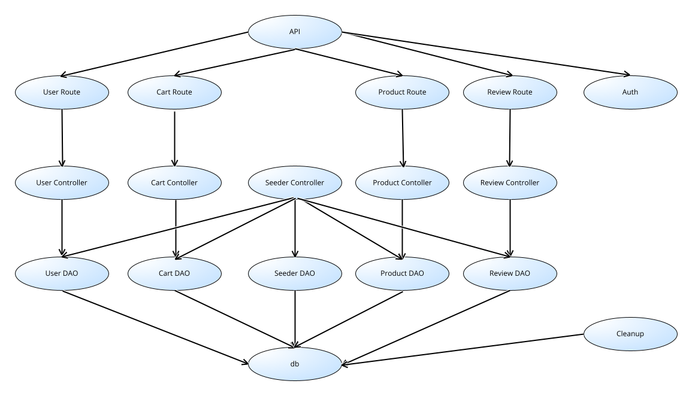
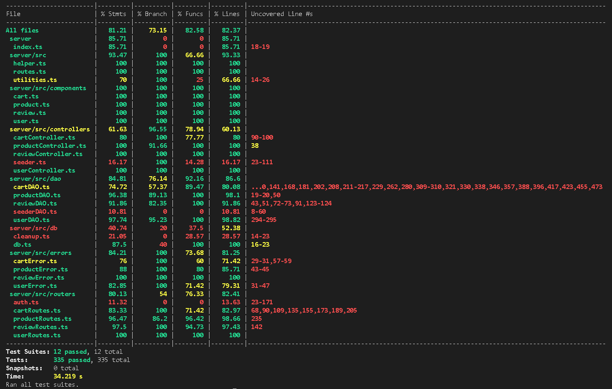

# Test Report

<The goal of this document is to explain how the application was tested, detailing how the test cases were defined and what they cover>

# Contents

- [Test Report](#test-report)
- [Contents](#contents)
- [Dependency graph](#dependency-graph)
- [Integration approach](#integration-approach)
- [Tests](#tests)
  - [Reviews](#reviews)
    - [Integration testing routes: reviews](#integration-testing-routes-reviews)
    - [Integration testing controller: reviews](#integration-testing-controller-reviews)
    - [Integration testing DAO: reviews](#integration-testing-dao-reviews)
    - [Unit testing routes: reviews](#unit-testing-routes-reviews)
    - [Unit testing controller: reviews](#unit-testing-controller-reviews)
    - [Unit testing DAO: reviews](#unit-testing-dao-reviews)
  - [Carts](#carts)
    - [Integration testing routes: carts](#integration-testing-routes-carts)
    - [Unit testing routes: carts](#unit-testing-routes-carts)
    - [Unit testing controller: carts](#unit-testing-controller-carts)
    - [Unit testing DAO: carts](#unit-testing-dao-carts)
  - [Users](#users)
    - [Integration testing routes: users](#integration-testing-routes-users)
    - [Integration testing DAO: users](#integration-testing-dao-users)
    - [Unit testing routes: users](#unit-testing-routes-users)
    - [Unit testing controller: users](#unit-testing-controller-users)
    - [Unit testing DAO: users](#unit-testing-dao-users)
  - [Products](#products)
    - [Integration testing routes: products](#integration-testing-routes-products)
    - [Integration testing DAO: products](#integration-testing-dao-products)
    - [Unit testing routes: products](#unit-testing-routes-products)
    - [Unit testing controller: products](#unit-testing-controller-products)
    - [Unit testing DAO: products](#unit-testing-dao-products)
- [Coverage](#coverage)
  - [Coverage of FR](#coverage-of-fr)
    - [Reviews](#reviews-1)
    - [Carts](#carts-1)
    - [Users](#users-1)
    - [Products](#products-1)
  - [Coverage white box](#coverage-white-box)

# Dependency graph

# Integration approach

La sequenza di integrazione adottata segue un approccio **bottom-up**, iniziando dal testing dei moduli di più basso livello e indipendenti, per poi passare gradualmente all'integrazione con i componenti di più alto livello che presentano dipendenze. Le singole unità di codice (funzioni o metodi) sono state testate isolatamente, al fine di verificarne il corretto funzionamento in un contesto controllato. Sono stati utilizzati *oggetti mock* per specificare esattamente il comportamento delle dipendenze dell'unità di codice testata. Test di integrazione sono stati successivamente utilizzati per verificare la corretta interazione tra le diverse unità di codice. Testando accuratamente le singole funzioni con i più diversi input, inclusi quelli che conducono ad errori (e.g. formato parametri errato), eventuali problematiche sono state più agevolmente individuate, migliorando così la qualità complessiva del software. Specificatamente per ogni singolo componente:

**Carts**:
- *step 1*: testdb + cartDAO + cartController + cartRoutes, test di tutto il sistema da livello API, approccio big bang

**Products**:
- *step 1*: testdb + productDAO, corrispondente allo unit_test productDAO coadiuvato dall'utilizzo del database di test
- *step 2*: testdb + productDAO + productController + productRoutes, corrispondente ad API testing

**Reviews**:
- *step 1*: testdb + reviewDAO, corrispondente allo unit_test reviewDAO coadiuvato dall'utilizzo del database di test
- *step 2*: testdb + reviewDAO + reviewController
- *step 3*: testdb + reviewDAO + reviewController + reviewRoutes, corrispondente ad API testing

**Users**:
- *step 1*: testdb + userDAO, corrispondente allo unit_test userDAO coadiuvato dall'utilizzo del database di test
- *step 2*: testdb + userDAO + userController
- *step 3*: testdb + userDAO + userController + userRoutes, corrispondente ad API testing

# Tests
## Reviews 

### Integration testing routes: reviews  
| Test case name                                     | Route called                                  | Test level | Technique used                  |
|----------------------------------------------------|-----------------------------------------------|------------|---------------------------------|
| 200: review added                                  | ReviewRoutes: "/ezelectronics/reviews/Samsung v11" | API        | BB / Equivalence Partitioning   |
| 404: model not in DB                               | ReviewRoutes: "/ezelectronics/reviews/model3"      | API        | BB / Equivalence Partitioning   |
| 409: review already exists                         | ReviewRoutes: "/ezelectronics/reviews/Hp v10"      | API        | BB / Equivalence Partitioning   |
| 401: Manager not customer                          | ReviewRoutes: "/ezelectronics/reviews/Samsung v11" | API        | BB / Equivalence Partitioning   |
| 401: Admin not customer                            | ReviewRoutes: "/ezelectronics/reviews/Samsung v11" | API        | BB / Equivalence Partitioning   |
| 401: user not logged in                            | ReviewRoutes: "/ezelectronics/reviews/Samsung v11" | API        | BB / Equivalence Partitioning   |
| 422: comment is not a string                       | ReviewRoutes: "/ezelectronics/reviews/Samsung v11" | API        | BB / Equivalence Partitioning   |
| 422: comment empty                                 | ReviewRoutes: "/ezelectronics/reviews/Samsung v11" | API        | BB / Equivalence Partitioning   |
| 422: score is > 5                                  | ReviewRoutes: "/ezelectronics/reviews/Samsung v11" | API        | BB / Boundary                   |
| 422: score is < 1                                  | ReviewRoutes: "/ezelectronics/reviews/Samsung v11" | API        | BB / Boundary                   |
| 422: score is float                                | ReviewRoutes: "/ezelectronics/reviews/Samsung v11" | API        | BB / Equivalence Partitioning   |
| 200: review list showed (Customer)                 | ReviewRoutes: "/ezelectronics/reviews/Hp v10"      | API        | BB / Equivalence Partitioning   |
| 200: review list showed (Manager)                  | ReviewRoutes: "/ezelectronics/reviews/Hp v10"      | API        | BB / Equivalence Partitioning   |
| 200: review list showed (Admin)                    | ReviewRoutes: "/ezelectronics/reviews/Hp v10"      | API        | BB / Equivalence Partitioning   |
| 401: user not logged in (retrieve reviews)         | ReviewRoutes: "/ezelectronics/reviews/Hp v10"      | API        | BB / Equivalence Partitioning   |
| 404: model not in DB (retrieve reviews)            | ReviewRoutes: "/ezelectronics/reviews/model3"      | API        | BB / Equivalence Partitioning   |
| 200: review deleted                                | ReviewRoutes: "/ezelectronics/reviews/Hp v10"      | API        | BB / Equivalence Partitioning   |
| 404: model not in DB (delete review)               | ReviewRoutes: "/ezelectronics/reviews/model3"      | API        | BB / Equivalence Partitioning   |
| 404: no review for this user and this product      | ReviewRoutes: "/ezelectronics/reviews/Asus v11"    | API        | BB / Equivalence Partitioning   |
| 401: user not logged in (delete review)            | ReviewRoutes: "/ezelectronics/reviews/Hp v10"      | API        | BB / Equivalence Partitioning   |
| 401: user not customer (manager) (delete review)   | ReviewRoutes: "/ezelectronics/reviews/Hp v10"      | API        | BB / Equivalence Partitioning   |
| 401: user not customer (admin) (delete review)     | ReviewRoutes: "/ezelectronics/reviews/Hp v10"      | API        | BB / Equivalence Partitioning   |
| 200: all reviews (of a product) deleted (manager)  | ReviewRoutes: "/ezelectronics/reviews/Hp v10/all"  | API        | BB / Equivalence Partitioning   |
| 200: all reviews (of a product) deleted (admin)    | ReviewRoutes: "/ezelectronics/reviews/Hp v10/all"  | API        | BB / Equivalence Partitioning   |
| 401: user not logged in (delete all reviews)       | ReviewRoutes: "/ezelectronics/reviews/model/all"   | API        | BB / Equivalence Partitioning   |
| 401: user not Admin or Manager (Customer)          | ReviewRoutes: "/ezelectronics/reviews/Hp v10/all"  | API        | BB / Equivalence Partitioning   |
| 404: model not in DB (delete all reviews)          | ReviewRoutes: "/ezelectronics/reviews/model3/all"  | API        | BB / Equivalence Partitioning   |
| 200: reviews deleted (manager)                     | ReviewRoutes: "/ezelectronics/reviews"             | API        | BB / Equivalence Partitioning   |
| 200: reviews deleted (admin)                       | ReviewRoutes: "/ezelectronics/reviews"             | API        | BB / Equivalence Partitioning   |
| 401: user not logged in (delete all reviews)       | ReviewRoutes: "/ezelectronics/reviews"             | API        | BB / Equivalence Partitioning   |
| 401: user not Admin or Manager (Customer)          | ReviewRoutes: "/ezelectronics/reviews"             | API        | BB / Equivalence Partitioning   |

### Integration testing controller: reviews  
| Test case name                                                  | Method tested                          | Test level  | Technique used          |
|-----------------------------------------------------------------|----------------------------------------|-------------|-------------------------|
| Integrated Controller Test: addReview - correct insertion       | ReviewController.addReview             | Integrated  | Black Box / Equivalence Partitioning |
| Integrated Controller Test: addReview - model not in DB         | ReviewController.addReview             | Integrated  | Black Box / Boundary Value Analysis |
| Integrated Controller Test: addReview - review exists           | ReviewController.addReview             | Integrated  | Black Box / Equivalence Partitioning |
| Integrated Controller Test: getProductReviews - correct listing | ReviewController.getProductReviews     | Integrated  | Black Box / Equivalence Partitioning |
| Integrated Controller Test: getProductReviews - product not found | ReviewController.getProductReviews   | Integrated  | Black Box / Boundary Value Analysis |
| Integrated Controller Test: deleteReview - correct removal      | ReviewController.deleteReview          | Integrated  | Black Box / Equivalence Partitioning |
| Integrated Controller Test: deleteReview - product not found    | ReviewController.deleteReview          | Integrated  | Black Box / Boundary Value Analysis |
| Integrated Controller Test: deleteReview - review not found     | ReviewController.deleteReview          | Integrated  | Black Box / Equivalence Partitioning |
| Integrated Controller Test: deleteReviewsOfProduct - correct removal | ReviewController.deleteReviewsOfProduct | Integrated  | Black Box / Equivalence Partitioning |
| Integrated Controller Test: deleteReviewsOfProduct - product not found | ReviewController.deleteReviewsOfProduct | Integrated  | Black Box / Boundary Value Analysis |
| Integrated Controller Test: deleteAllReviews - correct removal  | ReviewController.deleteAllReviews      | Integrated  | Black Box / Equivalence Partitioning |

### Integration testing DAO: reviews  
| Test case name                                         | Method tested                       | Test level   | Technique used                      |
| :----------------------------------------------------- | :---------------------------------: | :----------: | :---------------------------------: |
| Integrated Dao Test: createReview - correct insertion  | reviewDAO.createReview              | Integrated   | Black Box / Equivalence Partitioning|
| Integrated Dao Test: createReview - model not in DB    | reviewDAO.createReview              | Integrated   | Black Box / Boundary Value Analysis |
| Integrated Dao Test: createReview - review exists      | reviewDAO.createReview              | Integrated   | Black Box / Equivalence Partitioning|
| Integrated Dao Test: getReviews - correct listing      | reviewDAO.getReviews                | Integrated   | Black Box / Equivalence Partitioning|
| Integrated Dao Test: getReviews - model not in DB      | reviewDAO.getReviews                | Integrated   | Black Box / Boundary Value Analysis |
| Integrated Dao Test: deleteReview - correct removal    | reviewDAO.deleteReview              | Integrated   | Black Box / Equivalence Partitioning|
| Integrated Dao Test: deleteReview - model not in DB    | reviewDAO.deleteReview              | Integrated   | Black Box / Boundary Value Analysis |
| Integrated Dao Test: deleteReview - review not in DB   | reviewDAO.deleteReview              | Integrated   | Black Box / Equivalence Partitioning|
| Integrated Dao Test: deleteReviews - correct removal   | reviewDAO.deleteReviews             | Integrated   | Black Box / Equivalence Partitioning|
| Integrated Dao Test: deleteReviews - model not in DB   | reviewDAO.deleteReviews             | Integrated   | Black Box / Boundary Value Analysis |
| Integrated Dao Test: deleteAllReviews - correct removal | reviewDAO.deleteAllReviews          | Integrated   | Black Box / Equivalence Partitioning|

### Unit testing routes: reviews  
| Test Case Name                         | Object(s) Tested                  | Test Level | Technique Used                    |
|----------------------------------------|-----------------------------------|------------|-----------------------------------|
| 200: review added                      | Add review method                 | Unit       | WB/statement coverage             |
| 404: model not in DB                   | Add review method                 | Unit       | WB/statement coverage             |
| 409: review already exists             | Add review method                 | Unit       | WB/statement coverage             |
| 401: user not logged in                | Add review method                 | Unit       | WB/statement coverage             |
| 401: user not customer                 | Add review method                 | Unit       | WB/statement coverage             |
| 422: comment is not a string           | Add review method                 | Unit       | WB/statement coverage             |
| 422: comment empty                     | Add review method                 | Unit       | WB/statement coverage             |
| 422: score is > 5                      | Add review method                 | Unit       | WB/statement coverage             |
| 422: score is < 1                      | Add review method                 | Unit       | WB/statement coverage             |
| 422: score is float                    | Add review method                 | Unit       | WB/statement coverage             |
| 200: review list showed                | Get product reviews method        | Unit       | WB/statement coverage             |
| 401: user not logged in                | Get product reviews method        | Unit       | WB/statement coverage             |
| 404: model not in DB                   | Get product reviews method        | Unit       | WB/statement coverage             |
| 200: review deleted                    | Delete review method              | Unit       | WB/statement coverage             |
| 404: model not in DB                   | Delete review method              | Unit       | WB/statement coverage             |
| 404: no review for this user and this product | Delete review method        | Unit       | WB/statement coverage             |
| 401: user not logged in                | Delete review method              | Unit       | WB/statement coverage             |
| 401: user not customer                 | Delete review method              | Unit       | WB/statement coverage             |
| 200: all reviews (of a product) deleted | Delete reviews of product method | Unit       | WB/statement coverage             |
| 401: user not logged in                | Delete reviews of product method  | Unit       | WB/statement coverage             |
| 401: user not Admin or Manager         | Delete reviews of product method  | Unit       | WB/statement coverage             |
| 404: model not in DB                   | Delete reviews of product method  | Unit       | WB/statement coverage             |
| 200: reviews deleted                   | Delete all reviews method         | Unit       | WB/statement coverage             |
| 401: user not logged in                | Delete all reviews method         | Unit       | WB/statement coverage             |
| 401: user not Admin or Manager         | Delete all reviews method         | Unit       | WB/statement coverage             |

### Unit testing controller: reviews  
| Test case name                                    | Function(s) tested       | Test level | Technique used      |
|---------------------------------------------------|--------------------------|------------|---------------------|
| True: correct creation of review                   | ReviewController.addReview | Unit       | Equivalence Partitioning, White Box |
| False: product not found                          | ReviewController.addReview | Unit       | Equivalence Partitioning, White Box |
| False: review già esistente                       | ReviewController.addReview | Unit       | Equivalence Partitioning, White Box |
| False: generic DAO error                          | ReviewController.addReview | Unit       | Equivalence Partitioning, White Box |
| True: correct listing of reviews                  | ReviewController.getProductReviews | Unit       | Equivalence Partitioning, White Box |
| False: product not found                          | ReviewController.getProductReviews | Unit       | Equivalence Partitioning, White Box |
| False: generic DAO error                          | ReviewController.getProductReviews | Unit       | Equivalence Partitioning, White Box |
| True: correct removal of review                   | ReviewController.deleteReview | Unit       | Equivalence Partitioning, White Box |
| False: product not found                          | ReviewController.deleteReview | Unit       | Equivalence Partitioning, White Box |
| False: review già esistente                       | ReviewController.deleteReview | Unit       | Equivalence Partitioning, White Box |
| False: generic DAO error                          | ReviewController.deleteReview | Unit       | Equivalence Partitioning, White Box |
| True: correct removal of reviews of product       | ReviewController.deleteReviewsOfProduct | Unit       | Equivalence Partitioning, White Box |
| False: product not found                          | ReviewController.deleteReviewsOfProduct | Unit       | Equivalence Partitioning, White Box |
| False: generic DAO error                          | ReviewController.deleteReviewsOfProduct | Unit       | Equivalence Partitioning, White Box |
| True: correct removal of all reviews              | ReviewController.deleteAllReviews | Unit       | Equivalence Partitioning, White Box |
| False: generic DAO error                          | ReviewController.deleteAllReviews | Unit       | Equivalence Partitioning, White Box |

### Unit testing DAO: reviews
| Test Case Name                        | Object(s) Tested     | Test Level | Technique Used            |
|---------------------------------------|----------------------|------------|---------------------------|
| Correct review insertion              | ReviewDAO.createReview| Unit       | WB / Statement Coverage   |
| Generic DB error in get (createReview)| ReviewDAO.createReview| Unit       | WB / Statement Coverage   |
| Generic DB error in run (createReview)| ReviewDAO.createReview| Unit       | WB / Statement Coverage   |
| Review already exists                 | ReviewDAO.createReview| Unit       | WB / Statement Coverage   |
| Model not in DB (createReview)        | ReviewDAO.createReview| Unit       | WB / Statement Coverage   |
| Correct listing of all reviews        | ReviewDAO.getReviews  | Unit       | WB / Statement Coverage   |
| Generic DB error in all (getReviews)  | ReviewDAO.getReviews  | Unit       | WB / Statement Coverage   |
| Model not in DB (getReviews)          | ReviewDAO.getReviews  | Unit       | WB / Statement Coverage   |
| Correct removal of a review           | ReviewDAO.deleteReview| Unit       | WB / Statement Coverage   |
| Generic DB error in get (deleteReview)| ReviewDAO.deleteReview| Unit       | WB / Statement Coverage   |
| Generic DB error in run (deleteReview)| ReviewDAO.deleteReview| Unit       | WB / Statement Coverage   |
| Model not in DB (deleteReview)        | ReviewDAO.deleteReview| Unit       | WB / Statement Coverage   |
| Review not in DB (deleteReview)       | ReviewDAO.deleteReview| Unit       | WB / Statement Coverage   |
| Correct removal of all reviews        | ReviewDAO.deleteReviews| Unit      | WB / Statement Coverage   |
| Generic DB error in get (deleteReviews)| ReviewDAO.deleteReviews| Unit     | WB / Statement Coverage   |
| Generic DB error in run (deleteReviews)| ReviewDAO.deleteReviews| Unit     | WB / Statement Coverage   |
| Model not in DB (deleteReviews)       | ReviewDAO.deleteReviews| Unit      | WB / Statement Coverage   |
| Correct removal of all reviews (deleteAllReviews) | ReviewDAO.deleteAllReviews| Unit | WB / Statement Coverage |
| Generic DB error in run (deleteAllReviews) | ReviewDAO.deleteAllReviews| Unit | WB / Statement Coverage   |

## Carts

### Integration testing routes: carts
| Test Case Name                                  | Route Called                               | Test Level | Technique Used               |
|--------------------------------------------------|--------------------------------------------|------------|------------------------------|
| Get Cart - Success                              | GET /ezelectronics/carts                  | API        | BB / Big Bang |
| Add Product to Cart - Success                   | POST /ezelectronics/carts                 | API        | BB / Big Bang |
| Add Product to Cart - Empty String as Model - Fail | POST /ezelectronics/carts               | API        | BB / Big Bang |
| Add Product to Cart - Non-existing Model - Fail  | POST /ezelectronics/carts                 | API        | BB / Big Bang |
| Checkout Cart - Success                         | PATCH /ezelectronics/carts                | API        | BB / Big Bang |
| Checkout Cart - Non-existing Cart - Fail         | PATCH /ezelectronics/carts                | API        | BB / Big Bang |
| Checkout Cart - Empty Cart - Fail               | PATCH /ezelectronics/carts                | API        | BB / Big Bang |
| History of Carts of User - Success, Empty Array | GET /ezelectronics/carts/history          | API        | BB / Big Bang |
| Get History of Carts of User - Success, Cart Returned | GET /ezelectronics/carts/history    | API        | BB / Big Bang |
| Delete Product from Cart - Success               | DELETE /ezelectronics/carts/products/:model | API      | BB / Big Bang |
| Delete Product from Cart - Product Not in Cart - Fail | DELETE /ezelectronics/carts/products/:model | API  | BB / Big Bang |
| Delete Product from Cart - Product Does Not Exist - Fail | DELETE /ezelectronics/carts/products/:model | API | BB / Big Bang |
| Delete Product from Cart - Product is an Empty String - Fail | DELETE /ezelectronics/carts/products/:model | API | BB / Big Bang |
| Delete All Products from Current Cart - Success  | DELETE /ezelectronics/carts/current       | API        | BB / Big Bang |
| Delete All Products from Cart - Cart Does Not Exist - Fail | DELETE /ezelectronics/carts/current  | API        | BB / Big Bang |
| Delete All Carts - User is Not Manager or Admin - Fail | DELETE /ezelectronics/carts           | API        | BB / Big Bang |
| Get All Carts - User is Not Admin or Manager - Fail | GET /ezelectronics/carts/all         | API        | BB / Big Bang |
| Get User Cart - Manager or Admin - Fail          | GET /ezelectronics/carts                  | API        | BB / Big Bang |
| Add Product to Cart - Manager or Admin - Fail    | POST /ezelectronics/carts                 | API        | BB / Big Bang |
| Checkout Cart - Manager or Admin - Fail          | PATCH /ezelectronics/carts                | API        | BB / Big Bang |
| Get User Cart History - Manager or Admin - Fail  | GET /ezelectronics/carts/history          | API        | BB / Big Bang |
| Remove Product from Cart - Manager or Admin - Fail | DELETE /ezelectronics/carts/products/:model | API      | BB / Big Bang |
| Delete Current Cart - Manager or Admin - Fail    | DELETE /ezelectronics/carts/current       | API        | BB / Big Bang |
| Get All Carts - Success                         | GET /ezelectronics/carts/all              | API        | BB / Big Bang |
| Delete All Carts - Success                      | DELETE /ezelectronics/carts               | API        | BB / Big Bang |
| Get User Cart - Not Logged In - Fail             | GET /ezelectronics/carts                  | API        | BB / Big Bang |
| Add Product to Cart - Not Logged In - Fail       | POST /ezelectronics/carts                 | API        | BB / Big Bang |
| Checkout Cart - Not Logged In - Fail             | PATCH /ezelectronics/carts                | API        | BB / Big Bang |
| Get User Cart History - Not Logged In - Fail     | GET /ezelectronics/carts/history          | API        | BB / Big Bang |
| Remove Product from Cart - Not Logged In - Fail   | DELETE /ezelectronics/carts/products/:model | API      | BB / Big Bang |
| Delete Current Cart - Not Logged In - Fail       | DELETE /ezelectronics/carts/current       | API        | BB / Big Bang |
| Get All Carts - Not Logged In - Fail             | GET /ezelectronics/carts/all              | API        | BB / Big Bang |
| Delete All Carts - Not Logged In - Fail          | DELETE /ezelectronics/carts               | API        | BB / Big Bang |

### Unit testing routes: carts
| Test Case Name | Route Called | Test Level | Technique Used |
|----------------|--------------|------------|----------------|
| should return 200 with an empty cart as body | GET /ezelectronics/carts | API | WB/Equivalence Partitioning |
| user not customer, return 401 | GET /ezelectronics/carts | API | WB/Equivalence Partitioning |
| user not logged in, return 401 | GET /ezelectronics/carts | API | WB/Equivalence Partitioning |
| should add a cart succesfully | POST /ezelectronics/carts | API | WB/Equivalence Partitioning |
| should return 422, model is empty string | POST /ezelectronics/carts | API | WB/Equivalence Partitioning |
| should return 422, model is not a string | POST /ezelectronics/carts | API | WB/Equivalence Partitioning |
| should return 401, user is not a customer | POST /ezelectronics/carts | API | WB/Equivalence Partitioning |
| should return 401, user is not logged in | POST /ezelectronics/carts | API | WB/Equivalence Partitioning |
| should roturn 200 code, success | PATCH /ezelectronics/carts | API | WB/Equivalence Partitioning |
| non logged in user, shoud return 401 status | PATCH /ezelectronics/carts | API | WB/Equivalence Partitioning |
| non customer logged user, should return 401 status | PATCH /ezelectronics/carts | API | WB/Equivalence Partitioning |
| should return 200 status, success | GET /ezelectronics/carts/history | API | WB/Equivalence Partitioning |
| non logged in user, shoud return 401 status | GET /ezelectronics/carts/history | API | WB/Equivalence Partitioning |
| non customer logged user, should return 401 status | GET /ezelectronics/carts/history | API | WB/Equivalence Partitioning |
| should return 200, success | DELETE /ezelectronics/carts/products/:model | API | WB/Equivalence Partitioning |
| should return 401, non logged in user | DELETE /ezelectronics/carts/products/:model | API | WB/Equivalence Partitioning |
| should return 401, non customer user | DELETE /ezelectronics/carts/products/:model | API | WB/Equivalence Partitioning |
| should return 404, bad parameters passed | DELETE /ezelectronics/carts/products/:model | API | WB/Equivalence Partitioning |
| should return status 200, success | DELETE /ezelectronics/carts/current | API | WB/Equivalence Partitioning |
| should return status 401, user not logged in | DELETE /ezelectronics/carts/current | API | WB/Equivalence Partitioning |
| should return status 401, user not customer | DELETE /ezelectronics/carts/current | API | WB/Equivalence Partitioning |
| should return status 200, success | DELETE /ezelectronics/carts | API | WB/Equivalence Partitioning |
| should return status 401, user not logged in | DELETE /ezelectronics/carts | API | WB/Equivalence Partitioning |
| should return status 401, user not admin or manager | DELETE /ezelectronics/carts | API | WB/Equivalence Partitioning |
| should return status 200, success | GET /ezelectronics/carts/all | API | WB/Equivalence Partitioning |
| should return status 401, non logged in user | GET /ezelectronics/carts/all | API | WB/Equivalence Partitioning |
| should return status 401, non admin or manager user | GET /ezelectronics/carts/all | API | WB/Equivalence Partitioning |

### Unit testing controller: carts
| Test case name                                | Function(s) tested            | Test level | Technique used           |
|-----------------------------------------------|-------------------------------|------------|--------------------------|
| True: correct creation of review              | CartController.createReview   | Unit       | WB/Equivalence partitioning |
| False: product not found                      | CartController.createReview   | Unit       | WB/Equivalence partitioning |
| False: review già esistente                   | CartController.createReview   | Unit       | WB/Equivalence partitioning |
| False: generic DAO error                      | CartController.createReview   | Unit       | WB/Equivalence partitioning |
| True: correct listing of reviews              | CartController.getReviews     | Unit       | WB/Equivalence partitioning |
| False: product not found                      | CartController.getReviews     | Unit       | WB/Equivalence partitioning |
| False: generic DAO error                      | CartController.getReviews     | Unit       | WB/Equivalence partitioning |
| True: correct removal of review               | CartController.deleteReview   | Unit       | WB/Equivalence partitioning |
| False: product not found                      | CartController.deleteReview   | Unit       | WB/Equivalence partitioning |
| False: review già esistente                   | CartController.deleteReview   | Unit       | WB/Equivalence partitioning |
| False: generic DAO error                      | CartController.deleteReview   | Unit       | WB/Equivalence partitioning |
| True: correct removal of all reviews          | CartController.deleteAllReviews | Unit       | WB/Equivalence partitioning |
| False: generic DAO error                      | CartController.deleteAllReviews | Unit       | WB/Equivalence partitioning |

### Unit testing DAO: carts
| Test Case Name                                      | Object(s) Tested         | Test Level | Technique Used         |
|-----------------------------------------------------|--------------------------|------------|------------------------|
| It should retreive the empty current cart succesfully | CartDAO.getCurrentCart   | Unit       | WB/Equivalence Partitioning  |
| It should retreive a cart with a product inside     | CartDAO.getCurrentCart   | Unit       | WB/Equivalence Partitioning  |
| internal DB error                                   | CartDAO.getCurrentCart   | Unit       | WB/Equivalence Partitioning  |
| it should add a product to the cart succesfully     | CartDAO.addProductToCart | Unit       | WB/Equivalence Partitioning  |
| try to add a non existing product                   | CartDAO.addProductToCart | Unit       | WB/Equivalence Partitioning  |
| try to add a product with quantity == 0              | CartDAO.addProductToCart | Unit       | WB/Equivalence Partitioning  |
| internal DB error                                   | CartDAO.addProductToCart | Unit       | WB/Equivalence Partitioning  |
| it should add two products to the cart succesfully  | CartDAO.addProductToCart | Unit       | WB/Equivalence Partitioning  |
| it should add two different products to the cart succesfully | CartDAO.addProductToCart | Unit       | WB/Equivalence Partitioning  |
| it should pay the cart correctly and reduce the quantity of product in stock | CartDAO.payCurrentCart   | Unit       | WB/Equivalence Partitioning  |
| product quantity in stock == 0                      | CartDAO.payCurrentCart   | Unit       | WB/Equivalence Partitioning  |
| product quantity in stock < product quantity in cart | CartDAO.payCurrentCart   | Unit       | WB/Equivalence Partitioning  |
| try to pay a non existing cart                      | CartDAO.payCurrentCart   | Unit       | WB/Equivalence Partitioning  |
| try to pay an empty cart                             | CartDAO.payCurrentCart   | Unit       | WB/Equivalence Partitioning  |
| internal DB error                                   | CartDAO.payCurrentCart   | Unit       | WB/Equivalence Partitioning  |
| should succesfully return an array of payed carts   | CartDAO.getHistoryCart   | Unit       | WB/Equivalence Partitioning  |
| internal DB error                                   | CartDAO.getHistoryCart   | Unit       | WB/Equivalence Partitioning  |
| user has not any cart in history                    | CartDAO.getHistoryCart   | Unit       | WB/Equivalence Partitioning  |
| delete succesfully the product when quantity is == 1 | CartDAO.deleteProductFromCart | Unit       | WB/Equivalence Partitioning  |
| try to remove a product from a non existing cart    | CartDAO.deleteProductFromCart | Unit       | WB/Equivalence Partitioning  |
| try to remove a not existing product                | CartDAO.deleteProductFromCart | Unit       | WB/Equivalence Partitioning  |
| try to remove a product that is not in the cart     | CartDAO.deleteProductFromCart | Unit       | WB/Equivalence Partitioning  |
| decrease the quantity of a product in cart when quantity is > 1 | CartDAO.deleteProductFromCart | Unit       | WB/Equivalence Partitioning  |
| internal DB error                                   | CartDAO.deleteProductFromCart | Unit       | WB/Equivalence Partitioning  |
| delete current cart succesfully                     | CartDAO.deleteCurrentCart | Unit       | WB/Equivalence Partitioning  |
| try to delete a non existing cart                   | CartDAO.deleteCurrentCart | Unit       | WB/Equivalence Partitioning  |
| internal DB error                                   | CartDAO.deleteCurrentCart | Unit       | WB/Equivalence Partitioning  |
| internal DB error                                   | CartDAO.deleteCurrentCart | Unit       | WB/Equivalence Partitioning  |
| succesfully delete all carts                        | CartDAO.deleteAllCarts   | Unit       | WB/Equivalence Partitioning  |
| delete while there are no carts in the database     | CartDAO.deleteAllCarts   | Unit       | WB/Equivalence Partitioning  |
| internal DB error                                   | CartDAO.deleteAllCarts   | Unit       | WB/Equivalence Partitioning  |
| get the list of all carts                           | CartDAO.getAllCarts      | Unit       | WB/Equivalence Partitioning  |
| get the list of all the carts, no carts in storage  | CartDAO.getAllCarts      | Unit       | WB/Equivalence Partitioning  |
| internal DB error                                   | CartDAO.getAllCarts      | Unit       | WB/Equivalence Partitioning  |

## Users

### Integration testing routes: users  
| Test case name                                            | Route called                                  | Test level | Technique used                  |
|-----------------------------------------------------------|-----------------------------------------------|------------|---------------------------------|
| 1.1: It should return all users for an Admin                   | GET /ezelectronics/users           | API        | BB / Equivalence Partitioning   |
| 1.2: It should return 401 error for a Manager that tries to retrieve all users | GET /ezelectronics/users            | API        | BB / Equivalence Partitioning   |
| 1.3: It should return 401 error for a Customer that tries to retrieve all users| GET /ezelectronics/users            | API        | BB / Equivalence Partitioning   |
| 1.4: It should return 401 error for a not logged in user that tries to retrieve all users | GET /ezelectronics/users          | API        | BB / Equivalence Partitioning   |
| 2.1: It should return all users of a specific role for an Admin | GET /ezelectronics/users/roles/Customer | API   | BB / Equivalence Partitioning   |
| 2.2: It should return 401 error for a Manager that tries to retrieve all users of a specific role | GET /ezelectronics/users/roles/Customer     | API        | BB / Equivalence Partitioning   |
| 2.3: It should return 401 error for a Customer that tries to retrieve all users of a specific role | GET /ezelectronics/users/roles/Customer     | API        | BB / Equivalence Partitioning   |
| 2.4: It should return 401 error for a not logged in user that tries to retrieve all users of a specific role | GET /ezelectronics/users/roles/Customer     | API        | BB / Equivalence Partitioning   |
| 3.1: It should return the user with the specific username for an Admin | GET /ezelectronics/users/erika.astegiano | API        | BB / Equivalence Partitioning   |
| 3.2: It should return the user with the specific username for a Customer (own information) | GET /ezelectronics/users/customer | API | BB / Equivalence Partitioning   |
| 3.3: It should return 401 error for a Customer or Manager that tries to access other users information | GET /ezelectronics/users/erika.astegiano | API        | BB / Equivalence Partitioning   |
| 3.4: It should return 401 error for a not logged in user that tries to access other users information | GET /ezelectronics/users/erika.astegiano | API        | BB / Equivalence Partitioning   |
| 3.5: It should return 404 error if a user with a specific username does not exist | GET /ezelectronics/users/notexists | API        | BB / Equivalence Partitioning   |
| 4.1: It should delete the user with the specific username for an Admin | DELETE /ezelectronics/users/erika.astegiano | API        | BB / Equivalence Partitioning   |
| 4.2: It should delete the user with the specific username for a Customer (own profile) | DELETE /ezelectronics/users/customer | API        | BB / Equivalence Partitioning   |
| 4.3: It should return 401 error for a Customer or Manager that tries to delete another user | DELETE /ezelectronics/users/erika.astegiano | API        | BB / Equivalence Partitioning   |
| 4.4: It should return 401 error for a not logged in that tries to delete another user | DELETE /ezelectronics/users/erika.astegiano | API        | BB / Equivalence Partitioning   |
| 4.5: It should return 404 error if the user to delete with the specific username does not exist  | DELETE /ezelectronics/users/notexists | API        | BB / Equivalence Partitioning   |
| 5.1: It should delete all non-admin users for an Admin | DELETE /ezelectronics/users | API        | BB / Equivalence Partitioning   |
| 5.2: It should return 401 error for a Manager that tries to delete all users | DELETE /ezelectronics/users | API        | BB / Equivalence Partitioning   |
| 5.3: It should return 401 error for a Customer that tries to delete all users | DELETE /ezelectronics/users | API        | BB / Equivalence Partitioning   |
| 5.4: It should return 401 error for a not logged in user that tries to delete all users | DELETE /ezelectronics/users | API        | BB / Equivalence Partitioning   |
| 6.1: It should update the user with the specific username for an Admin | PATCH /ezelectronics/users/erika.astegiano | API        | BB / Equivalence Partitioning   |
| 6.2: It should update the user with the specific username for a Customer (own information) | PATCH /ezelectronics/users/customer | API        | BB / Equivalence Partitioning   |
| 6.3: It should return 401 error for a Customer or Manager that tries to update another user information | PATCH /ezelectronics/users/erika.astegiano | API        | BB / Equivalence Partitioning   |
| 6.4: It should return 401 error for a not logged in user that tries to update another user information | PATCH /ezelectronics/users/erika.astegiano | API        | BB / Equivalence Partitioning   |
| 6.5: It should return 404 error if the user to update with the specific username does not exist | PATCH /ezelectronics/users/notexists | API        | BB / Equivalence Partitioning   |

### Integration testing DAO: users
| Test case name                                         | Method tested                       | Test level   | Technique used                      |
| :----------------------------------------------------- | :---------------------------------: | :----------: | :---------------------------------: |
| 1.1: It should create a new user with the provided information | userDAO.createUser           | Integrated   | Black Box / Equivalence Partitioning |
| 1.2: It should return a 409 error when username represents a user that is already registered  | userDAO.createUser | Integrated | Black Box / Equivalence Partitioning |
| 2.1: It should return the list of all users | userDAO.getUsers           | Integrated   | Black Box / Equivalence Partitioning |
| 2.2: It should return an empty list if no user is registered | userDAO.getUsers          | Integrated   | Black Box / Equivalence Partitioning |
| 3.1: It should return the list of users with a specific role | userDAO.getUsersByRole    | Integrated   | Black Box / Equivalence Partitioning |
| 3.2: It should return an empty list if no user with a specific role exists | userDAO.getUsersByRole    | Integrated   | Black Box / Equivalence Partitioning |
| 4.1: It should return a single user, given the username | userDAO.getUserByUsername    | Integrated   | Black Box / Equivalence Partitioning |
| 4.2: It should return a 404 error if no user with the given username exists | userDAO.getUsersByUsername    | Integrated   | Black Box / Equivalence Partitioning |
| 5.1: It should delete the user with the specific username - admin deletes a user of type Customer or Manager | userDAO.deleteUser    | Integrated   | Black Box / Equivalence Partitioning |
| 5.2: It should delete the user with the specific username - Customer or Manager delete themselves | userDAO.deleteUser    | Integrated   | Black Box / Equivalence Partitioning |
| 5.3: It should return a 401 error when a user, that is not admin, tries to delete a different user | userDAO.deleteUser    | Integrated   | Black Box / Equivalence Partitioning |
| 5.4: It should return a 404 error when username represents a user to delete that is not registered | userDAO.deleteUser    | Integrated   | Black Box / Equivalence Partitioning |
| 5.5: It should return a 401 error when an admin tries to delete another admin | userDAO.deleteUser    | Integrated   | Black Box / Equivalence Partitioning |
| 6.1: It should delete all non-admin users (no admins in the database) | userDAO.deleteAllUsers    | Integrated   | Black Box / Equivalence Partitioning |
| 6.2: It should delete all non-admin users (some admins in the database) | userDAO.deleteAllUsers    | Integrated   | Black Box / Equivalence Partitioning |
| 7.1: It should update the user with the specific username - admin updates a user of type Customer or Manager | userDAO.updateUser    | Integrated   | Black Box / Equivalence Partitioning |
| 7.2: It should update the user with the specific username - Customer or Manager update themselves | userDAO.updateUser    | Integrated   | Black Box / Equivalence Partitioning |
| 7.3: It should return a 401 error when a user, that is not admin, tries to update a different user | userDAO.updateUser    | Integrated   | Black Box / Equivalence Partitioning |
| 7.4: It should return a 404 error when username represents a user to update that is not registered | userDAO.updateUser    | Integrated   | Black Box / Equivalence Partitioning |
| 7.5: It should return a 401 error when an admin tries to update another admin | userDAO.updateUser    | Integrated   | Black Box / Equivalence Partitioning |

### Unit testing routes: users
| Test Case Name                         | Object(s) Tested                  | Test Level | Technique Used                    |
|----------------------------------------|-----------------------------------|------------|-----------------------------------|
| 1.1: It should create a new user        | Create user method                | Unit       | WB/statement coverage             |
| 1.2: It should return a 409 error if username represents a user already registered        | Create user method                | Unit       | WB/statement coverage             |
| 1.3: It should return an error if createUser throws an error        | Create user method                | Unit       | WB/statement coverage             |
| 2.1: It should return the entire list of users |  Get users method                | Unit       | WB/statement coverage             |
| 2.2: It should return a 401 error if the user that tries to retrieve the entire list of users is not logged in        | Get users method                | Unit       | WB/statement coverage             |
| 2.3: It should return a 401 error if the user that tries to retrieve the entire list of users is not an admin         | Get users method                | Unit       | WB/statement coverage             |
| 2.4: It should return an error if getUsers throws an error        | Get users method                | Unit       | WB/statement coverage             |
| 3.1: It should return the entire list of users with a specific role   | Get users by role method         | Unit       | WB/statement coverage            |
| 3.2: It should return an error if getUserByRole throws an error   | Get users by role method         | Unit       | WB/statement coverage            |
| 4.1: It should return a single user with a specific username          | Get user by username method     | Unit       | WB/statement coverage             |
| 4.2: It should return a 401 error if the user that tries to retrieve a single user with a specific username is not logged in         | Get user by username method     | Unit       | WB/statement coverage             |
| 4.3: It should return a 404 error when username represents a user to retrieve that is not registered | Get user by username method     | Unit       | WB/statement coverage             |
| 4.4: It should return a 401 error when the user is not an admin and tries to retrieve other users information | Get user by username method     | Unit       | WB/statement coverage             |
| 5.1: It should delete a specific user, given the username | Delete user by username method     | Unit       | WB/statement coverage             |
| 5.2: It should return a 401 error if the user that tries to delete a single user with a specific username is not logged in | Delete user by username method     | Unit       | WB/statement coverage             |
| 5.3: It should return a 404 error when username represents a user to delete that is not registered | Delete user by username method     | Unit       | WB/statement coverage             |
| 5.4; It should return a 401 error when the user is not an admin and the username of the user to delete is not equal to the username of the logged in user | Delete user by username method     | Unit       | WB/statement coverage             |
| 5.5: It should return a 401 error when an admin tries to delete another admin | Delete user by username method     | Unit       | WB/statement coverage             |
| 6.1: It should delete all non-admin users | Delete all users method | Unit | WB/statement coverage |
| 6.2: It should return a 401 error if the user that tries to delete all non-admin users is not logged in | Delete all users method | Unit | WB/statement coverage |
| 6.3: It should return a 401 error if the user that tries to delete all non-admin users is not an admin | Delete all users method | Unit | WB/statement coverage |
| 6.4: It should return an error if deleteAll throws an error | Delete all users method | Unit | WB/statement coverage |
| 7.1: It should update the information of a single user | Update user method | Unit | WB/statement coverage |
| 7.2: It should return a 401 error if the user that tries to update another user is not logged in | Update user method | Unit | WB/statement coverage |
| 7.3: It should return a 401 error when an admin tries to update information of another admin | Update user method | Unit | WB/statement coverage |
| 7.4: It should return a 422 error if date is after the current date | Update user method | Unit | WB/statement coverage |
| 8.1: It should return the logged in user | Login method | Unit | WB/statement coverage |
| 8.2: It should return an error if login fails | Login method | Unit | WB/statement coverage |
| 9.1: It should logout the logged in user | Logout method | Unit | WB/statement coverage |
| 9.2: It should return an error if logout fails | Logout method | Unit | WB/statement coverage |
| 10.1: It should return the logged in user | Sessions current method | Unit | WB/statement coverage |

### Unit testing controller: users
| Test case name                                    | Function(s) tested       | Test level | Technique used      |
|---------------------------------------------------|--------------------------|------------|---------------------|
| 1.1: It should return true - creation of a new user | UserController.createUser | Unit       | Equivalence Partitioning, White Box |
| 2.1: It should return the list of all users        | UserController.getUsers   | Unit       | Equivalence Partitioning, White Box |
| 3.1: It should return the list of users with a specific role | UserController.getUsersByRole | Unit       | Equivalence Partitioning, White Box |
| 3.2: It should return an error if the role searched for is neither Customer, Manager or Admin | UserController.getUsersByRole | Unit       | Equivalence Partitioning, White Box |
| 4.1: It should return a single user with a given username | UserController.getUserByUsername | Unit       | Equivalence Partitioning, White Box |
| 4.2: It should return a 404 error, if no user with the given username exists | UserController.getUserByUsername | Unit       | Equivalence Partitioning, White Box |
| 4.3: It should return an error if the given username is empty | UserController.getUserByUsername | Unit       | Equivalence Partitioning, White Box |
| 4.4: It should return a 401 error when a user, that is not an admin, tries to access information of a different user | UserController.getUserByUsername | Unit       | Equivalence Partitioning, White Box |
| 5.1: It should delete the user with the specific username - admin deletes a user of type Customer or Manager | UserController.deleteUser | Unit | Equivalence Partitioning, White Box | 
| 5.2: It should delete the user with the specific username - Customer or Manager delete themselves | UserController.deleteUser | Unit | Equivalence Partitioning, White Box |
| 5.3: It should return a 401 error when a user, that is not admin, tries to delete a different user | UserController.deleteUser | Unit | Equivalence Partitioning, White Box |
| 5.4: It should return a 404 error when username represents a user to delete that is not registered | UserController.deleteUser | Unit | Equivalence Partitioning, White Box |
| 5.5: It should return a 401 error when an admin tries to delete another admin | UserController.deleteUser | Unit | Equivalence Partitioning, White Box |
| 5.6: It should return an error if the given username is empty | UserController.deleteUser | Unit | Equivalence Partitioning, White Box |
| 6.1: It should delete all non-admin users (no admins in the database) | UserController.deleteAllUsers | Unit | Equivalence Partitioning, White Box |
| 7.1: It should update user information given the specific username - admin updates information of user of type Customer or Manager | UserController.updateUserInfo | Unit | Equivalence Partitioning, White Box |
| 7.2: It should update user information given the specific username - Customer or Manager updates information of themselves | UserController.updateUserInfo | Unit | Equivalence Partitioning, White Box |
| 7.3: It should return a 401 error when a user, that is not admin, tries to update information of a different user | UserController.updateUserInfo | Unit | Equivalence Partitioning, White Box |
| 7.4: It should return a 404 error when username represents a user to update that is not registered | UserController.updateUserInfo | Unit | Equivalence Partitioning, White Box |
| 7.5: It should return a 401 error when an admin tries to update information of another admin | UserController.updateUserInfo | Unit | Equivalence Partitioning, White Box |
| 7.6: It should return an error if one or more parameters are empty | UserController.updateUserInfo | Unit | Equivalence Partitioning, White Box |
| 7.7: It should return an error if the date is not in the correct format | UserController.updateUserInfo | Unit | Equivalence Partitioning, White Box |
| 7.8: It should return an error if the date is after the current date | UserController.updateUserInfo | Unit | Equivalence Partitioning, White Box |

### Unit testing DAO: users
| Test Case Name                        | Object(s) Tested     | Test Level | Technique Used            |
|---------------------------------------|----------------------|------------|---------------------------|
| 1.1: It should resolve true - retrievement of a user   | UserDAO.getIsUserAuthenticated | Unit       | WB / Statement Coverage   |
| 1.2: Generic db error in get (retrievement of a user) | UserDAO.getIsUserAuthenticated | Unit       | WB / Statement Coverage   |
| 1.3: It should reject with error when there is an exception (get user authenticated) | UserDAO.getIsUserAuthenticated | Unit       | WB / Statement Coverage   |
| 2.1: It should resolve true - creation of a user       | UserDAO.createUser             | Unit       | WB / Statement Coverage   |
| 2.2: Generic db error in run (creation of a user)     | UserDAO.createUser             | Unit       | WB / Statement Coverage   |
| 2.3: It should reject with error when there is an exception (create user)     | UserDAO.createUser             | Unit       | WB / Statement Coverage   |
| 3.1: It should return the list of all users           | UserDAO.getUsers               | Unit       | WB / Statement Coverage   |
| 3.2: It should return an empty list if no users are registered       | UserDAO.getUsers               | Unit       | WB / Statement Coverage   |
| 3.3: Generic db error in all (retrievement of all users)      | UserDAO.getUsers               | Unit       | WB / Statement Coverage   |
| 3.4: It should reject with error when there is an exception (get users)      | UserDAO.getUsers               | Unit       | WB / Statement Coverage   |
| 4.1: It should return the list of all users with a specific role     | UserDAO.getUsersByRole         | Unit       | WB / Statement Coverage   |
| 4.2: It should return an empty list. No users with the specific role | UserDAO.getUsersByRole         | Unit       | WB / Statement Coverage   |
| 4.3: It should return an error if the searched role is not Admin, Customer or Manager           | UserDAO.getUsersByRole               | Unit       | WB / Statement Coverage   |
| 4.4: Generic db error in all method (retrievement of all users with a specific role)            | UserDAO.getUsersByRole               | Unit       | WB / Statement Coverage   |
| 4.5: It should reject with error when there is an exception (get users by role)                 | UserDAO.getUsersByRole               | Unit       | WB / Statement Coverage   |
| 5.1: It should return a single user with the specific username | UserDAO.getUserByUsername | Unit       | WB / Statement Coverage   |
| 5.2: It should return a 404 error when a user with the specific username does not exist | UserDAO.getUserByUsername | Unit       | WB / Statement Coverage   |
| 5.3: Generic db error in get (user with a given username) | UserDAO.getUserByUsername | Unit       | WB / Statement Coverage   |
| 5.4: It should reject with error when there is an expection (get user by username) | UserDAO.getUserByUsername | Unit       | WB / Statement Coverage   |
| 6.1: It should delete a specific user, given the username | UserDAO.deleteUser        | Unit       | WB / Statement Coverage   |
| 6.2: It should return an error if the username is an empty string | UserDAO.deleteUser        | Unit       | WB / Statement Coverage   |
| 6.3: It should return an error if a non-admin user tries to delete another user | UserDAO.deleteUser        | Unit       | WB / Statement Coverage   |
| 6.4: It should return a 404 error when a user with the specific username does not exist | UserDAO.deleteUser        | Unit       | WB / Statement Coverage   |
| 6.5: It should return an error if an admin tries to delete another admin | UserDAO.deleteUser        | Unit       | WB / Statement Coverage   |
| 6.6: Generic db error in get (retrievement of the user to delete) | UserDAO.deleteUser        | Unit       | WB / Statement Coverage   |
| 6.7: Generic db error in run (delete of the user) | UserDAO.deleteUser        | Unit       | WB / Statement Coverage   |
| 6.8: It should reject with error when there is an exception (delete user) | UserDAO.deleteUser        | Unit       | WB / Statement Coverage   |
| 7.1: It should delete all non-admin users         | UserDAO.deleteAllUsers    | Unit       | WB / Statement Coverage   |
| 7.2: Generic db error in run (delete of all non-admin user) | UserDAO.deleteAllUsers    | Unit       | WB / Statement Coverage   |
| 7.3: It should reject with error when there is an exception (delete all users) | UserDAO.deleteAllUsers    | Unit       | WB / Statement Coverage   |
| 8.1: It should update personal information of a single user | UserDAO.effectiveUpdateUser | Unit | WB / Statement Coverage |
| 8.2: Generic db error in run (effective update user) | UserDAO.effectiveUpdateUser | Unit | WB / Statement Coverage |
| 8.3: It should reject with error when there is an exception (effective update user) | UserDAO.updateUser          | Unit       | WB / Statement Coverage   |
| 9.1: It should return a user representing the updated one | UserDAO.updateUser          | Unit       | WB / Statement Coverage   |
| 9.2: It should return an error if a parameter is an empty string | UserDAO.updateUser          | Unit       | WB / Statement Coverage   |
| 9.3: It should return an error if date is not in the correct format | UserDAO.updateUser          | Unit       | WB / Statement Coverage   |
| 9.4: It should return an error if date is after the current date | UserDAO.updateUser          | Unit       | WB / Statement Coverage   |
| 9.5: It should return an error if a non-admin user tries to update information of another user | UserDAO.updateUser          | Unit       | WB / Statement Coverage   |
| 9.6: It should return a 404 error if the user to update does not exist | UserDAO.updateUser          | Unit       | WB / Statement Coverage   |
| 9.7: It should return a 401 error if an admin tries to update information of another admin | UserDAO.updateUser          | Unit       | WB / Statement Coverage   |
| 9.8: Generic db error in get (user retrievement, given a username) | UserDAO.updateUser          | Unit       | WB / Statement Coverage   |
| 9.9: Generic db error in get (updated user retrievement, given a username) | UserDAO.updateUser          | Unit       | WB / Statement Coverage   |
| 9.10: It should reject with error when there is an exception (update user) | UserDAO.updateUser          | Unit       | WB / Statement Coverage   |
| 9.11: It should return an error when the update fails | UserDAO.updateUser          | Unit       | WB / Statement Coverage   |

## Products

### Integration testing routes: products

| Test Case Name                                               | Route Called            | Test Level | Technique Used     |
|--------------------------------------------------------------|-------------------------|------------|--------------------|
| It should register a new product by a Manager                | POST /products          | API        | BB / eq partitioning|
| It should register a new product by an Admin                 | POST /products          | API        | BB / eq partitioning|
| It should return 401 for customer trying to register a product| POST /products          | API        | BB / eq partitioning|
| It should return 401 for a generic user trying to register a product | POST /products | API        | BB / eq partitioning|
| It should return 409 if model already exists                 | POST /products          | API        | BB / eq partitioning|
| It should return 422 for an invalid category                 | POST /products          | API        | BB / eq partitioning|
| It should return 422 for an empty model                      | POST /products          | API        | BB / eq partitioning|
| It should return 422 for a quantity less than or equal to 0  | POST /products          | API        | BB / eq partitioning|
| It should return 422 for a selling price less than or equal to 0 | POST /products      | API        | BB / eq partitioning|
| It should return 422 for an empty arrivalDate                | POST /products          | API        | BB / eq partitioning|
| It should return 422 if arrivalDate is after the current date | POST /products         | API        | BB / eq partitioning|
| It should use current date as arrivalDate when arrivalDate is missing | POST /products | API        | BB / eq partitioning|
| It should return 422 for an invalid arrivalDate format       | POST /products          | API        | BB / eq partitioning|
| It should increase product quantity with a request made by a Manager | PATCH /products/:model             | API        | BB / eq partitioning|
| It should increase product quantity with a request made by an Admin  | PATCH /products/:model             | API        | BB / eq partitioning|
| It should return 401 for customer trying to increase product quantity | PATCH /products/:model            | API        | BB / eq partitioning|
| It should return 404 if product model does not exist                 | PATCH /products/:model             | API        | BB / eq partitioning|
| It should return 422 if quantity is missing in update                | PATCH /products/:model             | API        | BB / eq partitioning|
| It should return 422 if quantity is less than or equal to 0           | PATCH /products/:model             | API        | BB / eq partitioning|
| It should return a 422 error if changeDate is before the product's arrivalDate | PATCH /products/:model | API        | BB / eq partitioning|
| It should return 422 if changeDate is after the current date         | PATCH /products/:model             | API        | BB / eq partitioning|
| It should use current date as changeDate when changeDate is missing  | PATCH /products/:model             | API        | BB / eq partitioning|
| It should return 422 for an invalid changeDate format                | PATCH /products/:model             | API        | BB / eq partitioning|
| It should reduce product quantity with a request made by a Manager       | PATCH /products/:model/sell           | API        | BB / eq partitioning|
| It should reduce product quantity with a request made by an Admin        | PATCH /products/:model/sell           | API        | BB / eq partitioning|
| It should return 401 for a Customer trying to reduce product quantity    | PATCH /products/:model/sell           | API        | BB / eq partitioning|
| It should return 404 if product model does not exist                     | PATCH /products/:model/sell           | API        | BB / eq partitioning|
| It should return 409 if available quantity is 0                          | PATCH /products/:model/sell           | API        | BB / eq partitioning|
| It should return 409 if requested quantity is greater than available quantity | PATCH /products/:model/sell       | API        | BB / eq partitioning|
| It should return 422 if quantity is equal to 0                           | PATCH /products/:model/sell           | API        | BB / eq partitioning|
| It should return 422 if quantity is a negative number                    | PATCH /products/:model/sell           | API        | BB / eq partitioning|
| It should return all products for a Manager                                                        | GET /products           | API        | BB / eq partitioning|
| It should return all products for an Admin                                                         | GET /products           | API        | BB / eq partitioning|
| It should return 401 for a Customer                                                                | GET /products           | API        | BB / eq partitioning|
| It should return 401 for a generic user                                                            | GET /products           | API        | BB / eq partitioning|
| It should return products filtered by category                                                     | GET /products           | API        | BB / eq partitioning|
| It should return products filtered by model                                                        | GET /products           | API        | BB / eq partitioning|
| It should return 422 if grouping is null and any of category or model is not null                  | GET /products           | API        | BB / eq partitioning|
| It should return 422 if grouping is category and category is null                                  | GET /products           | API        | BB / eq partitioning|
| It should return 422 if grouping is category and model is not null                                 | GET /products           | API        | BB / eq partitioning|
| It should return 422 if grouping is model and model is null                                        | GET /products           | API        | BB / eq partitioning|
| It should return 422 if grouping is model and category is not null                                 | GET /products           | API        | BB / eq partitioning|
| It should return 422 if grouping is not among null, category, or model                             | GET /products           | API        | BB / eq partitioning|
| It should return 422 if grouping is undefined while category or model are not                      | GET /products           | API        | BB / eq partitioning|
| It should return 404 if model does not represent a product in the database                         | GET /products           | API        | BB / eq partitioning|
| It should return all available products for a Customer                                            | GET /products/available        | API        | BB / eq partitioning|
| It should return all available products for a Manager                                             | GET /products/available        | API        | BB / eq partitioning|
| It should return all available products for an Admin                                              | GET /products/available        | API        | BB / eq partitioning|
| It should return 401 for a non-logged in user                                                     | GET /products/available        | API        | BB / eq partitioning|
| It should return available products filtered by category                                          | GET /products/available        | API        | BB / eq partitioning|
| It should return available products filtered by model                                             | GET /products/available        | API        | BB / eq partitioning|
| It should return 422 if grouping is null and any of category or model is not null                 | GET /products/available        | API        | BB / eq partitioning|
| It should return 422 if grouping is category and category is null                                 | GET /products/available        | API        | BB / eq partitioning|
| It should return 422 if grouping is category and model is not null                                | GET /products/available        | API        | BB / eq partitioning|
| It should return 422 if grouping is model and model is null                                       | GET /products/available        | API        | BB / eq partitioning|
| It should return 422 if grouping is model and category is not null                                | GET /products/available        | API        | BB / eq partitioning|
| It should return 404 if model does not represent a product in the database                        | GET /products/available        | API        | BB / eq partitioning|
| It should delete a product and its related entities if the request is made by a Manager                                                         | DELETE /products/:model       | API        | BB / eq partitioning |
| It should delete a product and its related entities if the request is made by an Admin                                                          | DELETE /products/:model       | API        | BB / eq partitioning |
| It should return 401 if the request is made by a Customer                                                                                       | DELETE /products/:model       | API        | BB / eq partitioning |
| It should return 401 if the request is made by a non authenticated user                                                                         | DELETE /products/:model       | API        | BB / eq partitioning |
| It should return 404 if the product does not exist in the database                                                                              | DELETE /products/:model       | API        | BB / eq partitioning |
| It should delete all products and their related entities if the request is made by a Manager                                                    | DELETE /products              | API        | BB / eq partitioning |
| It should delete all products and their related entities if the request is made by an Admin                                                     | DELETE /products              | API        | BB / eq partitioning |
| It should return 401 if the request to delete all products is made by a Customer                                                                | DELETE /products              | API        | BB / eq partitioning |
| It should return 401 if the request to delete all products is made by a non authenticated user                                                  | DELETE /products              | API        | BB / eq partitioning |

### Integration testing DAO: products

| Test case name                                         | Method tested                       | Test level   | Technique used                      |
| :----------------------------------------------------- | :---------------------------------: | :----------: | :---------------------------------: |
| It should register a new product successfully                                                                                 | ProductDAO.registerProduct        | Integrated  | BB / eq partitioning           |
| It should throw an error if product already exists                                                                            | ProductDAO.registerProduct        | Integrated  | BB / eq partitioning           |
| It should increase quantity of an existing product and check the new quantity                                                 | ProductDAO.increaseQuantity       | Integrated  | BB / eq partitioning           |
| It should throw an error if product does not exist (increaseQuantity method)                                                  | ProductDAO.increaseQuantity       | Integrated  | BB / eq partitioning           |
| It should decrease quantity of an existing product and check the decreased quantity                                           | ProductDAO.sellProduct            | Integrated  | BB / eq partitioning           |
| It should throw an error if product does not exist (sellProduct method)                                                       | ProductDAO.sellProduct            | Integrated  | BB / eq partitioning           |
| It should throw an error if product quantity is 0                                                                            | ProductDAO.sellProduct            | Integrated  | BB / eq partitioning           |
| It should throw an error if product quantity is less than purchase quantity                                                   | ProductDAO.sellProduct            | Integrated  | BB / eq partitioning           |
| It should return an empty array if no products exist                                                                          | ProductDAO.getProducts            | Integrated  | BB / eq partitioning           |
| It should return all registered products                                                                                      | ProductDAO.getProducts            | Integrated  | BB / eq partitioning           |
| It should return an empty array if no products are available                                                                  | ProductDAO.getAvailableProducts   | Integrated  | BB / eq partitioning           |
| It should return only available products among those registered                                                               | ProductDAO.getAvailableProducts   | Integrated  | BB / eq partitioning           |
| It should return an empty array if no products exist in the specified category                                                | ProductDAO.getProductsByCategory  | Integrated  | BB / eq partitioning           |
| It should return only products of the specified category                                                                      | ProductDAO.getProductsByCategory  | Integrated  | BB / eq partitioning           |
| It should handle invalid category and reject the promise                                                                      | ProductDAO.getProductsByCategory  | Integrated  | BB / eq partitioning        |
| It should return an empty array if no available products exist in the specified category                                      | ProductDAO.getAvailableProductsByCategory | Integrated  | BB / eq partitioning           |
| It should return only available products of the specified category                                                            | ProductDAO.getAvailableProductsByCategory | Integrated  | BB / eq partitioning           |
| It should return an array containing only the registered product                                                              | ProductDAO.getProductsByModel     | Integrated  | BB / eq partitioning           |
| It should return an empty array if no products exist with the specified model                                                 | ProductDAO.getProductsByModel     | Integrated  | BB / eq partitioning           |
| It should throw an error if product does not exist (getAvailableProductsByModel method)                                       | ProductDAO.getAvailableProductsByModel | Integrated  | BB / eq partitioning           |
| It should return an empty array of products for the given model if the product exists but doesn't satisfy the available constraint | ProductDAO.getAvailableProductsByModel | Integrated  | BB / eq partitioning           |
| It should return only available products for the given model                                                                  | ProductDAO.getAvailableProductsByModel | Integrated  | BB / eq partitioning           |
| It should delete an existing product successfully                                                                             | ProductDAO.deleteProduct          | Integrated  | BB / eq partitioning           |
| It should throw an error if the product does not exist (deleteProduct method)                                                 | ProductDAO.deleteProduct          | Integrated  | BB / eq partitioning           |
| It should delete all products successfully                                                                                    | ProductDAO.deleteProducts         | Integrated  | BB / eq partitioning           |

### Unit testing routes: products

| Test Case Name | Route Called                  | Test Level | Technique Used         |
|----------------|-------------------------------|------------|------------------------|
| It should register a new product | POST /products | Unit | WB / Statement Coverage                 |
| It should return 401 for a user trying to register a product | POST /products | Unit | WB / Statement Coverage                 |
| It should return 409 if model already exists | POST /products | Unit | WB / Statement Coverage                 |
| It should return 422 for an invalid category | POST /products | Unit | WB / Statement Coverage                 |
| It should return 422 for an empty model | POST /products | Unit | WB / Statement Coverage                 |
| It should return 422 for a quantity less than or equal to 0 | POST /products | Unit | WB / Statement Coverage                 |
| It should return 422 for a selling price less than or equal to 0 | POST /products | Unit | WB / Statement Coverage                 |
| It should return 422 for an empty arrivalDate | POST /products | Unit | WB / Statement Coverage                 |
| It should return 422 if arrivalDate is after the current date | POST /products | Unit | WB / Statement Coverage                 |
| It should return 422 for an invalid arrivalDate format | POST /products | Unit | WB / Statement Coverage                 |
| It should increase product quantity | PATCH /products/:model | Unit | WB / Statement Coverage                 |
| It should return 401 for customer trying to increase product quantity | PATCH /products/:model | Unit | WB / Statement Coverage                 |
| It should return 400 error if changeDate is before the product's arrivalDate | PATCH /products/:model | Unit | WB / Statement Coverage                 |
| It should return 422 if changeDate is after the current date | PATCH /products/:model | Unit | WB / Statement Coverage                 |
| It should reduce product quantity | PATCH /products/:model/sell | Unit | WB / Statement Coverage                 |
| It should return 404 if product model does not exist | PATCH /products/:model/sell | Unit | WB / Statement Coverage                 |
| It should return 409 if available quantity is 0 | PATCH /products/:model/sell | Unit | WB / Statement Coverage                 |
| It should return all products | GET /products | Unit | WB / Statement Coverage                 |
| It should return products filtered by category | GET /products | Unit | WB / Statement Coverage                 |
| It should return 422 if grouping is null and any of category or model is not null | GET /products | Unit | WB / Statement Coverage                 |
| It should return 422 if grouping is category and category is null | GET /products | Unit | WB / Statement Coverage                 |
| It should return 422 if grouping is category and model is not null | GET /products | Unit | WB / Statement Coverage                 |
| It should return 422 if grouping is model and model is null | GET /products | Unit | WB / Statement Coverage                 |
| It should return 422 if grouping is model and category is not null | GET /products | Unit | WB / Statement Coverage                 |
| It should return 422 if grouping is not among null, category or model | GET /products | Unit | WB / Statement Coverage                 |
| It should return 422 if grouping is undefined while category or model are not | GET /products | Unit | WB / Statement Coverage                 |
| It should return 404 if product model does not exist | GET /products | Unit | WB / Statement Coverage                 |
| It should return all available products | GET /products/available | Unit | WB / Statement Coverage                 |
| It should return 404 if product model does not exist (available products) | GET /products/available | Unit | WB / Statement Coverage                 |
| It should delete a product if the request is made by a Manager | DELETE /products/:model | Unit | WB / Statement Coverage                 |
| It should return 404 if product model does not exist (delete product) | DELETE /products/:model | Unit | WB / Statement Coverage                 |
| It should delete all products | DELETE /products | Unit | WB / Statement Coverage                 |

### Unit testing controller: products

| Test case name                                               | Method tested                           | Test level   | Technique used                      |
| :----------------------------------------------------------- | :-------------------------------------: | :----------: | :---------------------------------: |
| Correct registration of a product                            | ProductController.registerProducts     | Unit         | WB / Statement Coverage             |
| Correct update of product quantity                           | ProductController.changeProductQuantity| Unit         | WB / Statement Coverage             |
| Returns 404 if product model does not exist                  | ProductController.changeProductQuantity| Unit         | WB / Statement Coverage             |
| Returns 400 if changeDate is after current date             | ProductController.changeProductQuantity| Unit         | WB / Statement Coverage             |
| Correct registration of a product sale                       | ProductController.sellProduct          | Unit         | WB / Statement Coverage             |
| Returns 404 if product model does not exist                  | ProductController.sellProduct          | Unit         | WB / Statement Coverage             |
| Returns 409 if available quantity is less than requested quantity | ProductController.sellProduct    | Unit         | WB / Statement Coverage             |
| Returns all products when grouping is null                  | ProductController.getProducts         | Unit         | WB / Statement Coverage             |
| Returns products by category                                 | ProductController.getProducts         | Unit         | WB / Statement Coverage             |
| Returns products by model                                    | ProductController.getProducts         | Unit         | WB / Statement Coverage             |
| Returns all available products when grouping is null         | ProductController.getAvailableProducts| Unit         | WB / Statement Coverage             |
| Returns all available products by category                  | ProductController.getAvailableProducts| Unit         | WB / Statement Coverage             |
| Returns all available products by model                     | ProductController.getAvailableProducts| Unit         | WB / Statement Coverage             |
| Deletes a product by model                                   | ProductController.deleteProduct       | Unit         | WB / Statement Coverage             |
| Returns 404 if product model does not exist                 | ProductController.deleteProduct       | Unit         | WB / Statement Coverage             |
| Deletes all products                                         | ProductController.deleteAllProducts   | Unit         | WB / Statement Coverage             |

### Unit testing DAO: products

| Test case name                                               | Method tested                            | Test level   | Technique used                      |
| :----------------------------------------------------------- | :--------------------------------------: | :----------: | :---------------------------------: |
| It should register a new product successfully                | ProductDAO.registerProduct               | Unit         | WB / Statement Coverage             |
| It should throw an error if the product already exists       | ProductDAO.registerProduct               | Unit         | WB / Statement Coverage             |
| DB error in get                                              | ProductDAO.registerProduct               | Unit         | WB / Statement Coverage             |
| DB error in run                                              | ProductDAO.registerProduct               | Unit         | WB / Statement Coverage             |
| It should increase the quantity of an existing product       | ProductDAO.increaseQuantity              | Unit         | WB / Statement Coverage             |
| It should fail to increase quantity if product does not exist | ProductDAO.increaseQuantity              | Unit         | WB / Statement Coverage             |
| DB error in get                                              | ProductDAO.increaseQuantity              | Unit         | WB / Statement Coverage             |
| DB error in run                                              | ProductDAO.increaseQuantity              | Unit         | WB / Statement Coverage             |
| It should sell an existing product successfully             | ProductDAO.sellProduct                   | Unit         | WB / Statement Coverage             |
| It should fail to sell a product that does not exist         | ProductDAO.sellProduct                   | Unit         | WB / Statement Coverage             |
| It should fail to sell a product with zero quantity          | ProductDAO.sellProduct                   | Unit         | WB / Statement Coverage             |
| It should fail to sell more quantity than available           | ProductDAO.sellProduct                   | Unit         | WB / Statement Coverage             |
| DB error in get                                              | ProductDAO.sellProduct                   | Unit         | WB / Statement Coverage             |
| DB error in run                                              | ProductDAO.sellProduct                   | Unit         | WB / Statement Coverage             |
| It should return an empty array if no products exist         | ProductDAO.getProducts                   | Unit         | WB / Statement Coverage |
| It should return all registered products                     | ProductDAO.getProducts                   | Unit         | WB / Statement Coverage |
| DB error in all                                              | ProductDAO.getProducts                   | Unit         | WB / Statement Coverage |
| It should return an empty array if no products are available | ProductDAO.getAvailableProducts          | Unit         | WB / Statement Coverage |
| It should return only available products                     | ProductDAO.getAvailableProducts          | Unit         | WB / Statement Coverage |
| DB error in all                                              | ProductDAO.getAvailableProducts          | Unit         | WB / Statement Coverage |
| It should return an empty array if no products exist in the specified category | ProductDAO.getProductsByCategory         | Unit         | WB / Statement Coverage |
| It should return only products of the specified category     | ProductDAO.getProductsByCategory         | Unit         | WB / Statement Coverage |
| It should handle invalid category                            | ProductDAO.getProductsByCategory         | Unit         | WB / Statement Coverage |
| DB error in all                                              | ProductDAO.getProductsByCategory         | Unit         | WB / Statement Coverage |
| It should return an empty array if no available products exist in the specified category | ProductDAO.getAvailableProductsByCategory | Unit       | WB / Statement Coverage |
| It should return only available products of the specified category | ProductDAO.getAvailableProductsByCategory | Unit       | WB / Statement Coverage |
| It should handle invalid category                            | ProductDAO.getAvailableProductsByCategory | Unit       | WB / Statement Coverage |
| DB error in all                                              | ProductDAO.getAvailableProductsByCategory | Unit       | WB / Statement Coverage |
| It should return an array containing only the registered product | ProductDAO.getProductsByModel            | Unit         | WB / Statement Coverage |
| It should return an empty array if no products exist with the specified model | ProductDAO.getProductsByModel            | Unit         | WB / Statement Coverage |
| DB error in all                                              | ProductDAO.getProductsByModel            | Unit         | WB / Statement Coverage |
| It should throw an error if the product does not exist       | ProductDAO.getAvailableProductsByModel   | Unit         | WB / Statement Coverage |
| It should return an empty array of products for the given model if no products are available | ProductDAO.getAvailableProductsByModel   | Unit         | WB / Statement Coverage |
| It should return only available products for the given model | ProductDAO.getAvailableProductsByModel   | Unit         | WB / Statement Coverage |
| DB error in all                                              | ProductDAO.getAvailableProductsByModel   | Unit         | WB / Statement Coverage |
| It should delete an existing product successfully            | ProductDAO.deleteProduct                  | Unit         | WB / Statement Coverage |
| It should throw an error if the product does not exist       | ProductDAO.deleteProduct                  | Unit         | WB / Statement Coverage |
| DB error in get                                              | ProductDAO.deleteProduct                  | Unit         | WB / Statement Coverage |
| DB error in the first run                                    | ProductDAO.deleteProduct                  | Unit         | WB / Statement Coverage |
| DB error in the second run                                   | ProductDAO.deleteProduct                  | Unit         | WB / Statement Coverage |
| DB error in the third run                                    | ProductDAO.deleteProduct                  | Unit         | WB / Statement Coverage |
| It should delete all products successfully                   | ProductDAO.deleteProducts                 | Unit         | WB / Statement Coverage |
| DB error in the first run                                    | ProductDAO.deleteProducts                 | Unit         | WB / Statement Coverage |
| DB error in the second run                                   | ProductDAO.deleteProducts                 | Unit         | WB / Statement Coverage |
| DB error in the third run                                    | ProductDAO.deleteProducts                 | Unit         | WB / Statement Coverage |

# Coverage

## Coverage of FR

### Reviews
| Functional Requirement or scenario | Test(s) |
| :-------------------------------- | :------- |
| UC12 Scenario 17.1                 | 6 |
| UC12 Scenario 17.2                 | 6 |
| UC13 Scenario 18.1                 | 6 |
| UC13 Scenario 18.2                 | 6 |
| UC19 Scenario 19.1                 | 6 |
| UC19 Scenario 19.2                 | 6  |
| FR4.1                              | 37 |
| FR4.2                              | 18 |
| FR4.3                              | 26 |
| FR4.4                              | 20 |
| FR4.5                              | 13 |

### Carts

| Functional Requirement or scenario | Test(s) |
|:-|:-:|
|  FR5.1 - Show the information of the current cart            |10|
|  FR5.2 - Add a product to the current cart                   |21|
|  FR5.3 - Checkout the current cart                           |17|
|  FR5.4 - Show the history of the paid carts                  |11|
|  FR5.5 - Remove a product from the current cart              |19|
|  FR5.6 - Delete the current cart                             |13|
|  FR5.7 - See the list of all carts of all users              |9|
|  FR5.8 - Delete all carts                                    |9|
| Scenario 10.1 - View information of the current cart (not paid yet)                     |4|
| Scenario 10.2 - View the history of already paid carts                                  |5|
| Scenario 10.3 - Add a product to the current cart                                       |6|
| Scenario 10.4 - Try to add a product that does not exist to the current cart            |4|
| Scenario 10.5 - Try to add a product that is not available to the current cart          |2|
| Scenario 10.6 - Pay for the current cart                                                |4|
| Scenario 10.7 - Try to pay for an empty cart                                            |3|
| Scenario 10.8 - Try to pay for a cart that does not exist                               |3|
| Scenario 10.9 - Remove one product instance product from the current cart               |5|
| Scenario 10.10 - Try to remove a product that does not exist from the current cart      |3|
| Scenario 10.11 - Try to remove a product from a cart that does not exist                |3|
| Scenario 10.12 - Try to remove a product that is not in the current cart                |1|
| Scenario 11.1 - Delete the current cart                                                 |4|
| Scenario 11.2 - Try to delete the current cart when there is none                       |3|

### Users
| Functional Requirement or scenario                      | Test(s) |
| :----------------------------------------------------- | :-----: |
| FR1.1 - Login                                           | 4 |
| FR1.2 - Logout                                          | 3 |
| FR1.3 - Create a new user account                       | 9  |
| FR2.1 - Show the list of all users                      | 14 |
| FR2.2 - Show the list of all users with a specific role | 11 |
| FR2.3 - Show the information of a single user           | 18 |
| FR2.4 - Update the information of a single user         | 35 |
| FR2.5 - Delete a single non Admin user                  | 29 |
| FR2.6 - Delete all non Admin users                      | 14 |
| UC1 - Scenario 1.1 Successful Login                     | 2  |
| UC2 - Scenario 2.1 Logout                               | 2 |
| UC3 - Scenario 3.1 Registration                         | 4 |
| UC3 - Scenario 3.2 Username already in use              | 2 |
| UC4 - Scenario 4.1 View the information of one user     | 6 |
| UC4 - Scenario 4.2 Ask to view information of a user who does not exist | 5 |
| UC4 - Scenario 4.3 View the information of all users    | 7 |
| UC4 - Scenario 4.4 View the information of all users with a specific role (Customer or Manager) | 6|
| UC4 - Scenario 4.5 Ask to view information of users with a role that does not exist | 2 |
| UC5 - Scenario 5.1 Delete one user                      | 6 |
| UC5 - Scenario 5.2 Try to delete a user that does not exist | 5 |

### Products
| Functional Requirement or scenario | Test(s) |
| :-------------------------------- | :-----: |
|                FR3.1 - Register a set of new products                 |    30     |
|                FR3.2 - Update the quantity of a product                 |    23     |
|                FR3.3 - Sell a product                 |    24     |
|                FR3.4 - Show the list of all products                 |     16    |
|                FR3.4.1 - Show the list of all available products                 |     13    |
|                FR3.5 - Show the list of all products with the same category                 |    14     |
|                FR3.5.1 - Show the list of all available products with the same category                 |     11    |
|                FR3.6 - Show the list of all products with the same model                |     13    |
|                FR3.6.1 - Show the list of all available products with the same model                 |     12    |
|                FR3.7 - Delete a product                 |     17    |
|                FR3.8 - Delete all products                 |     11    |
|                UC6 - Scenario 6.1                  |     7    |
|                UC6 - Scenario 6.2                 |     4    |
|                UC6 - Scenario 6.3                 |     14    |
|                UC6 - Scenario 6.4                 |     7    |
|                UC6 - Scenario 6.5                 |     4    |
|                UC7 - Scenario 7.1                 |     6    |
|                UC7 - Scenario 7.2                 |     5    |
|                UC7 - Scenario 7.3                 |     8    |
|                UC8 - Scenario 8.1                 |     4    |
|                UC8 - Scenario 8.2                 |     4    |
|                UC8 - Scenario 8.3                 |     8    |
|                UC8 - Scenario 8.4                 |     7    |
|                UC8 - Scenario 8.5                 |    6     |
|                UC8 - Scenario 8.6                 |     4    |
|                UC8 - Scenario 8.7                 |      9   |
|                UC8 - Scenario 8.8                 |     6    |
|                UC8 - Scenario 8.9                 |     6    |
|                UC9 - Scenario 9.1                 |     6    |
|                UC9 - Scenario 9.2                 |     5    |

## Coverage white box

