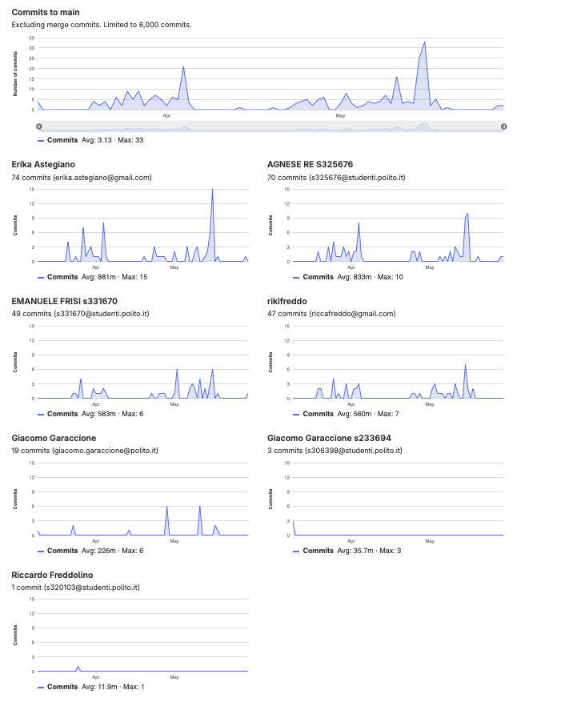

# Gruppo 3

## Valutazione deliverable V1

| gruppo | context diagram | business model | stakeholder | stories | interface | FR | NFR | use cases diagram | use cases | scenario | Glossary | DeploymentDiagram | functionality | estimation doc | precisione valori estimation | valutazione |
| --- | --- | --- | --- | --- | --- | --- | --- | --- | --- | --- | --- | --- | --- | --- | --- | --- |
| - | 1 | 0.5 | 0.5 | 1 | 1 | 3 | 3 | 1 | 5 | 5 | 5 | 2 | 1 | 2 | 2 | 33 |
| 3 | 100 | 100 | 95 | 100 | 100 | 95 | 100 | 95 | 100 | 100 | 95 | 95 | 100 | 90 | 99.77 | 99.17 |

## Valutazione deliverable V2

| gruppo | context diagram | business model | stakeholder | stories | interface | FR | NFR | ACCESS RIGHTS | use cases diagram | use cases | scenario | Glossary | DeploymentDiagram | functionality | estimation | precisione valori estimation | valutazione |
| --- | --- | --- | --- | --- | --- | --- | --- | --- | --- | --- | --- | --- | --- | --- | --- | --- | --- |
| - | 1 | 0.5 | 0.5 | 1 | 1 | 3 | 2 | 1 | 1 | 5 | 5 | 5 | 2 | 1 | 2 | 2 | 33 |
| 3 | 100 | 100 | 100 | 100 | 100 | 100 | 100 | 100 | 100 | 100 | 100 | 100 | 90 | 100 | 100 | 99.88 | 100.92 |

Le percentuali di v2 sono state riscalate in quanto la media pesata delle percentuali portava alcuni gruppi oltre al 100%.

## Valutazione codice e test (V2 + V3)

| Test Unit Totali | Test Unit Passati | Statement Coverage Unit | Branch Coverage Unit | Function Coverage Unit | Line Coverage Unit | Test Integration Totali | Test Integration Falliti | Statement Coverage Integration | Branch Coverage Integration | Function Coverage Integration | Line Coverage Integration | Correttezza V2 | Correttezza V3 | valutazione |
| --- | --- | --- | --- | --- | --- | --- | --- | --- | --- | --- | --- | --- | --- | --- |
| 1 | 0.5 | 2 | 2 | 1 | 1 | 1 | 0.5 | 2 | 2 | 1 | 1 | 16 | 2 | 33 |
| 100 | 100 | 100 | 75 | 100 | 100 | 100 | 100 | 100 | 75 | 100 | 100 | 87.3949579831933 | 100 | 90.86 |

 Unit e integration test prodotti dai gruppi sono stati eseguiti con la versione V2 del codice.

## Risultati Progetto

| Deliverable | Punteggio | Peso |
| --- | --- | --- |
| **Documenti V1** | 99.17% | 6 |
| **Documenti V2** | 99.57% | 2 |
| **Codice e Test** | 90.86% | 22 |
| **Timesheet** | 100.0% | 3 |
| **Valutazione** | 30.93 | 33 |
| **Valutazione** | 12.37 | 13.2 |

## Calcolo pesi progetto per singolo studente

| cognome | nome | email | gruppo | commit studente | commit totali | commit sul totale | coefficiente catme | coefficiente pesato | coefficiente progetto |
| --- | --- | --- | --- | --- | --- | --- | --- | --- | --- |
| ASTEGIANO | ERIKA | s329268@studenti.polito.it | 3 | 74 | 241 | 0.31 | 1.00 | 0.86 | 0.99 |
| FREDDOLINO | RICCARDO | s320103@studenti.polito.it | 3 | 48 | 241 | 0.20 | 0.93 | 0.78 | 0.91 |
| FRISI | EMANUELE | s331670@studenti.polito.it | 3 | 49 | 241 | 0.20 | 1.01 | 0.85 | 0.98 |
| RE | AGNESE | s325676@studenti.polito.it | 3 | 70 | 241 | 0.29 | 1.01 | 0.87 | 1.00 |

 I pesi del progetto sono ottenuti per l'80% dal valore calcolato da CATME e per il 20% dalla percentuale dei commit del singolo studente sul totale dei commit effettuati dagli studenti dello stesso gruppo. Il risultato è stato poi riscalato in modo che il punteggio più alto del gruppo ottenesse 1.

## Studenti

| Nome | Matricola | Email | Bonus | Voto Primo Appello | Voto Secondo Appello | Voto Progetto | Voto Finale |
| --- | --- | --- | --- | --- | --- | --- | --- |
| AGNESE RE | 325676 | s325676@studenti.polito.it | 1 | 17.4 | | 12.37 | 30 |
| EMANUELE FRISI | 331670 | s331670@studenti.polito.it | 1 | 16.7 | | 12.12 | 30 |
| RICCARDO FREDDOLINO | 320103 | s320103@studenti.polito.it | 0 | 13.2 | 14.1| 11.20 | 25 |
| ERIKA ASTEGIANO | 329268 | s329268@studenti.polito.it | 1 |  | 16.2 | 12.30 | 30 |
